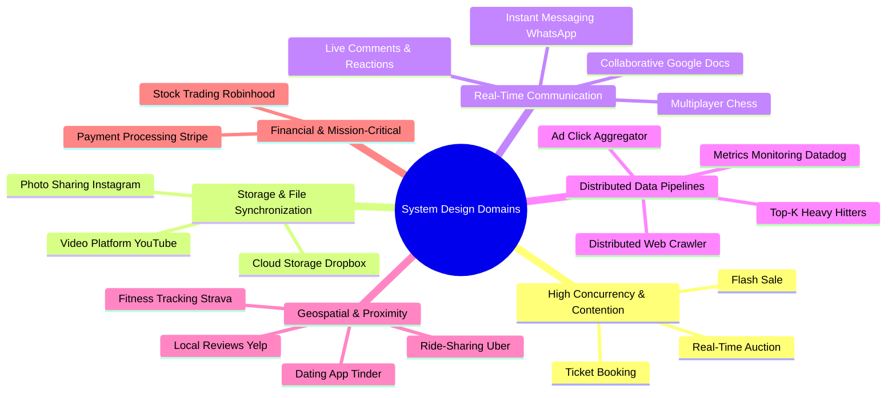

# System Design Knowledge Compendium

A comprehensive, production-grade reference manual and catalog of **32 full-scale system design problems**, **9 foundational concepts**, **7 core architectural patterns**, and **14 technology deep dives**.

---

## 📚 Table of Contents
1. [Master Problem Catalog (Pages 01 - 32)](#master-problem-catalog)
2. [Foundational Concepts & Patterns](#foundational-concepts--patterns)
3. [System Design Taxonomy Matrix](#system-design-taxonomy-matrix)
4. [ScaleLab Studio Integration Blueprint](#scalelab-studio-integration-blueprint)

---

## Master Problem Catalog

Every problem has a dedicated page index file located in [`pages/`](./pages) with complete functional requirements, non-functional targets, quantitative capacity math, core entities, API design, high-level architectures, deep dives, level rubrics, and simulation blueprints.

| Page | Problem Name | Domain Classification | Difficulty | Primary Architectural Patterns |
| :---: | :--- | :--- | :---: | :--- |
| **01** | [Ad Click Aggregator](./pages/page_01_ad_click_aggregator.md) | Distributed Stream Analytics | Medium | Stream Processing, Window Aggregations, Deduplication |
| **02** | [URL Shortener (Bitly)](./pages/page_02_bitly.md) | Key Generation & Fast Redirects | Easy | Scaling Reads, Consistent Hashing, Bloom Filters |
| **03** | [Price Tracking Service](./pages/page_03_camelcamelcamel.md) | Distributed Scraping & Alerting | Medium | Long Running Tasks, Time Series, Rate Limiting |
| **04** | [LLM Streaming Chat (ChatGPT)](./pages/page_04_chatgpt.md) | Generative AI & Streaming Gateways | Medium | Real-Time Updates, SSE, Long Running Tasks |
| **05** | [Distributed Cache](./pages/page_05_distributed_cache.md) | In-Memory Key-Value Stores | Hard | Consistent Hashing, LRU Eviction, Replication |
| **06** | [Distributed Rate Limiter](./pages/page_06_distributed_rate_limiter.md) | Gateway Traffic & Security | Medium | Token Bucket, Redis Lua, Sliding Windows |
| **07** | [Cloud File Storage (Dropbox)](./pages/page_07_dropbox.md) | Chunked Storage & File Sync | Hard | Large Blobs, Chunking, Delta Sync, Metadata Sharding |
| **08** | [Live Comments & Reactions](./pages/page_08_fb_live_comments.md) | High-Velocity Broadcasting | Hard | Real-Time Updates, Pub/Sub Fan-out, Dynamic Sampling |
| **09** | [Social News Feed (Facebook)](./pages/page_09_fb_news_feed.md) | Social Graph Fan-Out & Feeds | Medium | Push/Pull Fan-out, Celebrity Hot Keys, Feed Caching |
| **10** | [Social Post Search](./pages/page_10_fb_post_search.md) | Distributed Inverted Indexing | Hard | Elasticsearch, Inverted Index, Scatter-Gather |
| **11** | [Flash Sale Inventory System](./pages/page_11_flash_sale.md) | Extreme Write Contention | Hard | Contention, In-Memory Atomic Holds, Sagas |
| **12** | [Collaborative Editor (Google Docs)](./pages/page_12_google_docs.md) | Real-Time Document Collaboration | Hard | Operational Transformation (OT), CRDT, WebSockets |
| **13** | [News Aggregator (Google News)](./pages/page_13_google_news.md) | Content Clustering & Deduplication | Medium | MinHash/SimHash, Inverted Index, Crawlers |
| **14** | [Local Delivery Service (Gopuff)](./pages/page_14_gopuff.md) | Dark Store Logistics & Routing | Medium | Spatial Routing, Real-Time Tracking, Inventory Holds |
| **15** | [Photo Sharing App (Instagram)](./pages/page_15_instagram.md) | Media Pipelines & Global CDNs | Medium | Large Blobs, Direct S3 Upload, Sharding, CDNs |
| **16** | [Job Scheduler (Airflow)](./pages/page_16_job_scheduler.md) | Distributed DAG Orchestration | Hard | DAG Scheduling, Worker Pools, Heartbeats, State Recovery |
| **17** | [Online Code Judge (LeetCode)](./pages/page_17_leetcode.md) | Sandboxed Execution & Contests | Medium | MicroVM Sandboxing, Worker Queues, Leaderboards |
| **18** | [Metrics Platform (Datadog)](./pages/page_18_metrics_monitoring.md) | High-Throughput Time-Series | Hard | TSDB, Gorilla Compression, Downsampling Rollups |
| **19** | [Distributed Notification System](./pages/page_19_notification_system.md) | Multi-Channel Message Delivery | Medium | Priority Queues, Idempotency, Provider Fallbacks |
| **20** | [Real-Time Auction (eBay)](./pages/page_20_online_auction.md) | Low-Latency Bidding & Holds | Hard | Contention Locking, Soft Closing, Actor Model |
| **21** | [Online Multiplayer Chess](./pages/page_21_online_chess.md) | Turn-Based Synchronization | Medium | WebSockets, Move Validation, Elo Matchmaking |
| **22** | [Payment Processing (Stripe)](./pages/page_22_payment_system.md) | Financial Ledgers & Idempotency | Hard | Double-Entry Ledgers, 2PC/Sagas, Webhook Delivery |
| **23** | [Stock Trading Platform (Robinhood)](./pages/page_23_robinhood.md) | Order Books & Market Feeds | Hard | LMAX Disruptor, FIFO Matching Engine, Streaming |
| **24** | [Fitness Tracking (Strava)](./pages/page_24_strava.md) | GPS Matching & Leaderboards | Medium | Polyline Decimation, Spatial R-Trees, Redis Sorted Sets |
| **25** | [Ticket Booking (Ticketmaster)](./pages/page_25_ticketmaster.md) | Seat Map Concurrency & Holds | Hard | Optimistic Locking, Virtual Queues, Temporary TTLs |
| **26** | [Dating App (Tinder)](./pages/page_26_tinder.md) | Geospatial Proximity & Swipes | Medium | Geohash/S2, Bi-Directional Graph Matching, Caching |
| **27** | [Top-K Heavy Hitters](./pages/page_27_top_k.md) | Streaming Frequency Estimation | Hard | Count-Min Sketch, HeavyKeeper, Rolling Windows |
| **28** | [Ride-Sharing Dispatch (Uber)](./pages/page_28_uber.md) | Spatial Indexing & Dispatch | Hard | H3 Hexagons, Real-Time Pings, Dispatch State Machine |
| **29** | [Distributed Web Crawler](./pages/page_29_web_crawler.md) | High-Volume Internet Scraping | Hard | URL Frontier, Politeness Queues, Bloom Filters |
| **30** | [Messaging App (WhatsApp)](./pages/page_30_whatsapp.md) | Global E2E Encrypted Chat | Hard | Connection Gateways, Offline Buffers, Ephemeral Media |
| **31** | [Local Business Reviews (Yelp)](./pages/page_31_yelp.md) | Spatial Search & Rating Rollups | Medium | QuadTree/Geohash, Async Rating Rollups, Fraud Filter |
| **32** | [Video Streaming (YouTube)](./pages/page_32_youtube.md) | Video Ingestion, Encoding & CDN | Hard | Chunked Transcoding, Adaptive Bitrate (ABR), CDNs |

---

## Foundational Concepts & Patterns

- **[Core Concepts Reference](./concepts/core_concepts_reference.md)**:
  - Networking Essentials (TCP vs UDP, HTTP/1.1 vs HTTP/2 vs HTTP/3, WebSockets, gRPC, SSE)
  - API Design & System Interface Hardening (Idempotency, Pagination, Rate Limits)
  - Data Modeling & Storage Engine Selection (RDBMS, Document, Key-Value, Wide-Column, TSDB, Graph)
  - Caching Strategies & Eviction Mechanics (Cache-aside, Write-behind, LRU, Stampedes)
  - Database Sharding & Partitioning Strategies
  - Consistent Hashing with Virtual Nodes
  - CAP Theorem & PACELC Tradeoffs
  - Database Indexing Internals (B-Trees vs LSM-Trees)
  - Latency Numbers Every Systems Engineer Must Know
- **[Battle-Tested Architectural Patterns](./concepts/architectural_patterns.md)**:
  - Pattern 1: Dealing with Contention & Hot Keys
  - Pattern 2: Handling Large Blobs & File Uploads
  - Pattern 3: Managing Long-Running Tasks
  - Pattern 4: Multi-Step Processes & Distributed Transactions (Sagas & Outbox)
  - Pattern 5: Real-Time Updates & Bidirectional Synchronization
  - Pattern 6: Scaling Reads (Read-Heavy Systems)
  - Pattern 7: Scaling Writes (Write-Heavy Systems)
- **[Technology Deep Dives](./concepts/technology_deep_dives.md)**:
  - Apache Kafka, Redis, Apache Cassandra, Amazon DynamoDB, Elasticsearch
  - Big Data Structures (Bloom Filters, HyperLogLog, Count-Min Sketch)
  - Geospatial Indexing (Geohash, QuadTree, Google S2, Uber H3)

---

## System Design Taxonomy Matrix

