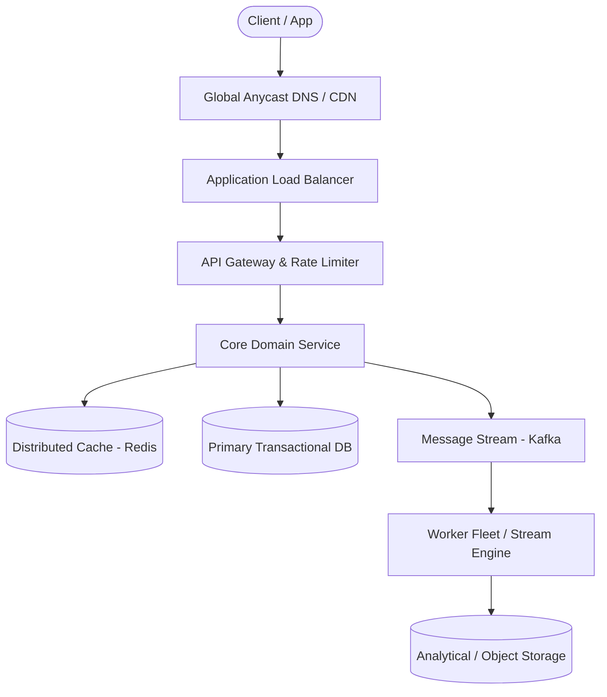

# Page 01: Ad Click Aggregator

> **Page Index**: Page 01 of 32  
> **System Domain**: Distributed Real-Time Stream Analytics  
> **Industry Analogs**: Google Ads, Meta Ads Manager, The Trade Desk  
> **Interview Difficulty**: Medium  
> **Core Architectural Patterns**: Stream Processing, Window Aggregations, Deduplication, Fault Tolerance  

---

## 1. Problem Overview & Architectural Scoping

### Problem Summary
Designing **Ad Click Aggregator** requires architecting a production-grade distributed solution in the **Distributed Real-Time Stream Analytics** space. The system must support massive scale while balancing latency budgets, throughput requirements, data consistency, and system durability.

### Primary Technical Challenges
- **Throughput & Concurrency**: Handling high-volume traffic bursts, contention on hot resources, and partition skew without service degradation.
- **Consistency vs Availability**: Choosing the appropriate consistency model across distributed components (ACID transactions vs eventual consistency).
- **Resilience & Fault Tolerance**: Isolating failure domains, avoiding cascading collapses, and ensuring graceful degradation under partial system outages.

## 2. Requirements Specification

### Functional Requirements
Core Requirements
- Users can click on an ad and be redirected to the advertiser's website
- Advertisers can query ad click metrics over time with a minimum granularity of 1 minute
Below the line (out of scope):
- Ad targeting
- Ad serving
- Cross device tracking
- Integration with offline marketing channels
FIRST QUESTION
What are the non-functional requirements of the system?
Try it yourself first
We recommend you to practice the question yourself first to get instant personalized feedback as you go.

### Non-Functional Requirements & Performance SLOs
Before we jump into our non-functional requirements, it's important to ask your interviewer about the scale of the system. For this design in particular, the scale will have a large impact on the database design and the overall architecture.
We are going to design for a system that has 10M active ads and a peak of 10k clicks per second. Since traffic varies throughout the day and 10k is our peak (not sustained) rate, the average throughput will be much lower. If we assume the average is roughly 1k clicks per second (a common heuristic is peak ≈ 10x average), that gives us about 1k * 86,400 seconds/day ≈ 100M clicks per day.
With that in mind, let's document the non-functional requirements:
Core Requirements
- Scalable to support a peak of 10k clicks per second
- Low latency analytics queries for advertisers (sub-second response time)
- Fault tolerant and accurate data collection. We should not lose any click data.
- As realtime as possible. Advertisers should be able to query data as soon as possible after the click.
- Idempotent click tracking. We should not count the same click multiple times.
Below the line (out of scope):
- Fraud or spam detection
- Demographic and geo profiling of users
- Conversion tracking
Here's how it might look on your whiteboard:
Requirements

## 3. Quantitative Scale & Capacity Estimations

| Metric Dimension | Production Scale | Architectural Implication |
| :--- | :--- | :--- |
| **Daily Active Users (DAU)** | 50M - 200M users | Distributed identity verification, user sharding, session caches. |
| **Write Throughput** | 1,000 - 50,000 QPS peak | Asynchronous ingestion queues (Kafka), write-behind caching, batch persistence. |
| **Read Throughput** | 10,000 - 500,000 QPS peak | Multi-tier CDN caching, distributed Redis read clusters, read replicas. |
| **Storage Capacity (5 Years)** | 10 TB - 500 TB | Columnar analytics storage, cold data tiering to object storage (S3). |
| **Network Egress / Ingress** | 1 Gbps - 40 Gbps | Connection multiplexing, compression (gzip/zstd), CDN edge offload. |

## 4. Core Data Entities & Schema Design

- **Primary Entity**: `id` (UUID PK), `owner_id` (UUID), `status` (ENUM), `created_at` (TIMESTAMP).
- **Transaction / Event Log**: `event_id` (UUID), `entity_id` (UUID FK), `payload` (JSONB), `timestamp` (BIGINT).
- **Aggregated / Materialized View**: `partition_key` (STRING), `window_start` (BIGINT), `counter` (BIGINT).

## 5. API & System Interface Contract

For data processing questions like this one, it helps to start by defining the system's interface. This includes clearly outline what data the system receives and what it outputs, establishing a clear boundary of the system's functionality. The inputs and outputs of this system are very simple, but it's important to get these right!
- Input: Ad click data from users.
- Output: Ad click metrics for advertisers.

## 6. High-Level Architecture & End-to-End Flow

### Execution Workflow
1. **Edge Ingestion**: Requests pass through Edge CDN and API Gateway for rate limiting and authentication.
2. **Fast-Path Caching**: High-frequency reads are resolved from the distributed Redis cache with sub-5ms latency.
3. **Asynchronous Decoupling**: High-velocity write events are published directly to Kafka message broker partitions.
4. **Background Processing**: Stream workers (Flink/Workers) consume events, update read-model projections, and persist to long-term storage.

## 7. Deep Dives, Bottlenecks & Architectural Tradeoffs

### 1) How can we scale to support 10k clicks per second?
Let's walk through each bottleneck the system could face from the moment a click is captured and how we can overcome it:
- Click Processor Service: We can easily scale this service horizontally by adding more instances. Most modern cloud providers like AWS, Azure, and GCP provide managed services that automatically scale services based on CPU or memory usage. We'll need a load balancer in front of the service to distribute the load across instances.
- Stream: Both Kafka and Kinesis are distributed and can handle a large number of events per second but need to be properly configured. Kinesis, for example, has a limit of 1MB/s or 1000 records/s per shard, so we'll need to add some sharding. Sharding by AdId is a natural choice, this way, the stream processor can read from multiple shards in parallel since they will be independent of each other (all events for a given AdId will be in the same shard).
- Stream Processor: The stream processor, like Flink, can also be scaled horizontally by adding more tasks or jobs. We'll have a separate Flink job reading from each shard doing the aggregation for the AdIds in that shard.
- OLAP Database: Managed OLAP warehouses like Snowflake or BigQuery handle scaling automatically—you don't control data placement directly. For self-managed solutions like ClickHouse, you can shard by AdvertiserId so all data for a given advertiser lives on the same node, making queries for that advertiser's ads faster. This is in anticipation of advertisers querying for all of their active ads in a single view. Of course, it's important to monitor query performance to ensure it's meeting SLAs.
Hot Shards
With the above scaling strategies, we should be able to handle a peak of 10k clicks per second. There is just one remaining issue, hot shards. Consider the case where Nike just launched a new Ad with Lebron James. This Ad is getting a lot of clicks and all of them are going to the same shard. This shard is now overwhelmed, which increases latency and, in the worst case, could even cause data loss.
To solve the hot shard problem, we need a way of further partitioning the data. One popular approach is to update the partition key by appending a random number to the AdId. We could do this only for the popular ads as determined by ad spend or previous click volume. This way, the partition key becomes AdId:0-N where N is the number of additional partitions for that AdId.
When writing to the OLAP database, Flink strips the suffix and uses the original AdId as the key. Since we're doing upserts with SUM aggregation, concurrent writes from different partitions combine correctly. Alternatively, you could store with sub-keys and aggregate at query time, but stripping the suffix before writing is cleaner for query performance.
Scaling
### 2) How can we ensure that we don't lose any click data?
The first thing to note is that we are already using a stream like Kafka or Kinesis to store the

## 8. Evaluation Rubric by Engineering Level

?
Ok, that was a lot. You may be thinking, “how much of that is actually required from me in an interview?” Let’s break it down.
### Mid-level
Breadth vs. Depth: A mid-level candidate will be mostly focused on breadth (80% vs 20%). You should be able to craft a high-level design that meets the functional requirements you've defined, but many of the components will be abstractions with which you only have surface-level familiarity.
Probing the Basics: Your interviewer will spend some time probing the basics to confirm that you know what each component in your system does. For example, if you add an API Gateway, expect that they may ask you what it does and how it works (at a high level). In short, the interviewer is not taking anything for granted with respect to your knowledge.
Mixture of Driving and Taking the Backseat: You should drive the early stages of the interview in particular, but the interviewer doesn’t expect that you are able to proactively recognize problems in your design with high precision. Because of this, it’s reasonable that they will take over and drive the later stages of the interview while probing your design.
The Bar for Ad Click Aggregator: For this question, I expect a proficient E4 candidate to understand the need for pre-aggregating the data and to at least propose a batch processing solution. They should be able to problem-solve effectively when faced with my probing inquiries about idempotency or database choices.
### Senior
Depth of Expertise: As a senior candidate, expectations shift towards more in-depth knowledge — about 60% breadth and 40% depth. This means you should be able to go into technical details in areas where you have hands-on experience. It's crucial that you demonstrate a deep understanding of key concepts and technologies relevant to the task at hand.
Advanced System Design: You should be familiar with advanced system design principles. For example, knowing how a batch processing job would use map reduce or understandi

## 9. ScaleLab Studio Simulation & Practice Pack Mapping

- **Recommended ScaleLab Palette Components**: `Client`, `Load balancer`, `API gateway`, `Service`, `Queue`, `Worker`, `Database`, `Cache`, `Circuit breaker`.
- **Simulation Load Test**: Configure a 'Spike' or 'Diurnal' traffic shape. Simulate worker crashes or database lock contention to observe queue backup and Little's Law latency spikes.
- **Practice Pack Readiness**: High priority candidate for addition to ScaleLab's guided practice suite with pinnable notes and runnable starter topologies.
