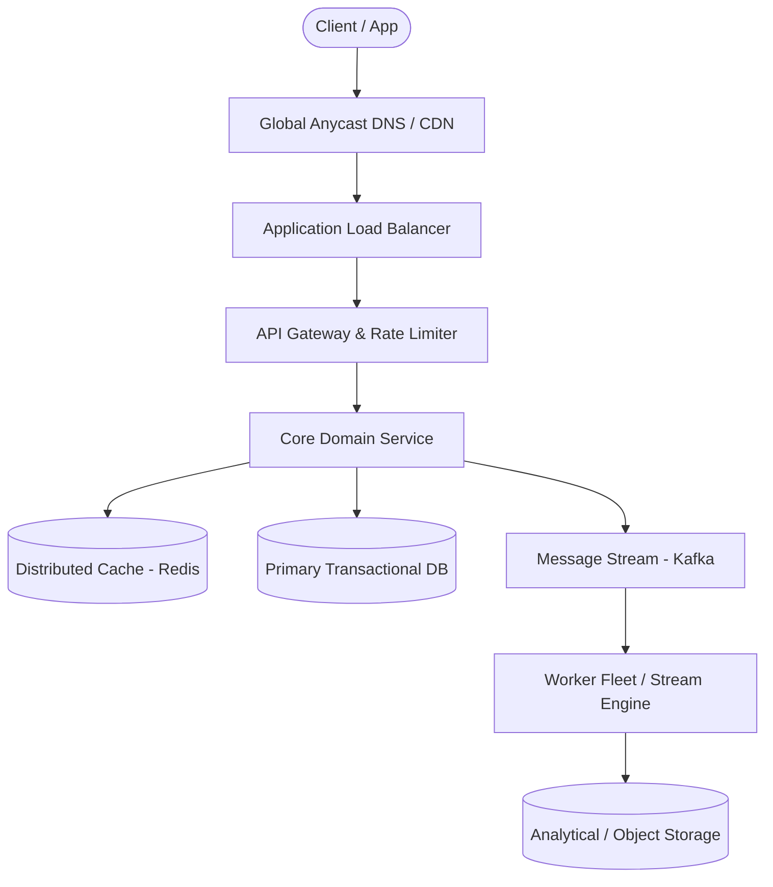

# Page 02: URL Shortener (Bitly)

> **Page Index**: Page 02 of 32  
> **System Domain**: High-Throughput Key Generation & Read-Heavy Caching  
> **Industry Analogs**: Bitly, TinyURL, Ow.ly  
> **Interview Difficulty**: Easy  
> **Core Architectural Patterns**: Scaling Reads, Consistent Hashing, Bloom Filters, Caching  

---

## 1. Problem Overview & Architectural Scoping

### Problem Summary
Designing **URL Shortener (Bitly)** requires architecting a production-grade distributed solution in the **High-Throughput Key Generation & Read-Heavy Caching** space. The system must support massive scale while balancing latency budgets, throughput requirements, data consistency, and system durability.

### Primary Technical Challenges
- **Throughput & Concurrency**: Handling high-volume traffic bursts, contention on hot resources, and partition skew without service degradation.
- **Consistency vs Availability**: Choosing the appropriate consistency model across distributed components (ACID transactions vs eventual consistency).
- **Resilience & Fault Tolerance**: Isolating failure domains, avoiding cascading collapses, and ensuring graceful degradation under partial system outages.

## 2. Requirements Specification

### Functional Requirements
The first thing you'll want to do when starting a system design interview is to get a clear understanding of the requirements of the system. Functional requirements are the features that the system must have to satisfy the needs of the user.
In some interviews, the interviewer will provide you with the core functional requirements upfront. In other cases, you'll need to determine these requirements yourself. If you're familiar with the product, this task should be relatively straightforward. However, if you're not, it's advisable to ask your interviewer some clarifying questions to gain a better understanding of the system.
The most important thing is that you zero in on the top 3-4 features of the system and don't get distracted by the bells and whistles.
We'll concentrate on the following set of functional requirements:
Core Requirements
- Users should be able to submit a long URL and receive a shortened version.
Optionally, users should be able to specify a custom alias for their shortened URL (ie. "www.short.ly/my-custom-alias")
- Optionally, users should be able to specify an expiration date for their shortened URL.
- Users should be able to access the original URL by using the shortened URL.
Below the line (out of scope):
- User authentication and account management.
- Analytics on link clicks (e.g., click counts, geographic data).
These features are considered "below the line" because they add complexity to the system without being core to the basic functionality of a URL shortener. In a real interview, you might discuss these with your interviewer to determine if they should be included in your design.
FIRST QUESTION
What are the non-functional requirements for this system?
Try it yourself first
We recommend you to practice the question yourself first to get instant personalized feedback as you go.

### Non-Functional Requirements & Performance SLOs
Next up, you'll want to outline the core non-functional requirements of the system. Non-functional requirements refer to specifications about how a system operates, rather than what tasks it performs. These requirements are critical as they define system attributes like scalability, latency, security, and availability, and are often framed as specific benchmarks—such as a system's ability to handle 100 million daily active users or respond to queries within 200 milliseconds.
Core Requirements
- The system should ensure uniqueness for the short codes (each short code maps to exactly one long URL)
- The redirection should occur with minimal delay (< 100ms)
- The system should be reliable and available 99.99% of the time (availability > consistency)
- The system should scale to support 1B shortened URLs and 100M DAU
Below the line (out of scope):
- Data consistency in real-time analytics.
- Advanced security features like spam detection and malicious URL filtering.
An important consideration in this system is the significant imbalance between read and write operations. The read-to-write ratio is heavily skewed towards reads, as users frequently access shortened URLs, while the creation of new short URLs is comparatively rare. For instance, we might see 1000 clicks (reads) for every 1 new short URL created (write). This asymmetry will significantly impact our system design, particularly in areas such as caching strategies, database choice, and overall architecture.
Here is what you might write on the whiteboard:
Bit.ly Non-Functional Requirements

## 3. Quantitative Scale & Capacity Estimations

| Metric Dimension | Production Scale | Architectural Implication |
| :--- | :--- | :--- |
| **Daily Active Users (DAU)** | 50M - 200M users | Distributed identity verification, user sharding, session caches. |
| **Write Throughput** | 1,000 - 50,000 QPS peak | Asynchronous ingestion queues (Kafka), write-behind caching, batch persistence. |
| **Read Throughput** | 10,000 - 500,000 QPS peak | Multi-tier CDN caching, distributed Redis read clusters, read replicas. |
| **Storage Capacity (5 Years)** | 10 TB - 500 TB | Columnar analytics storage, cold data tiering to object storage (S3). |
| **Network Egress / Ingress** | 1 Gbps - 40 Gbps | Connection multiplexing, compression (gzip/zstd), CDN edge offload. |

## 4. Core Data Entities & Schema Design

We recommend that you start with a broad overview of the primary entities. At this stage, it is not necessary to know every specific column or detail. We will focus on the intricacies, such as columns and fields, later when we have a clearer grasp. Initially, establishing these key entities will guide our thought process and lay a solid foundation as we progress towards defining the API.
Just make sure that you let your interviewer know your plan so you're on the same page. I'll often explain that I'm going to start with just a simple list, but as we get to the high-level design, I'll document the data model more thoroughly.
In a URL shortener, the core entities are very straightforward:
- Original URL: The original long URL that the user wants to shorten.
- Short URL: The shortened URL that the user receives and can share.
- User: Represents the user who created the shortened URL.
In the actual interview, this can be as simple as a short list like this. Just make sure you talk through the entities with your interviewer to ensure you are on the same page.
Bit.ly Entities

## 5. API & System Interface Contract

The next step in the delivery framework is to define the APIs of the system. This sets up a contract between the client and the server, and it's the first point of reference for the high-level design.
Your goal is to simply go one-by-one through the core requirements and define the APIs that are necessary to satisfy them. Usually, these map 1:1 to the functional requirements, but there are times when multiple endpoints are needed to satisfy an individual functional requirement.
9/10 you'll use a REST API and focus on choosing the right HTTP method or verb to use.
- POST: Create a new resource
- GET: Read an existing resource
- PUT: Update an existing resource
- DELETE: Delete an existing resource
To shorten a URL, we'll need a POST endpoint that takes in the long URL and optionally a custom alias and expiration date, and returns the shortened URL. We use post here because we are creating a new entry in our database mapping the long url to the newly created short url.
// Shorten a URL
POST /urls
{
"long_url": "https://www.example.com/some/very/long/url",
"custom_alias": "optional_custom_alias",
"expiration_date": "optional_expiration_date"
}
->
{
"short_url": "http://short.ly/abc123"
}
For redirection, we'll need a GET endpoint that takes in the short code and redirects the user to the original long URL. GET is the right verb here because we are reading the existing long url from our database based on the short code.
// Redirect to Original URL
GET /{short_code}
-> HTTP 302 Redirect to the original long URL
We'll talk more about which HTTP status codes to use during the high-level design.

## 6. High-Level Architecture & End-to-End Flow

### Execution Workflow
1. **Edge Ingestion**: Requests pass through Edge CDN and API Gateway for rate limiting and authentication.
2. **Fast-Path Caching**: High-frequency reads are resolved from the distributed Redis cache with sub-5ms latency.
3. **Asynchronous Decoupling**: High-velocity write events are published directly to Kafka message broker partitions.
4. **Background Processing**: Stream workers (Flink/Workers) consume events, update read-model projections, and persist to long-term storage.

## 7. Deep Dives, Bottlenecks & Architectural Tradeoffs

At this point, we have a basic, functioning system that satisfies the functional requirements. However, there are a number of areas we could dive deeper into to reduce the likelihood of collision, support scalability, and improve performance. We can now look back at our non-functional requirements and see which ones still need to be satisfied or improved upon.
### 1) How can we ensure short urls are unique?
In our high-level design, we abstracted away the details of how we generate a short url but now it's time to get into the nitty-gritty! There are a handful of constraints we need to keep in mind as we design:
- We need to ensure that the short codes are unique.
- We want the short codes to be as short as possible (it is a url shortener afterall).
- We want to ensure codes are efficiently generated.
Let's weigh a few options and consider their pros and cons.
### Bad Solution: Long Url Prefix
Approach
The silliest thing we could do to shorten an input url is to just take the prefix of the input url as the short code. Imagine you had a url like www.linkedin.com/in/evan-king-40072280/ we could just take the first N (lets say 8 for now) characters of the url and use that as the short code. In this case www.short.ly/www.link.Challenges
Clearly, this method would not meet constraint #1 about uniqueness. Any two urls that share the first N characters would end up mapping to the exact same short url. When a user comes and asks to be redirected via short url www.short.ly/www.link we would not know whether they want to visit www.linkedin.com/in/evan-king-40072280/, www.linkedin.com/in/stefanmai/, or any of the countless other urls that share the same prefix.
### Great Solution: Hash Function
Approach
We need some entropy (randomness) to try to ensure that our codes are unique. We could try a random number generator or a hash function!
Using a random number generator to create short codes involves generating a random number each time a new URL is shortened. This random number serves as the unique identifier for the URL. We can use common random number generation functions like JavaScript's Math.random() or more robust cryptographic random number generators for increased unpredictability. The generated random number would then be used as the short code for the URL. But a random number generator does not provide enough entropy to ensure that our codes are unique.
So instead, we could use a hash function like SHA-256 to generate a fixed-size hash code. Hash functions take an input and return a deterministic, fixed-size string of characters. Pure hash functions are deterministic: the same long URL always maps to the same short code without needing to query the database. This may be desirable (deduplication) or not (if you need multiple codes per URL or want to prevent guessability/adversarial preimages). For the latter cases, add a secret salt or nonce (HMAC). Hash functions also provide a high degree of entropy, meaning that the output appears random and is 

## 8. Evaluation Rubric by Engineering Level

?
URL shortener is considered an entry-level system design question, but that doesn't mean it's trivial. Here's what I look for at each level.
### Mid-level
At mid-level, I expect you to produce a working high-level design that handles URL shortening and redirection. You should understand the basic flow: user submits a long URL, system generates a short code, stores the mapping, and redirects users who visit the short URL. I want to see you recognize that short code generation needs to guarantee uniqueness and propose at least one reasonable approach (hashing or counter-based). You should understand why we use a 302 redirect (even if you did not know the status code yourself) and be able to discuss basic database indexing. With some prompting, you should recognize that a cache would help with read performance given the read-heavy nature of the system.
### Senior
For senior candidates, I expect you to drive the conversation and proactively identify the key challenges: unique code generation at scale, fast redirects, and horizontal scaling. You should be able to articulate the tradeoffs between hashing (collision handling) and counter-based approaches (coordination overhead) without much prompting. I expect you to discuss caching strategies in detail, including cache invalidation for expired URLs. You should propose a reasonable database choice and justify it. When we get to scaling, you should recognize that separating read and write services makes sense given the asymmetric workload, and understand how to scale the counter across multiple write instances using Redis or similar coordination.
### Staff+
For staff candidates, I'm evaluating your ability to see past the "textbook" solution and discuss real production concerns. You should quickly recognize this is a read-heavy system and structure your design accordingly from the start. I expect you to proactively discuss multi-region deployment, counter range allocation, and what happens during Redis failover without be

## 9. ScaleLab Studio Simulation & Practice Pack Mapping

- **Recommended ScaleLab Palette Components**: `Client`, `Load balancer`, `API gateway`, `Service`, `Queue`, `Worker`, `Database`, `Cache`, `Circuit breaker`.
- **Simulation Load Test**: Configure a 'Spike' or 'Diurnal' traffic shape. Simulate worker crashes or database lock contention to observe queue backup and Little's Law latency spikes.
- **Practice Pack Readiness**: High priority candidate for addition to ScaleLab's guided practice suite with pinnable notes and runnable starter topologies.
