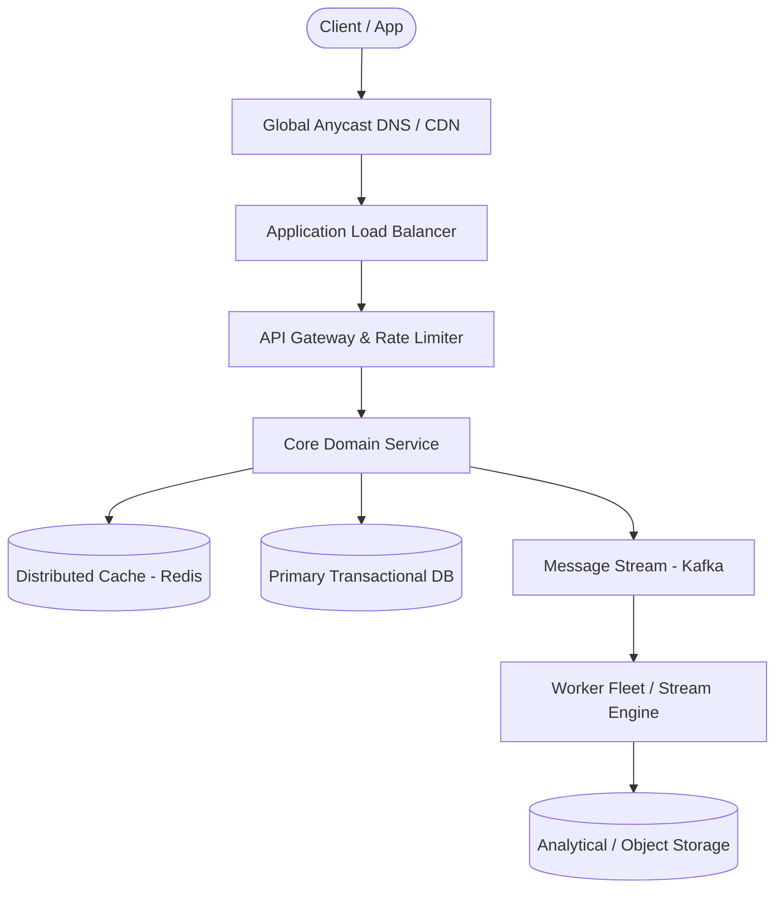

# Page 04: LLM Assistant & Streaming Chat (ChatGPT)

> **Page Index**: Page 04 of 32  
> **System Domain**: Conversational AI & Streaming Inference Gateway  
> **Industry Analogs**: OpenAI ChatGPT, Anthropic Claude, Google Gemini  
> **Interview Difficulty**: Medium  
> **Core Architectural Patterns**: Real-time Updates, Managing Long Running Tasks, Rate Limiter, Scaling Reads  

---

## 1. Problem Overview & Architectural Scoping

### Problem Summary
Designing **LLM Assistant & Streaming Chat (ChatGPT)** requires architecting a production-grade distributed solution in the **Conversational AI & Streaming Inference Gateway** space. The system must support massive scale while balancing latency budgets, throughput requirements, data consistency, and system durability.

### Primary Technical Challenges
- **Throughput & Concurrency**: Handling high-volume traffic bursts, contention on hot resources, and partition skew without service degradation.
- **Consistency vs Availability**: Choosing the appropriate consistency model across distributed components (ACID transactions vs eventual consistency).
- **Resilience & Fault Tolerance**: Isolating failure domains, avoiding cascading collapses, and ensuring graceful degradation under partial system outages.

## 2. Requirements Specification

### Functional Requirements
Core Requirements
- Users should be able to send a prompt in a chat and receive an AI-generated response.
- Users should be able to view past chats and resume a conversation, with the chat's prior context carried into the prompt.
Below the line (out of scope)
- Editing or branching existing messages.
- Image, audio, or video input and output (text only).
- Sharing chats or collaborating on a chat with other users.
- Custom GPTs, tool / function calling, and web browsing.
- Full-text search across a user's chat history.
FIRST QUESTION
What are the non-functional requirements of the system?
Try it yourself first
We recommend you to practice the question yourself first to get instant personalized feedback as you go.

### Non-Functional Requirements & Performance SLOs
Non-functional requirements cover the properties of the system that matter to the user and the business.
ChatGPT feels broken if you stare at a blank screen for a few seconds after hitting enter, so latency to the first token matters more than total completion time. Because GPUs are limited and expensive, the system has to be deliberate about who gets compute and when. ChatGPT serves a little over 200M daily active users at the time of writing. A few prompts each per day puts us somewhere around 20k prompts per second at peak, and since a response takes several seconds to generate, roughly 120k of them are streaming at any given moment. That's the scale we'll design against.

## 3. Quantitative Scale & Capacity Estimations

| Metric Dimension | Production Scale | Architectural Implication |
| :--- | :--- | :--- |
| **Daily Active Users (DAU)** | 50M - 200M users | Distributed identity verification, user sharding, session caches. |
| **Write Throughput** | 1,000 - 50,000 QPS peak | Asynchronous ingestion queues (Kafka), write-behind caching, batch persistence. |
| **Read Throughput** | 10,000 - 500,000 QPS peak | Multi-tier CDN caching, distributed Redis read clusters, read replicas. |
| **Storage Capacity (5 Years)** | 10 TB - 500 TB | Columnar analytics storage, cold data tiering to object storage (S3). |
| **Network Egress / Ingress** | 1 Gbps - 40 Gbps | Connection multiplexing, compression (gzip/zstd), CDN edge offload. |

## 4. Core Data Entities & Schema Design

- **Primary Entity**: `id` (UUID PK), `owner_id` (UUID), `status` (ENUM), `created_at` (TIMESTAMP).
- **Transaction / Event Log**: `event_id` (UUID), `entity_id` (UUID FK), `payload` (JSONB), `timestamp` (BIGINT).
- **Aggregated / Materialized View**: `partition_key` (STRING), `window_start` (BIGINT), `counter` (BIGINT).

## 5. API & System Interface Contract

```http
POST /api/v1/resource
Headers:
  Authorization: Bearer <token>
  Idempotency-Key: <uuid>
Content-Type: application/json

{
  "action": "execute",
  "payload": {}
}

HTTP/1.1 200 OK
```

## 6. High-Level Architecture & End-to-End Flow



### Execution Workflow
1. **Edge Ingestion**: Requests pass through Edge CDN and API Gateway for rate limiting and authentication.
2. **Fast-Path Caching**: High-frequency reads are resolved from the distributed Redis cache with sub-5ms latency.
3. **Asynchronous Decoupling**: High-velocity write events are published directly to Kafka message broker partitions.
4. **Background Processing**: Stream workers (Flink/Workers) consume events, update read-model projections, and persist to long-term storage.

## 7. Deep Dives, Bottlenecks & Architectural Tradeoffs

### 1) How do we stream tokens back to the client?
### 2) How do we keep the stream alive across reconnects and deploys?
### 3) How do we route and schedule generation requests across GPU workers?
### 4) How do we keep heavy users from taking over the GPU pool while giving paid tiers a better experience?
### 5) As conversations get longer, how do we control inference cost without making the assistant feel forgetful?
#### Cancelling a run and reclaiming the GPU
#

## 8. Evaluation Rubric by Engineering Level

?
### Mid-level
### Senior
### Staff+
### Purchase Premium to Keep Reading
Unlock this article and so much more with Hello Interview Premium
Buy Premium
Currently  up to 20% off
Hello Interview Premium
System Design Guided Practice
Exclusive content
Recent interview questions
Learn More
Reading Progress
On This Page
Understanding the Problem
Functional Requirements
Non-Functional Requirements
The Set Up
Planning the Approach
Defining the Core Entities
API or System Interface
High-Level Design
1) Users should be able to send a prompt and receive an AI-generated response
2) Users should be able to view past chats and resume a conversation with context carried across turns
Potential Deep Dives
1) How do we stream tokens back to the client?
2) How do we keep the stream alive across reconnects and deploys?
3) How do we route and schedule generation requests across GPU workers?
4) How do we keep heavy users from taking over the GPU pool while giving paid tiers a better experience?
5) As conversations get longer, how do we control inference cost without making the assistant feel forgetful?
Final Design
Some additional deep dives you might consider
What is Expected at Each Level?
Mid-level
Senior
Staff+
Questions
Meta SWE Interview QuestionsAmazon SWE Interview QuestionsGoogle SWE Interview QuestionsOpenAI SWE Interview QuestionsAnthropic SWE Interview QuestionsEngineering Manager (EM) Interview Questions
Learn
Learn System DesignLearn DSALearn BehavioralLearn ML System DesignLearn Low Level DesignGuided Practice
Links
FAQPricingGift PremiumHello Interview Premium
Legal
Terms and ConditionsPrivacy PolicySecurity
Contact
About UsProduct Support
7511 Greenwood Ave North
Unit #4238 Seattle
WA 98103
© 2026 Optick Labs Inc. All rights reserved.

## 9. ScaleLab Studio Simulation & Practice Pack Mapping

- **Recommended ScaleLab Palette Components**: `Client`, `Load balancer`, `API gateway`, `Service`, `Queue`, `Worker`, `Database`, `Cache`, `Circuit breaker`.
- **Simulation Load Test**: Configure a 'Spike' or 'Diurnal' traffic shape. Simulate worker crashes or database lock contention to observe queue backup and Little's Law latency spikes.
- **Practice Pack Readiness**: High priority candidate for addition to ScaleLab's guided practice suite with pinnable notes and runnable starter topologies.
