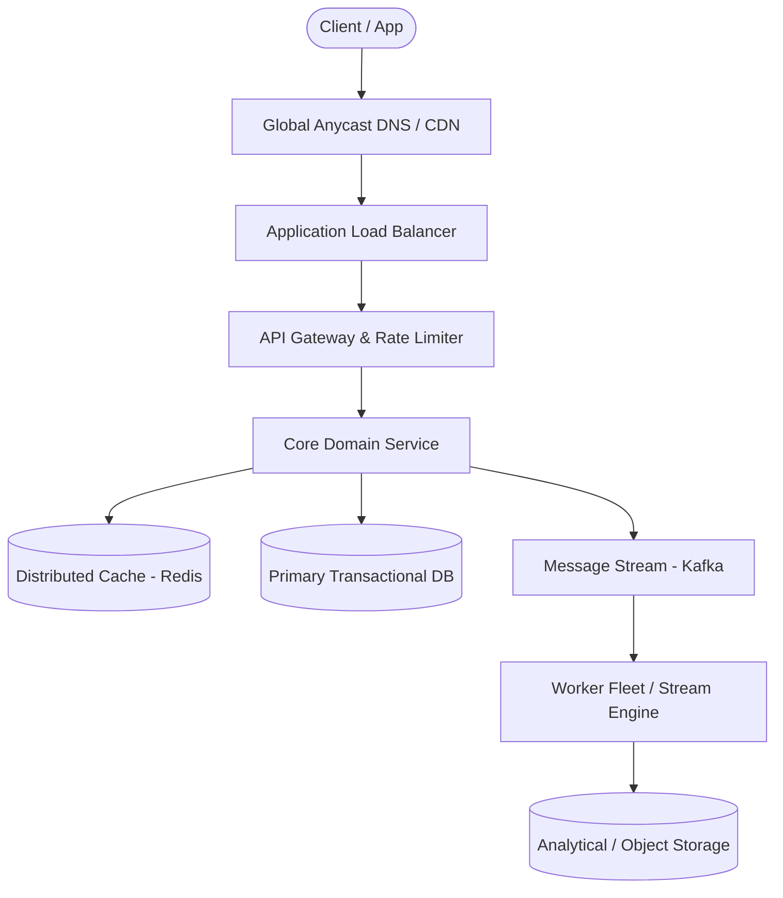

# Page 05: Distributed Cache

> **Page Index**: Page 05 of 32  
> **System Domain**: In-Memory Storage & Consistent Hashing  
> **Industry Analogs**: Redis, Memcached, Hazelcast  
> **Interview Difficulty**: Hard  
> **Core Architectural Patterns**: Scaling Reads, Consistent Hashing, Dealing with Contention  

---

## 1. Problem Overview & Architectural Scoping

### Problem Summary
Designing **Distributed Cache** requires architecting a production-grade distributed solution in the **In-Memory Storage & Consistent Hashing** space. The system must support massive scale while balancing latency budgets, throughput requirements, data consistency, and system durability.

### Primary Technical Challenges
- **Throughput & Concurrency**: Handling high-volume traffic bursts, contention on hot resources, and partition skew without service degradation.
- **Consistency vs Availability**: Choosing the appropriate consistency model across distributed components (ACID transactions vs eventual consistency).
- **Resilience & Fault Tolerance**: Isolating failure domains, avoiding cascading collapses, and ensuring graceful degradation under partial system outages.

## 2. Requirements Specification

### Functional Requirements
Core Requirements
- Users should be able to set, get, and delete key-value pairs.
- Users should be able to configure the expiration time for key-value pairs.
- Data should be evicted according to Least Recently Used (LRU) policy.
Below the line (out of scope)
- Users should be able to configure the cache size.
We opted for an LRU eviction policy, but you'll want to ask your interviewer what they're looking for if they weren't explicitly upfront. There are, of course, other eviction policies you could implement, like LFU, FIFO, and custom policies.
FIRST QUESTION
What are the non-functional requirements of the system?
Try it yourself first
We recommend you to practice the question yourself first to get instant personalized feedback as you go.

### Non-Functional Requirements & Performance SLOs
At this point in the interview, you should ask the interviewer what sort of scale we are expecting. This will have a big impact on your design, starting with how you define the non-functional requirements.
If I were your interviewer, I would say we need to store up to 1TB of data and expect to handle a peak of up to 100k requests per second.
Core Requirements
- The system should be highly available. Eventual consistency is acceptable.
- The system should support low latency operations (< 10ms for get and set requests).
- The system should be scalable to support the expected 1TB of data and 100k requests per second.
Below the line (out of scope)
- Durability (data persistence across restarts)
- Strong consistency guarantees
- Complex querying capabilities
- Transaction support
Note that I'm making quite a few strong assumptions about what we care about here. Make sure you're confirming this with your interviewer. Chances are you've used a cache before, so you know the plethora of potential trade-offs. Some interviewers might care about durability, for example, just ask.

## 3. Quantitative Scale & Capacity Estimations

| Metric Dimension | Production Scale | Architectural Implication |
| :--- | :--- | :--- |
| **Daily Active Users (DAU)** | 50M - 200M users | Distributed identity verification, user sharding, session caches. |
| **Write Throughput** | 1,000 - 50,000 QPS peak | Asynchronous ingestion queues (Kafka), write-behind caching, batch persistence. |
| **Read Throughput** | 10,000 - 500,000 QPS peak | Multi-tier CDN caching, distributed Redis read clusters, read replicas. |
| **Storage Capacity (5 Years)** | 10 TB - 500 TB | Columnar analytics storage, cold data tiering to object storage (S3). |
| **Network Egress / Ingress** | 1 Gbps - 40 Gbps | Connection multiplexing, compression (gzip/zstd), CDN edge offload. |

## 4. Core Data Entities & Schema Design

- **Primary Entity**: `id` (UUID PK), `owner_id` (UUID), `status` (ENUM), `created_at` (TIMESTAMP).
- **Transaction / Event Log**: `event_id` (UUID), `entity_id` (UUID FK), `payload` (JSONB), `timestamp` (BIGINT).
- **Aggregated / Materialized View**: `partition_key` (STRING), `window_start` (BIGINT), `counter` (BIGINT).

## 5. API & System Interface Contract

```http
POST /api/v1/resource
Headers:
  Authorization: Bearer <token>
  Idempotency-Key: <uuid>
Content-Type: application/json

{
  "action": "execute",
  "payload": {}
}

HTTP/1.1 200 OK
```

## 6. High-Level Architecture & End-to-End Flow



### Execution Workflow
1. **Edge Ingestion**: Requests pass through Edge CDN and API Gateway for rate limiting and authentication.
2. **Fast-Path Caching**: High-frequency reads are resolved from the distributed Redis cache with sub-5ms latency.
3. **Asynchronous Decoupling**: High-velocity write events are published directly to Kafka message broker partitions.
4. **Background Processing**: Stream workers (Flink/Workers) consume events, update read-model projections, and persist to long-term storage.

## 7. Deep Dives, Bottlenecks & Architectural Tradeoffs

### 1) How do we ensure our cache is highly available and fault tolerant?
### 2) How do we ensure our cache is scalable?
### 3) How can we ensure an even distribution of keys across our nodes?
### 4) What happens if you have a hot key that is being read from a lot?
### 5) What happens if you have a hot key that is being written to a lot?
### 6) How do we ensure our cache is performant?

## 8. Evaluation Rubric by Engineering Level

?
### Mid-level
### Senior
### Staff
### Purchase Premium to Keep Reading
Unlock this article and so much more with Hello Interview Premium
Buy Premium
Currently  up to 20% off
Hello Interview Premium
System Design Guided Practice
Exclusive content
Recent interview questions
Learn More
Reading Progress
On This Page
Understanding the Problem
Functional Requirements
Non-Functional Requirements
The Set Up
Planning the Approach
Defining the Core Entities
The API
High-Level Design
1) Users should be able to set, get, and delete key-value pairs
2) Users should be able to configure the expiration time for key-value pairs
3) Data should be evicted according to LRU policy
Potential Deep Dives
1) How do we ensure our cache is highly available and fault tolerant?
2) How do we ensure our cache is scalable?
3) How can we ensure an even distribution of keys across our nodes?
4) What happens if you have a hot key that is being read from a lot?
5) What happens if you have a hot key that is being written to a lot?
6) How do we ensure our cache is performant?
Final Design
What is Expected at Each Level?
Mid-level
Senior
Staff
Questions
Meta SWE Interview QuestionsAmazon SWE Interview QuestionsGoogle SWE Interview QuestionsOpenAI SWE Interview QuestionsAnthropic SWE Interview QuestionsEngineering Manager (EM) Interview Questions
Learn
Learn System DesignLearn DSALearn BehavioralLearn ML System DesignLearn Low Level DesignGuided Practice
Links
FAQPricingGift PremiumHello Interview Premium
Legal
Terms and ConditionsPrivacy PolicySecurity
Contact
About UsProduct Support
7511 Greenwood Ave North
Unit #4238 Seattle
WA 98103
© 2026 Optick Labs Inc. All rights reserved.

## 9. ScaleLab Studio Simulation & Practice Pack Mapping

- **Recommended ScaleLab Palette Components**: `Client`, `Load balancer`, `API gateway`, `Service`, `Queue`, `Worker`, `Database`, `Cache`, `Circuit breaker`.
- **Simulation Load Test**: Configure a 'Spike' or 'Diurnal' traffic shape. Simulate worker crashes or database lock contention to observe queue backup and Little's Law latency spikes.
- **Practice Pack Readiness**: High priority candidate for addition to ScaleLab's guided practice suite with pinnable notes and runnable starter topologies.
