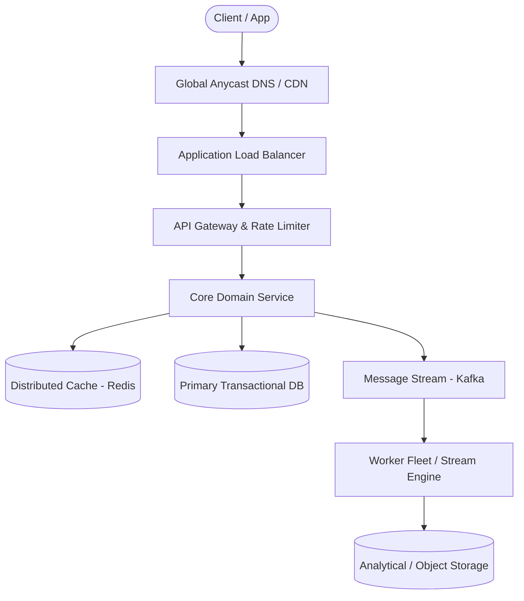

# Page 06: Distributed Rate Limiter

> **Page Index**: Page 06 of 32  
> **System Domain**: API Gateway & Security  
> **Industry Analogs**: Cloudflare, Kong, Envoy  
> **Interview Difficulty**: Medium  
> **Core Architectural Patterns**: Rate Limiter, Dealing with Contention, Consistent Hashing  

---

## 1. Problem Overview & Architectural Scoping

### Problem Summary
Designing **Distributed Rate Limiter** requires architecting a production-grade distributed solution in the **API Gateway & Security** space. The system must support massive scale while balancing latency budgets, throughput requirements, data consistency, and system durability.

### Primary Technical Challenges
- **Throughput & Concurrency**: Handling high-volume traffic bursts, contention on hot resources, and partition skew without service degradation.
- **Consistency vs Availability**: Choosing the appropriate consistency model across distributed components (ACID transactions vs eventual consistency).
- **Resilience & Fault Tolerance**: Isolating failure domains, avoiding cascading collapses, and ensuring graceful degradation under partial system outages.

## 2. Requirements Specification

### Functional Requirements
For this breakdown, we'll design a request-level rate limiter for a social media platform's API. This means we're limiting individual HTTP requests (like posting tweets, fetching timelines, or uploading photos) rather than higher-level actions or business operations. We'll focus on a server-side implementation that controls traffic and protects our systems. While client-side rate limiting has value as a complementary approach (which we'll discuss later), server-side rate limiting is essential for security and system protection since clients can't be trusted to self-regulate.
Core Requirements
- The system should identify clients by user ID, IP address, or API key to apply appropriate limits.
- The system should limit HTTP requests based on configurable rules (e.g., 100 API requests per minute per user).
- When limits are exceeded, the system should reject requests with HTTP 429 and include helpful headers (rate limit remaining, reset time).
Below the line (out of scope)
- Complex querying or analytics on rate limit data
- Long-term persistence of rate limiting data
FIRST QUESTION
What are the non-functional requirements?
Try it yourself first
We recommend you to practice the question yourself first to get instant personalized feedback as you go.

### Non-Functional Requirements & Performance SLOs
At this point, you should ask your interviewer about scale expectations. Are we building this for a startup API with thousands of requests per day, or for a major platform handling millions of requests per second? The scale will completely change our design choices.
We'll assume we're designing for a substantial but realistic load: 1 million requests per second across 100 million daily active users.
Core Requirements
- The system should introduce minimal latency overhead (< 10ms per request check).
- The system should be highly available. Eventual consistency is ok as slight delays in limit enforcement across nodes are acceptable.
- The system should handle 1M requests/second across 100M daily active users.
Below the line (out of scope)
- Strong consistency guarantees across all nodes
Here is how this might look on the whiteboard in an interview:
Requirements

## 3. Quantitative Scale & Capacity Estimations

| Metric Dimension | Production Scale | Architectural Implication |
| :--- | :--- | :--- |
| **Daily Active Users (DAU)** | 50M - 200M users | Distributed identity verification, user sharding, session caches. |
| **Write Throughput** | 1,000 - 50,000 QPS peak | Asynchronous ingestion queues (Kafka), write-behind caching, batch persistence. |
| **Read Throughput** | 10,000 - 500,000 QPS peak | Multi-tier CDN caching, distributed Redis read clusters, read replicas. |
| **Storage Capacity (5 Years)** | 10 TB - 500 TB | Columnar analytics storage, cold data tiering to object storage (S3). |
| **Network Egress / Ingress** | 1 Gbps - 40 Gbps | Connection multiplexing, compression (gzip/zstd), CDN edge offload. |

## 4. Core Data Entities & Schema Design

While rate limiters might seem like simple infrastructure components, they actually involve several important entities that we need to model properly:
Rules: The rate limiting policies that define limits for different scenarios. Each rule specifies parameters like requests per time window, which clients it applies to, and what endpoints it covers. For example: "authenticated users get 1000 requests/hour" or "the search API allows 10 requests/minute per IP."
Clients: The entities being rate limited - this could be users (identified by user ID), IP addresses, API keys, or combinations thereof. Each client has associated rate limiting state that tracks their current usage against applicable rules.
Requests: The incoming API requests that need to be evaluated against rate limiting rules. Each request carries context like client identity, endpoint being accessed, and timestamp that determines which rules apply and how to track usage.
These entities work together: when a Request arrives, we identify the Client, look up applicable Rules, check current usage against those rules, and decide whether to allow or deny the request. The interaction between these entities powers our rate limiter.

## 5. API & System Interface Contract

A rate limiter is an infrastructure component that other services call to check if a request should be allowed. The interface is straightforward:
isRequestAllowed(clientId, ruleId) -> { passes: boolean, remaining: number, resetTime: timestamp }
This method takes a client identifier (user ID, IP address, or API key) and a rule identifier, then returns whether the request should be allowed based on current usage. It also provides information for response headers like X-RateLimit-Remaining and X-RateLimit-Reset.

## 6. High-Level Architecture & End-to-End Flow

### Execution Workflow
1. **Edge Ingestion**: Requests pass through Edge CDN and API Gateway for rate limiting and authentication.
2. **Fast-Path Caching**: High-frequency reads are resolved from the distributed Redis cache with sub-5ms latency.
3. **Asynchronous Decoupling**: High-velocity write events are published directly to Kafka message broker partitions.
4. **Background Processing**: Stream workers (Flink/Workers) consume events, update read-model projections, and persist to long-term storage.

## 7. Deep Dives, Bottlenecks & Architectural Tradeoffs

Up until this point we've designed a simple, single-node (meaning one Redis instance) rate limiter. But now we need to discuss how to scale it to handle 1M requests/second across 10M users while maintaining high availability and low latency.
For these distributed system challenges, you should try to lead the conversation toward deep dives that address your non-functional requirements. However, interviewers will likely jump in with probing questions, so be prepared to be flexible.
### 1) How do we scale to handle 1M requests/second?
Our current design has multiple API gateways talking to a single Redis instance. This works fine for smaller loads, but the math breaks down at our target scale of 1M requests/second. A typical Redis instance can handle around 100,000-200,000 operations per second depending on the operation complexity. Each one of our rate limit checks requires multiple Redis operations, at minimum an HMGET to fetch state and an HSET to update it. So our single Redis instance can realistically handle maybe 50,000-100,000 rate limit checks per second before becoming the bottleneck.
At 1M requests/second, we need to distribute the Redis load across multiple instances. But this isn't quite as simple as just spinning up more Redis servers because we need a way to partition the rate limiting data so each request knows which Redis instance to talk to.
Pattern: Scaling Writes
Rate limiters demonstrate classic scaling writes challenges with millions of counter updates per second. Each rate limit check requires atomic read-modify-write operations to update token buckets or request counters across distributed Redis shards.Learn This Pattern
The sharding strategy depends on our rate limiting rules. Remember we identified multiple client types earlier - user IDs for authenticated users, IP addresses for anonymous users, and API keys for developer access. We need to shard consistently so that all of a client's requests always hit the same Redis instance. If user "alice" sometimes hits Redis shard 1 and sometimes hits shard 2, her rate limiting state gets split and becomes useless.
We need a distribution algorithm like consistent hashing to solve this. For authenticated users, we hash their user ID to determine which Redis shard stores their rate limit data. For anonymous users, we hash their IP address. For API key requests, we hash the API key. This ensures each client's rate limiting state lives on exactly one shard, while distributing the load evenly across all shards.
Redis Sharding
Each API gateway needs routing logic to determine which Redis shard to query. When a request arrives, the gateway extracts the appropriate identifier (user ID, IP, or API key), applies the distribution algorithm, and routes the rate limit check to the correct Redis instance. The Token Bucket algorithm remains exactly the same, we're just talking to different Redis instances instead of one.
With 10 Redis shards, each handling ~100k operations/second, we should be abl

## 8. Evaluation Rubric by Engineering Level

?
### Mid-level
A mid-level candidate will focus mostly on breadth (80% vs 20%) and should be able to craft a high-level design that meets the functional requirements, though many components will be abstractions you understand at a surface level. Your interviewer will spend time confirming you understand what each component does - if you mention Redis, expect them to ask how it works and why you chose it. You should drive the early stages like requirements gathering and basic algorithm selection, but don't expect to proactively spot all design flaws. For this question specifically, you should clearly explain one rate limiting algorithm (Token Bucket works fine), place the rate limiter sensibly in the architecture (API Gateway), identify Redis as the shared state solution, and when asked about scaling, recognize the need to shard Redis with a rough understanding of how that would work.
### Senior
As a senior candidate, expectations shift toward more technical depth (60% breadth, 40% depth) where you should confidently discuss trade-offs between different rate limiting algorithms and explain your choices. You should understand distributed systems concepts like consistent hashing, Redis Cluster, and connection pooling without much guidance, know that Redis operations need to be atomic, and suggest MULTI/EXEC transactions. You're expected to clearly explain trade-offs between fail-open vs fail-closed strategies, discuss pros and cons of different rate limiter placements, and proactively identify potential issues like hot keys, Redis availability concerns, and latency optimization opportunities. For rate limiting specifically, E5 candidates should move quickly through basic algorithm discussion to spend time on distributed systems challenges, confidently discuss Redis sharding strategies and failover scenarios, and have opinions about configuration management approaches.
### Staff+
Staff+ candidates should demonstrate deep understanding of distributed rate limiting in pr

## 9. ScaleLab Studio Simulation & Practice Pack Mapping

- **Recommended ScaleLab Palette Components**: `Client`, `Load balancer`, `API gateway`, `Service`, `Queue`, `Worker`, `Database`, `Cache`, `Circuit breaker`.
- **Simulation Load Test**: Configure a 'Spike' or 'Diurnal' traffic shape. Simulate worker crashes or database lock contention to observe queue backup and Little's Law latency spikes.
- **Practice Pack Readiness**: High priority candidate for addition to ScaleLab's guided practice suite with pinnable notes and runnable starter topologies.
