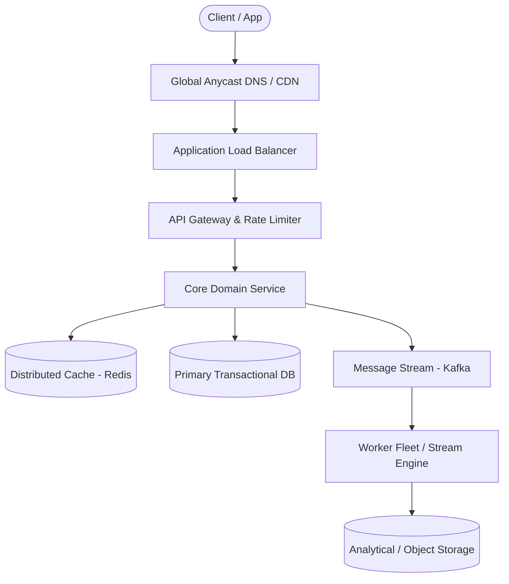

# Page 07: Cloud File Storage & Sync (Dropbox)

> **Page Index**: Page 07 of 32  
> **System Domain**: Distributed Storage & Synchronization  
> **Industry Analogs**: Dropbox, Google Drive, Box  
> **Interview Difficulty**: Hard  
> **Core Architectural Patterns**: Handling Large Blobs, Scaling Writes, Real-time Updates  

---

## 1. Problem Overview & Architectural Scoping

### Problem Summary
Designing **Cloud File Storage & Sync (Dropbox)** requires architecting a production-grade distributed solution in the **Distributed Storage & Synchronization** space. The system must support massive scale while balancing latency budgets, throughput requirements, data consistency, and system durability.

### Primary Technical Challenges
- **Throughput & Concurrency**: Handling high-volume traffic bursts, contention on hot resources, and partition skew without service degradation.
- **Consistency vs Availability**: Choosing the appropriate consistency model across distributed components (ACID transactions vs eventual consistency).
- **Resilience & Fault Tolerance**: Isolating failure domains, avoiding cascading collapses, and ensuring graceful degradation under partial system outages.

## 2. Requirements Specification

### Functional Requirements
Core Requirements
- Users should be able to upload a file from any device
- Users should be able to download a file from any device
- Users should be able to share a file with other users and view the files shared with them
- Users can automatically sync files across devices
Below the line (out of scope):
- Users should be able to edit files
- Users should be able to view files without downloading them
It's worth noting that there are related system design problems around designing Blob Storage itself. This is out of scope for this problem, but you may consider doing some research on your own to understand how Blob Storage works and how it's designed.
FIRST QUESTION
What are the non-functional requirements?
Try it yourself first
We recommend you to practice the question yourself first to get instant personalized feedback as you go.

### Non-Functional Requirements & Performance SLOs
Core Requirements
- The system should be highly available (prioritizing availability over consistency).
- The system should support files as large as 50GB.
- The system should be secure and reliable. We should be able to recover files if they are lost or corrupted.
- The system should make upload, download, and sync times as fast as possible (low latency).
Below the line (out of scope):
- The system should have a storage limit per user
- The system should support file versioning
- The system should scan files for viruses and malware
Here's how it might look on your whiteboard:
Non-Functional Requirements
Many candidates struggle with the CAP theorem trade-off for this question. Remember, you prioritize consistency over availability only if every read must receive the most recent write; otherwise, the system will break. For example, with a stock trading app, if a user buys a share of AAPL in Germany and then another user immediately tries to buy a share of AAPL in the US, you need to be sure that the first transaction has been replicated to the US before you can proceed. However, for a file storage system like Dropbox, it's okay if a user in Germany uploads a file and a user in the US can't see it for a few seconds.

## 3. Quantitative Scale & Capacity Estimations

| Metric Dimension | Production Scale | Architectural Implication |
| :--- | :--- | :--- |
| **Daily Active Users (DAU)** | 50M - 200M users | Distributed identity verification, user sharding, session caches. |
| **Write Throughput** | 1,000 - 50,000 QPS peak | Asynchronous ingestion queues (Kafka), write-behind caching, batch persistence. |
| **Read Throughput** | 10,000 - 500,000 QPS peak | Multi-tier CDN caching, distributed Redis read clusters, read replicas. |
| **Storage Capacity (5 Years)** | 10 TB - 500 TB | Columnar analytics storage, cold data tiering to object storage (S3). |
| **Network Egress / Ingress** | 1 Gbps - 40 Gbps | Connection multiplexing, compression (gzip/zstd), CDN edge offload. |

## 4. Core Data Entities & Schema Design

I like to start with a broad overview of the primary entities. At this stage, it is not necessary to know every specific column or detail. We will focus on these intricacies later when we have a clearer grasp of the system (during the high-level design). Initially, establishing these key entities will guide our thought process and lay a solid foundation as we progress towards defining the API.
For Dropbox, the primary entities are incredibly straightforward:
- File: This is the raw data that users will be uploading, downloading, and sharing.
- FileMetadata: This is the metadata associated with the file. It will include information like the file's name, size, mime type, and the user who uploaded it.
- User: The user of our system.
In the actual interview, this can be as simple as a short list like this. Just make sure you talk through the entities with your interviewer to ensure you are on the same page.
Defining the Core Entities
As you move onto the design, your objective is simple: create a system that meets all functional and non-functional requirements. To do this, I recommend you start by satisfying the functional requirements and then layer in the non-functional requirements afterward. This will help you stay focused and ensure you don't get lost in the weeds as you go.

## 5. API & System Interface Contract

The API is the primary interface that users will interact with. It's important to define the API early on, as it will guide your high-level design. We just need to define an endpoint for each of our functional requirements.
Starting with uploading a file, we might have an endpoint like this:
POST /files
Request:
{
File,
FileMetadata
}
To download a file, our endpoint can be:
GET /files/{fileId} -> File & FileMetadata
Be aware that your APIs may change or evolve as you progress. In this case, our upload and download APIs actually evolve significantly as we weigh the trade-offs of various approaches in our high-level design (more on this later). You can proactively communicate this to your interviewer by saying, "I am going to outline some simple APIs, but may come back and improve them as we delve deeper into the design."
To share a file, we might have an endpoint like this:
POST /files/{fileId}/share
Request:
{
User[] // The users to share the file with
}
Lastly, we need a way for clients to query for changes to files on the remote server. This way we know which files need to be synced to the local device.
GET /files/changes?since={timestamp} -> ChangeEvent[]
Each ChangeEvent includes the fileId, the type of change (created, updated, deleted), and the updated metadata. By passing a since timestamp, the client can efficiently fetch only the changes that have occurred since its last sync.
With each of these requests, the user information will be passed in the headers (either via session token or JWT). This is a common pattern for APIs and is a good way to ensure that the user is authenticated and authorized to perform the action while preserving security. You should avoid passing user information in the request body, as this can be easily manipulated by the client.

## 6. High-Level Architecture & End-to-End Flow

### Execution Workflow
1. **Edge Ingestion**: Requests pass through Edge CDN and API Gateway for rate limiting and authentication.
2. **Fast-Path Caching**: High-frequency reads are resolved from the distributed Redis cache with sub-5ms latency.
3. **Asynchronous Decoupling**: High-velocity write events are published directly to Kafka message broker partitions.
4. **Background Processing**: Stream workers (Flink/Workers) consume events, update read-model projections, and persist to long-term storage.

## 7. Deep Dives, Bottlenecks & Architectural Tradeoffs

### 1) How can you support large files?
The first thing you should consider when thinking about large files is the user experience. There are two key insights that should stick out and ultimately guide your design:
- Progress Indicator: Users should be able to see the progress of their upload so that they know it's working and how long it will take.
- Resumable Uploads: Users should be able to pause and resume uploads. If they lose their internet connection or close the browser, they should be able to pick up where they left off rather than re-uploading the 49GB that may have already been uploaded before the interruption.
This is, in some sense, the meat of the problem and where I usually end up spending the most time with candidates in a real interview.
Before we go deep on solutions, let's take a moment to acknowledge the limitations that come with uploading a large file via a single POST request.
- Timeouts: Web servers and clients typically have timeout settings to prevent indefinite waiting for a response. A single POST request for a 50GB file could easily exceed these timeouts. In fact, this may be an appropriate time to do some quick math in the interview. If we have a 50GB file and an internet connection of 100Mbps, how long will it take to upload the file? 50GB * 8 bits/byte / 100Mbps = 4000 seconds then 4000 seconds / 60 seconds/minute / 60 minutes/hour = 1.11 hours. That's a long time to wait without any response from the server.
- Browser and Server Limitation: In most cases, it's not even possible to upload a 50GB file via a single POST request due to limitations configured in the browser or on the server. Both browsers and web servers often impose limits on the size of a request payload. While raw web servers like Apache and NGINX can be configured to accept large payloads, most modern services like Amazon API Gateway have hard limits that are much lower and cannot be increased. This is just 10MB in the case of Amazon API Gateway which we are using in our design.
- Network Interruptions: Large files are more susceptible to network interruptions. If a user is uploading a 50GB file and their internet connection drops, they will have to start the upload from scratch.
- User Experience: Users are effectively blind to the progress of their upload. They have no idea how long it will take or if it's even working.
To address these limitations, we can use a technique called "chunking" to break the file into smaller pieces and upload them one at a time (or in parallel, depending on network bandwidth). Chunking needs to be done on the client so that the file can be broken into pieces before it is sent to the server (or S3 in our case). A very common mistake candidates make is to chunk the file on the server, which effectively defeats the purpose since you still upload the entire file at once to get it on the server in the first place. When we chunk, we typically break the file into 5-10 MB pieces, but this can be adjusted based on the network 

## 8. Evaluation Rubric by Engineering Level

?
Ok, that was a lot. You may be thinking, “how much of that is actually required from me in an interview?” Let’s break it down.
### Mid-level
Breadth vs. Depth: A mid-level candidate will be mostly focused on breadth (80% vs 20%). You should be able to craft a high-level design that meets the functional requirements you've defined, but many of the components will be abstractions with which you only have surface-level familiarity.
Probing the Basics: Your interviewer will spend some time probing the basics to confirm that you know what each component in your system does. For example, if you add an API Gateway, expect that they may ask you what it does and how it works (at a high level). In short, the interviewer is not taking anything for granted with respect to your knowledge.
Mixture of Driving and Taking the Backseat: You should drive the early stages of the interview in particular, but the interviewer doesn’t expect that you are able to proactively recognize problems in your design with high precision. Because of this, it’s reasonable that they will take over and drive the later stages of the interview while probing your design.
The Bar for Dropbox: For this question, an E4 candidate will have clearly defined the API endpoints and data model, landed on a high-level design that is functional for all of uploading, downloading, and sharing. I don't expect candidates to know about pre-signed URLs or uploading/downloading to/from S3 directly, or to immediately know about chunking. However, I expect that when I ask probing questions like, "You're uploading the file twice right now, how can we avoid that?" or "How can you show a user's progress while allowing them to resume an upload?" that they can reason through the problem and come to a solution via some back and forth.
### Senior
Depth of Expertise: As a senior candidate, expectations shift towards more in-depth knowledge — about 60% breadth and 40% depth. This means you should be able to go into technical details 

## 9. ScaleLab Studio Simulation & Practice Pack Mapping

- **Recommended ScaleLab Palette Components**: `Client`, `Load balancer`, `API gateway`, `Service`, `Queue`, `Worker`, `Database`, `Cache`, `Circuit breaker`.
- **Simulation Load Test**: Configure a 'Spike' or 'Diurnal' traffic shape. Simulate worker crashes or database lock contention to observe queue backup and Little's Law latency spikes.
- **Practice Pack Readiness**: High priority candidate for addition to ScaleLab's guided practice suite with pinnable notes and runnable starter topologies.
