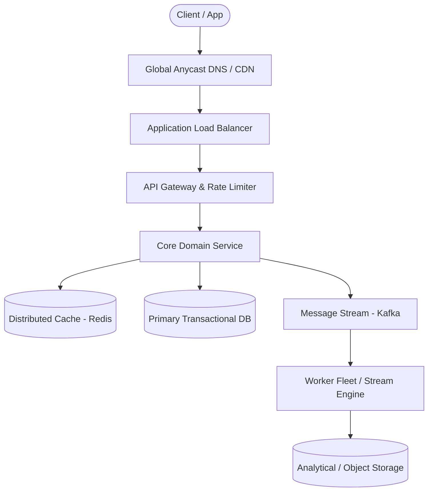

# Page 08: Live Stream Comments & Reactions

> **Page Index**: Page 08 of 32  
> **System Domain**: High-Velocity Real-Time Broadcasting  
> **Industry Analogs**: Facebook Live, Twitch, YouTube Live  
> **Interview Difficulty**: Hard  
> **Core Architectural Patterns**: Real-time Updates, Stream Processing, Scaling Reads  

---

## 1. Problem Overview & Architectural Scoping

### Problem Summary
Designing **Live Stream Comments & Reactions** requires architecting a production-grade distributed solution in the **High-Velocity Real-Time Broadcasting** space. The system must support massive scale while balancing latency budgets, throughput requirements, data consistency, and system durability.

### Primary Technical Challenges
- **Throughput & Concurrency**: Handling high-volume traffic bursts, contention on hot resources, and partition skew without service degradation.
- **Consistency vs Availability**: Choosing the appropriate consistency model across distributed components (ACID transactions vs eventual consistency).
- **Resilience & Fault Tolerance**: Isolating failure domains, avoiding cascading collapses, and ensuring graceful degradation under partial system outages.

## 2. Requirements Specification

### Functional Requirements
Core Requirements
- Viewers can post comments on a Live video feed.
- Viewers can see new comments being posted while they are watching the live video.
- Viewers can see comments made before they joined the live feed.
Below the line (out of scope):
- Viewers can reply to comments
- Viewers can react to comments
FIRST QUESTION
What are the non-functional requirements?
Try it yourself first
We recommend you to practice the question yourself first to get instant personalized feedback as you go.

### Non-Functional Requirements & Performance SLOs
Core Requirements
- The system should scale to support millions of concurrent videos and thousands of comments per second per live video.
- The system should prioritize availability over consistency, eventual consistency is fine.
- The system should have low latency, broadcasting comments to viewers in near-real time (< 200ms end-to-end latency under typical network conditions)
Below the line (out of scope):
- The system should be secure, ensuring that only authorized users can post comments.
- The system should enforce integrity constraints, ensuring that comments are appropriate (ie. not spam, hate speech, etc.)
🤩 Fun Fact!
Humans generally perceive interactions as real-time if they occur within 200 milliseconds. Any delay shorter than 200 milliseconds in a user interface is typically perceived as instantaneous so when developing real-time systems, this is the target latency to aim for.
🤩 Fun Fact!
The most popular Facebook Live video was called Chewbacca Mom which features a mom thoroughly enjoying a plastic, roaring Chewbacca mask. It has been viewed over 180 million times. Check it out here.
Here's how your requirements section might look on your whiteboard:
FB Live Comments Requirements

## 3. Quantitative Scale & Capacity Estimations

| Metric Dimension | Production Scale | Architectural Implication |
| :--- | :--- | :--- |
| **Daily Active Users (DAU)** | 50M - 200M users | Distributed identity verification, user sharding, session caches. |
| **Write Throughput** | 1,000 - 50,000 QPS peak | Asynchronous ingestion queues (Kafka), write-behind caching, batch persistence. |
| **Read Throughput** | 10,000 - 500,000 QPS peak | Multi-tier CDN caching, distributed Redis read clusters, read replicas. |
| **Storage Capacity (5 Years)** | 10 TB - 500 TB | Columnar analytics storage, cold data tiering to object storage (S3). |
| **Network Egress / Ingress** | 1 Gbps - 40 Gbps | Connection multiplexing, compression (gzip/zstd), CDN edge offload. |

## 4. Core Data Entities & Schema Design

I like to begin with a broad overview of the primary entities. Initially, establishing these key entities will guide our thought process and lay a solid foundation as we progress towards defining the API. Think of these as the "nouns" of the system.
Why just the entities and not the whole data model at this point? The reality is we're too early in the design and likely can't accurately enumerate all the columns/fields yet. Instead, we start by grasping the core entities and then build up the data model as we progress with the design.
For this particular problem, we only have three core entities:
- User: A user can be a viewer or a broadcaster.
- Live Video: The video that is being broadcasted by a user (this is owned and managed by a different team, but is relevant as we will need to integrate with it).
- Comment: The message posted by a user on a live video.
In your interview, this can be as simple as a bulleted list like:
FB Live Comments Core Entities
Now, let's carry on to outline the API, tackling each functional requirement in sequence. This step-by-step approach will help us maintain focus and manage scope effectively.

## 5. API & System Interface Contract

We'll need a simple POST endpoint to create a comment.
POST /comments/:liveVideoId
Header: JWT | SessionToken
{
"message": "Cool video!"
}
Note that the userId is not passed in the request body. Instead, it is a part of the request header, either by way of a session token or a JWT. This is a common pattern in modern web applications. The client is responsible for storing the session token or JWT and passing it in the request header. The server then validates the token and extracts the userId from it. This is a more secure approach than passing the userId in the request body because it prevents users from tampering with the request and impersonating other users.
We also need to be able to fetch past comments for a given live video.
GET /comments/:liveVideoId?cursor={last_comment_id}&pageSize=10&sort=desc
Pagination will be important for this endpoint. More on that later when we get deeper into the design.

## 6. High-Level Architecture & End-to-End Flow

### Execution Workflow
1. **Edge Ingestion**: Requests pass through Edge CDN and API Gateway for rate limiting and authentication.
2. **Fast-Path Caching**: High-frequency reads are resolved from the distributed Redis cache with sub-5ms latency.
3. **Asynchronous Decoupling**: High-velocity write events are published directly to Kafka message broker partitions.
4. **Background Processing**: Stream workers (Flink/Workers) consume events, update read-model projections, and persist to long-term storage.

## 7. Deep Dives, Bottlenecks & Architectural Tradeoffs

### 1) How can we ensure comments are broadcasted to viewers in real-time?
Our simple polling solution was a good start, but it's not going to pass the interview. Instead of having the client "guess" when new comments are ready and requesting them, we can use a push based model. This way the server can push new comments to the client as soon as they are created.
There are two main ways we can implement this. Websockets and Server Sent Events (SSE). Let's weigh the pros and cons of each.
Pattern: Real-time Updates
Facebook Live Comments showcases the real-time updates pattern at massive scale. Whether it's broadcasting comments via Server-Sent Events, distributing updates through pub/sub systems, or coordinating across multiple servers, the same principles apply to any system requiring instant data delivery, from collaborative editing to live dashboards to gaming platforms.Learn This Pattern
### Good Solution: Websockets
Approach
Websockets are a two-way communication channel between a client and a server. The client opens a connection to the server and keeps it open. The server keeps a connection open and sends new data to the client without requiring additional requests. When a new comment arrives, the Comment Management Server distributes it to all clients, enabling them to update the comment feed. This is much more efficient as it eliminates polling and enables the server to immediately push new comments to the client upon creation.Challenges
Websockets are a good solution, and for real-time chat applications that have a more balanced read/write ratio, they are optimal. However, for our use case, the read/write ratio is not balanced. Comment creation is a relatively infrequent event, so while most viewers will never post a comment, they will be viewing/reading all comments.
Because of this imbalance, it doesn't make sense to open a two-way communication channel for each viewer, given that the overhead of maintaining the connection is high.
Websockets
### Great Solution: Server Sent Events (SSE)
Approach
A better approach is to use Server Sent Events (SSE). SSE is a persistent connection that operates over standard HTTP, making it simpler to implement than WebSockets. The server can push data to the client in real-time, while client-to-server communication happens through regular HTTP requests.
This is a better solution given our read/write ratio imbalance. The infrequent comment creation can use standard HTTP POST requests, while the frequent reads benefit from SSE's efficient one-way streaming.Challenges
SSE introduces several infrastructure challenges that need careful consideration. Some proxies and load balancers lack support for streaming responses, leading to buffering issues that can be difficult to track down. Browsers also impose limits on concurrent SSE connections per domain, which creates problems for users trying to watch multiple live videos simultaneously. The long-lived nature of SSE connections complicates monitoring and debug

## 8. Evaluation Rubric by Engineering Level

?
Ok, that was a lot. You may be thinking, "how much of that is actually required from me in an interview?" Let's break it down.
### Mid-level
Breadth vs. Depth: A mid-level candidate will be mostly focused on breadth (80% vs 20%). You should be able to craft a high-level design that meets the functional requirements you've defined, but many of the components will be abstractions with which you only have surface-level familiarity.
Probing the Basics: Your interviewer will spend some time probing the basics to confirm that you know what each component in your system does. For example, if you add an API Gateway, expect that they may ask you what it does and how it works (at a high level). In short, the interviewer is not taking anything for granted with respect to your knowledge.
Mixture of Driving and Taking the Backseat: You should drive the early stages of the interview in particular, but the interviewer doesn't expect that you are able to proactively recognize problems in your design with high precision. Because of this, it's reasonable that they will take over and drive the later stages of the interview while probing your design.
The Bar for FB Live Comments: For this question, I expect that candidates proactively realize the limitations with a polling approach and start to reason around a push based model. With only minor hints they should be able to come up with the pub/sub solution and should be able to scale it with some help from the interviewer.
### Senior
Depth of Expertise: As a senior candidate, expectations shift towards more in-depth knowledge — about 60% breadth and 40% depth. This means you should be able to go into technical details in areas where you have hands-on experience. It's crucial that you demonstrate a deep understanding of key concepts and technologies relevant to the task at hand.
Advanced System Design: You should be familiar with advanced system design principles. For example, knowing how to use pub/sub for broadcasting messages. You'r

## 9. ScaleLab Studio Simulation & Practice Pack Mapping

- **Recommended ScaleLab Palette Components**: `Client`, `Load balancer`, `API gateway`, `Service`, `Queue`, `Worker`, `Database`, `Cache`, `Circuit breaker`.
- **Simulation Load Test**: Configure a 'Spike' or 'Diurnal' traffic shape. Simulate worker crashes or database lock contention to observe queue backup and Little's Law latency spikes.
- **Practice Pack Readiness**: High priority candidate for addition to ScaleLab's guided practice suite with pinnable notes and runnable starter topologies.
