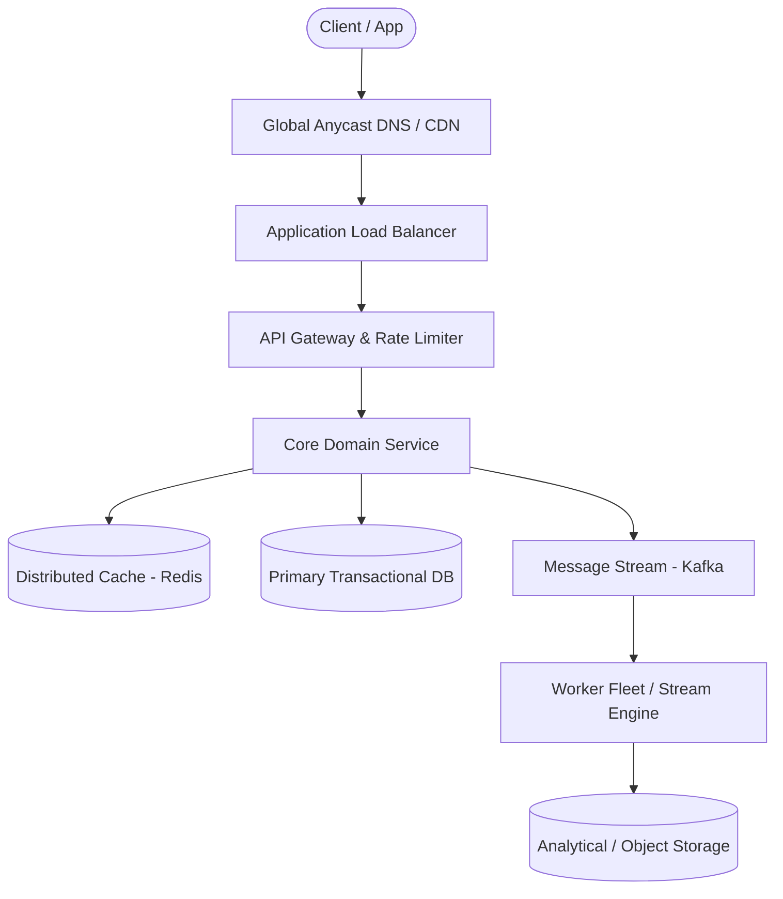

# Page 09: Social News Feed (Facebook)

> **Page Index**: Page 09 of 32  
> **System Domain**: Social Graph Fan-out & Feed Ranking  
> **Industry Analogs**: Facebook, Twitter / X, LinkedIn  
> **Interview Difficulty**: Medium  
> **Core Architectural Patterns**: Scaling Reads, Scaling Writes, Caching  

---

## 1. Problem Overview & Architectural Scoping

### Problem Summary
Designing **Social News Feed (Facebook)** requires architecting a production-grade distributed solution in the **Social Graph Fan-out & Feed Ranking** space. The system must support massive scale while balancing latency budgets, throughput requirements, data consistency, and system durability.

### Primary Technical Challenges
- **Throughput & Concurrency**: Handling high-volume traffic bursts, contention on hot resources, and partition skew without service degradation.
- **Consistency vs Availability**: Choosing the appropriate consistency model across distributed components (ACID transactions vs eventual consistency).
- **Resilience & Fault Tolerance**: Isolating failure domains, avoiding cascading collapses, and ensuring graceful degradation under partial system outages.

## 2. Requirements Specification

### Functional Requirements
Core Requirements
- Users should be able to create posts.
- Users should be able to friend/follow people.
- Users should be able to view a feed of posts from people they follow, in reverse chronological order (newest first).
- Users should be able to page through their feed.
Below the line (out of scope):
- Users should be able to like and comment on posts.
- Posts can be private or have restricted visibility.
For the sake of this problem (and most system design problems for what it's worth), we can assume that users are already authenticated and that we have their user ID stored in the session or JWT.
FIRST QUESTION
What are the non-functional requirements for this system?
Try it yourself first
We recommend you to practice the question yourself first to get instant personalized feedback as you go.

### Non-Functional Requirements & Performance SLOs
Core Requirements
- The system should be highly available (prioritizing availability over consistency). We'll tolerate up to 1 minute of post staleness (eventual consistency).
- Posting and viewing the feed should be fast, returning in < 500ms.
- The system should be able to handle a massive number of users (2B).
- Users should be able to follow an unlimited number of users, users should be able to be followed by an unlimited number of users.
Having quantities on your non-functional requirements will help you make decisions during your design. A system which is single-digit millisecond fast requires a dramatically different architecture than a "fast" system which can take a second to respond.
Here's how it might look on your whiteboard:
Facebook News Feed Requirements

## 3. Quantitative Scale & Capacity Estimations

| Metric Dimension | Production Scale | Architectural Implication |
| :--- | :--- | :--- |
| **Daily Active Users (DAU)** | 50M - 200M users | Distributed identity verification, user sharding, session caches. |
| **Write Throughput** | 1,000 - 50,000 QPS peak | Asynchronous ingestion queues (Kafka), write-behind caching, batch persistence. |
| **Read Throughput** | 10,000 - 500,000 QPS peak | Multi-tier CDN caching, distributed Redis read clusters, read replicas. |
| **Storage Capacity (5 Years)** | 10 TB - 500 TB | Columnar analytics storage, cold data tiering to object storage (S3). |
| **Network Egress / Ingress** | 1 Gbps - 40 Gbps | Connection multiplexing, compression (gzip/zstd), CDN edge offload. |

## 4. Core Data Entities & Schema Design

Starting with core entities gives us a set of terms to use through the rest of the interview. This also helps us to understand the data model we'll need to support the functional requirements later.
For the News Feed, the primary entities are easy. We'll make an explicit entity for the link between users:
- User: A user in our system.
- Follow: A uni-directional link between users in our system.
- Post: A post made by a user in our system. Posts can be made by any user, and are shown in the feed of users who follow the poster.
In the actual interview, this can be as simple as a short list like this. Just make sure you talk through the entities with your interviewer to ensure you are on the same page.
Core Entities

## 5. API & System Interface Contract

The API is the primary interface that users will interact with. It's important to define the API early on, as it will guide your high-level design. We can build our API by defining the endpoints necessary for each of our functional requirements.
For our first requirement, we need to create posts:
POST /posts
{
"content": { }
}
// -> 200 OK
{
"postId": // ...
}
We'll leave the content empty to account for rich content or other structured data we might want to include in the post. For authentication, we'll tell our interviewer that authentication tokens are included in the header of the request and avoid going into too much detail there unless requested.
Moving on, we need to be able to follow people. Let's use a simple RESTFUL PUT endpoint for this. The authenticated user (from their JWT) is the one doing the following, and [id] is the user they want to follow.
PUT /users/[id]/follow
{ }
// -> 200 OK
Here the follow action is binary. By using PUT we can ensure it is idempotent so it doesn't fail if the user clicks follow twice. Unfollowing (out of scope) would be accomplished with a DELETE. We don't need a body but we'll include a stub just in case and keep moving.
Our last requirement is to be able to view our feed and page through it.
GET /feed?pageSize={size}&cursor={timestamp?}
{
items: Post[],
nextCursor: string
}
This can be a simple GET request. We've included some parameters to allow the user to page through their feed. Since our requirements are to return posts in reverse chronological order, when users page through their feed they'll be looking at older posts. We'll use a timestamp as a "cursor" to represent the oldest post they've seen so far, so each page will return N posts older than that timestamp.
We'll avoid diving into the structure of Posts for the moment to give ourselves time for the juicier parts of the interview.
Especially for more senior candidates, it's important to focus your efforts on the "interesting" aspects of the interview. Spending t

## 6. High-Level Architecture & End-to-End Flow

### Execution Workflow
1. **Edge Ingestion**: Requests pass through Edge CDN and API Gateway for rate limiting and authentication.
2. **Fast-Path Caching**: High-frequency reads are resolved from the distributed Redis cache with sub-5ms latency.
3. **Asynchronous Decoupling**: High-velocity write events are published directly to Kafka message broker partitions.
4. **Background Processing**: Stream workers (Flink/Workers) consume events, update read-model projections, and persist to long-term storage.

## 7. Deep Dives, Bottlenecks & Architectural Tradeoffs

### 1) How do we handle users who are following a large number of users?
First, if a user is following a large number of users, the queries to the Follow table will take a while to return. Once we get each of the people they're following, we'll be making a large number of queries to the Post table to build their feed. This is called fan-out on read — a single read request fans out to create many more requests. Especially when latency is a concern, fan-out on read can be a real problem, so it makes for a good discussion point in system design interviews.
It's not uncommon to generate 10s to 100s of requests to satisfy an incoming request, but it is rarer to have to generate 1000's of requests, especially for a service that needs to serve users with low latency.
So what can we do instead? Your instinct here should be to think about ways that we can compute the feed results on write or post creation rather than at the time we want to read their feed. This is called fan-out on write — instead of assembling the feed when a user asks for it, we precompute feeds when posts are created. And in fact this is a good line of thinking!
While this particular question begs the question of how to handle a large number of follows, a sensible question for your interviewer might be "can we adjust the product in these instances?" Facebook, for example, sets the max number of friends as 5,000. Setting a max number of follows, or having a slightly different experience for these users is a very common approach for production systems like this. Is your user with 100k follows really going to notice if their posts are appearing a couple minutes late?
For users following a large number of users we can keep a PrecomputedFeed table. Instead of querying the Follow and Post tables, we'll be able to pull from this precomputed table. Then, when a new post is created, we'll simply add to the relevant feeds.
Each entry in the PrecomputedFeed table is keyed by userId and its value is a list of post IDs in reverse chronological order, limited to a small number of posts (say 200 or so). We want each entry to be compact so we can minimize the amount of space we require. Since we only ever access this table by user ID, we don't need to deal with any secondary indexes.
People frequently wonder "what about if users page back 100 pages into {their feed, search results, etc}?" While this is a fair question, most systems will simply just not support this (try to go a few dozen pages deep into Google) because real users aren't doing this.
At the end of the day, this fixed 200 number here could be increased or decreased by how much it impacts those tail users and the relative tradeoff in cost. We can always fall back to our naive solution of querying the base Follow and Post tables if we need to get more content for users who have reached the end of their feed.
Adding a Feed Table
Let's quickly gut-check the storage required of this solution before we move on. Let's assume each postID is 10 b

## 8. Evaluation Rubric by Engineering Level

?
Ok, that was a lot. You may be thinking, “how much of that is actually required from me in an interview?” Let’s break it down.
### Mid-level
Breadth vs. Depth: A mid-level candidate will be mostly focused on breadth (80% vs 20%). You should be able to craft a high-level design that meets the functional requirements you've defined, but many of the components will be abstractions with which you only have surface-level familiarity.
Probing the Basics: Your interviewer will spend some time probing the basics to confirm that you know what each component in your system does. For example, if you add an API Gateway, expect that they may ask you what it does and how it works (at a high level). In short, the interviewer is not taking anything for granted with respect to your knowledge.
Mixture of Driving and Taking the Backseat: You should drive the early stages of the interview in particular, but the interviewer doesn’t expect that you are able to proactively recognize problems in your design with high precision. Because of this, it’s reasonable that they will take over and drive the later stages of the interview while probing your design.
The Bar for News Feed: For this question, an E4 candidate will have clearly defined the API endpoints and data model, and landed on a high-level design that is functional and meets the requirements. While they may have some of the "Good" solutions, they would not be expected to cover all the possible scaling edge cases in the Deep Dives.
### Senior
Depth of Expertise: As a senior candidate, expectations shift towards more in-depth knowledge — about 60% breadth and 40% depth. This means you should be able to go into technical details in areas where you have hands-on experience. It's crucial that you demonstrate a deep understanding of key concepts and technologies relevant to the task at hand.
Advanced System Design: You should be familiar with advanced system design principles. For example, knowing approaches for handling fan-out is esse

## 9. ScaleLab Studio Simulation & Practice Pack Mapping

- **Recommended ScaleLab Palette Components**: `Client`, `Load balancer`, `API gateway`, `Service`, `Queue`, `Worker`, `Database`, `Cache`, `Circuit breaker`.
- **Simulation Load Test**: Configure a 'Spike' or 'Diurnal' traffic shape. Simulate worker crashes or database lock contention to observe queue backup and Little's Law latency spikes.
- **Practice Pack Readiness**: High priority candidate for addition to ScaleLab's guided practice suite with pinnable notes and runnable starter topologies.
