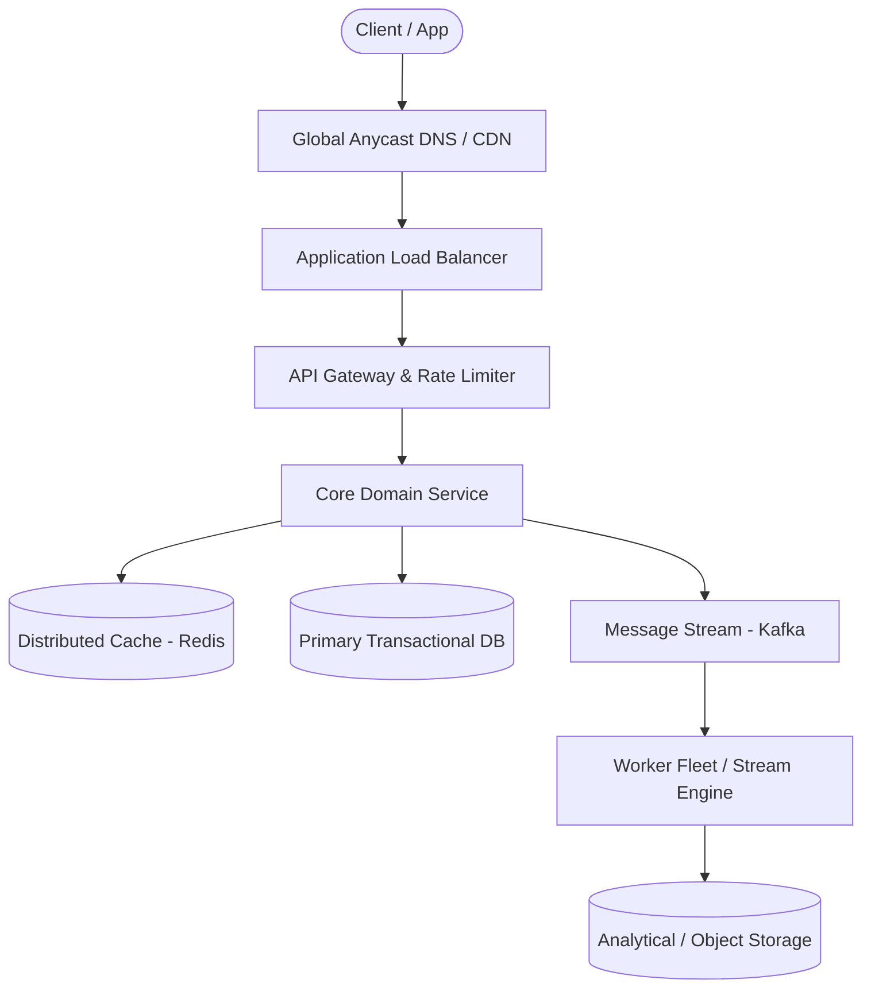

# Page 10: Social Post Search

> **Page Index**: Page 10 of 32  
> **System Domain**: Distributed Full-Text Inverted Indexing  
> **Industry Analogs**: Facebook Search, Twitter Search, Elasticsearch  
> **Interview Difficulty**: Hard  
> **Core Architectural Patterns**: Scaling Reads, Stream Processing, Consistent Hashing  

---

## 1. Problem Overview & Architectural Scoping

### Problem Summary
Designing **Social Post Search** requires architecting a production-grade distributed solution in the **Distributed Full-Text Inverted Indexing** space. The system must support massive scale while balancing latency budgets, throughput requirements, data consistency, and system durability.

### Primary Technical Challenges
- **Throughput & Concurrency**: Handling high-volume traffic bursts, contention on hot resources, and partition skew without service degradation.
- **Consistency vs Availability**: Choosing the appropriate consistency model across distributed components (ACID transactions vs eventual consistency).
- **Resilience & Fault Tolerance**: Isolating failure domains, avoiding cascading collapses, and ensuring graceful degradation under partial system outages.

## 2. Requirements Specification

### Functional Requirements
For our requirements, we not only want to get an idea of what the system will do but also what we don't need it to do. While explicitly enumerating out-of-scope requirements isn't necessary, asking detailed questions about what functionality might be included will help to make sure you avoid any last-minute surprises from your interviewer.
Core Requirements
- Users should be able to create and like posts.
- Users should be able to search posts by keyword.
- Users should be able to get search results sorted by recency or like count.
Below the line (out of scope)
- Support fuzzy matching on terms (e.g. search for "bird" matches "ostrich").
- Personalization in search results (i.e. the results depend on details of the user searching).
- Privacy rules and filters.
- Sophisticated relevance algorithms for ranking.
- Images and media.
- Realtime updates to the search page as new posts come in.
By de-scoping personalization, we dramatically simplify the problem and make caching much more effective. It's a good idea to ask if it's a firm requirement for the system!
FIRST QUESTION
What are the non-functional requirements of the system?
Try it yourself first
We recommend you to practice the question yourself first to get instant personalized feedback as you go.

### Non-Functional Requirements & Performance SLOs
In infrastructure-focused questions, non-functional requirements tend to take center stage as your interviewer is looking to see how you identify and solve bottlenecks. For this problem, we know we want search to be fast but we also need to think about how posts are created and made searchable.
Core Requirements
- The system must be fast, median queries should return in < 500ms.
- The system must support a high volume of requests (we'll estimate this later).
- New posts must be searchable in a short amount of time, < 1 minute.
- All posts must be discoverable, including old or unpopular posts. (we can take more time for these)
- The system should be highly available.
If you have a lot of data in your system, there's a good chance you'll have "hot" and "cold" data. Hot data is readily accessed and needs to be served quickly, often from memory. Cold data is infrequently accessed and can be served from disk, a remote database, or even tape.
In this case the non-functional requirement that we can take more time for old or unpopular posts is foreshadowing a potential design decision later in the interview.
Here's how these might be shorthanded in an interview. Note that out-of-scope requirements usually stem from questions like "do we need to handle privacy?". Interviewers are usually comfortable with you making assertions "I'm going to leave privacy out of scope for the start" and will correct you if needed.
Requirements
## Scale estimations
For this problem, it's obvious we're dealing with a large-scale system. What we need to know in order to make informed design decisions is a few parameters: how much data are we storing, how often are we writing to the system, and how frequently are we reading from it?
A common mistake here is to fixate on the search aspect of this problem and assume reads are the most important part. So let's do a bit of estimates to come up with ballpark numbers which will help us decipher the nature of the system we're designing.
We'll assume Fac

## 3. Quantitative Scale & Capacity Estimations

| Metric Dimension | Production Scale | Architectural Implication |
| :--- | :--- | :--- |
| **Daily Active Users (DAU)** | 50M - 200M users | Distributed identity verification, user sharding, session caches. |
| **Write Throughput** | 1,000 - 50,000 QPS peak | Asynchronous ingestion queues (Kafka), write-behind caching, batch persistence. |
| **Read Throughput** | 10,000 - 500,000 QPS peak | Multi-tier CDN caching, distributed Redis read clusters, read replicas. |
| **Storage Capacity (5 Years)** | 10 TB - 500 TB | Columnar analytics storage, cold data tiering to object storage (S3). |
| **Network Egress / Ingress** | 1 Gbps - 40 Gbps | Connection multiplexing, compression (gzip/zstd), CDN edge offload. |

## 4. Core Data Entities & Schema Design

We'll start by identifying the core entities we'll be working with. Fortunately, for this problem, the core entities are very simple:
- User: This entity creates posts.
- Post: This is the thing that we're searching! It has a content, is created by a user, and implicitly has a like count.
- Like: Likes are created when a user likes a post, but for this problem we mostly care about the count of likes.
We don't need to spend extra time here because the entities in this problem are purposefully simple, let's keep going.

## 5. API & System Interface Contract

Getting a handle on the APIs for our system is going to provide a scaffolding for the rest of our solution. Most of the time, our job is to make the connection between APIs and storage systems or dependencies, and this case is no different.
Our APIs are straightforward. We have two paths: a query path for searching and a write path for creating posts and likes.
In a real system we might be consuming from a Kafka stream or some other event bus for both of these events, but for clarity we'll create separate API endpoints for each and can let our interviewer know that we'd elect to merge these into the rest of the system as appropriate.
API
With these APIs defined, we can start to see the shape of our system. Writes come in via the two write endpoints and are written to a database. Queries come in via the search endpoint and read from the database. Good start!

## 6. High-Level Architecture & End-to-End Flow

### Execution Workflow
1. **Edge Ingestion**: Requests pass through Edge CDN and API Gateway for rate limiting and authentication.
2. **Fast-Path Caching**: High-frequency reads are resolved from the distributed Redis cache with sub-5ms latency.
3. **Asynchronous Decoupling**: High-velocity write events are published directly to Kafka message broker partitions.
4. **Background Processing**: Stream workers (Flink/Workers) consume events, update read-model projections, and persist to long-term storage.

## 7. Deep Dives, Bottlenecks & Architectural Tradeoffs

With the core functional requirements met, it's time to dig into the non-functional requirements and other optimizations via deep dives.
Ideally, you've identified potential scaling bottlenecks and issues up to this point. Those make excellent anchor points for your deep dives. You should prepare to be quizzed by your interviewer about various relevant aspects of the system, but some interviewers will expect you to spot your own deficiencies and resolve them.
### 1) How can we handle the large volume of requests from users?
Our in-memory reverse-index based system is quite fast, but we're going to be handling a lot of traffic. We had some convenient requirements earlier that might make our job even easier. Two requirements in particular:
- We do not have personalization, so if you and I are searching for the same thing with the same parameters, we should get the same results!
- We have up to 1 minute before a post needs to appear in the search results.
Caching sticks out here as the obvious tool for us! Any time we can tolerate stale data and we have duplicate requests coming through, we should consider whether caching is appropriate.
Pattern: Scaling Reads
Caching is a powerful tool to use for systems where we need to scale reads. Read our breakdown on this pattern for more strategies when you're designing a system for heavy read traffic.Learn This Pattern
### Good Solution: Use a distributed cache alongside our search service
Approach
One option for us is to add a distributed cache alongside our search service. This cache would be responsible for storing the most recent results for a given search query. When a search is performed, the service would first check the cache to see if the results are available. If they are, the service would return the results from the cache. If they are not, the service would perform a full search and store the results in the cache for future requests.
We'll want to put an eviction policy on our cache to ensure stale results don't stick around. Since we have up to 1 minute SLA on new posts, we can institute a TTL of < 1 minute on our cache. This will guarantee we're never serving results that might not contain newly created posts.
Search Cache
### Great Solution: Use a CDN to cache at the edge
Approach
In addition to the Redis search cache, we can also utilize edge caching via a Content Delivery Network (CDN) like Cloudflare or AWS Cloudfront. Most CDNs operate like a big set of geographically-spread HTTP caches. You configure an "origin" or target for the cache and configure DNS to route through the CDN. If the cache has the item the user is looking for, it can return it faster than almost any alternative option: most CDNs have locations very close to most users. If it doesn't hit the cache, the CDN will proxy the request back to your servers to handle.
Using the CDN here is simple: on the response to our /search endpoint, we can add cache-control headers which tell our CDN when and for how long to cache a result.

## 8. Evaluation Rubric by Engineering Level

?
There’s a lot of meat to this question! Your interviewer may even have you go deeper on specific sections. What might you expect in an actual assessment?
### Mid-Level
Breadth vs. Depth: A mid-level candidate will be mostly focused on breadth. As an approximation, you’ll show 80% breadth and 20% depth in your knowledge. You should be able to craft a high-level design that meets the functional requirements you've defined, but the optimality of your solution will be icing on top rather than the focus.
Probing the Basics: Your interviewer will spend some time probing the basics to confirm that you know what each component in your system does. For example, if you're using a cache, expect to be asked about your eviction policy. Your interviewer will not be taking anything for granted with respect to your knowledge.
Mixture of Driving and Taking the Backseat: You should drive the early stages of the interview in particular, but your interviewer won't expect that you are able to proactively recognize problems in your design with high precision. Because of this, it’s reasonable that they take over and drive the later stages of the interview while probing your design.
The Bar for Post Search: For this question, interviewers expect a mid-level candidate to have clearly defined the API endpoints and data model, and created both the sides of the system: ingestion and query. In instances where the candidate uses a “Bad” solution, the interviewer will expect a good discussion but not that the candidate immediately jumps to a great (or sometimes even good) solution.
### Senior
Depth of Expertise: As a senior candidate, your interviewer expects a shift towards more in-depth knowledge — about 60% breadth and 40% depth. This means you should be able to go into technical details in areas where you have hands-on experience.
Advanced System Design: You should be familiar with advanced system design principles. Certain aspects of this problem should jump out to experienced engineers (w

## 9. ScaleLab Studio Simulation & Practice Pack Mapping

- **Recommended ScaleLab Palette Components**: `Client`, `Load balancer`, `API gateway`, `Service`, `Queue`, `Worker`, `Database`, `Cache`, `Circuit breaker`.
- **Simulation Load Test**: Configure a 'Spike' or 'Diurnal' traffic shape. Simulate worker crashes or database lock contention to observe queue backup and Little's Law latency spikes.
- **Practice Pack Readiness**: High priority candidate for addition to ScaleLab's guided practice suite with pinnable notes and runnable starter topologies.
