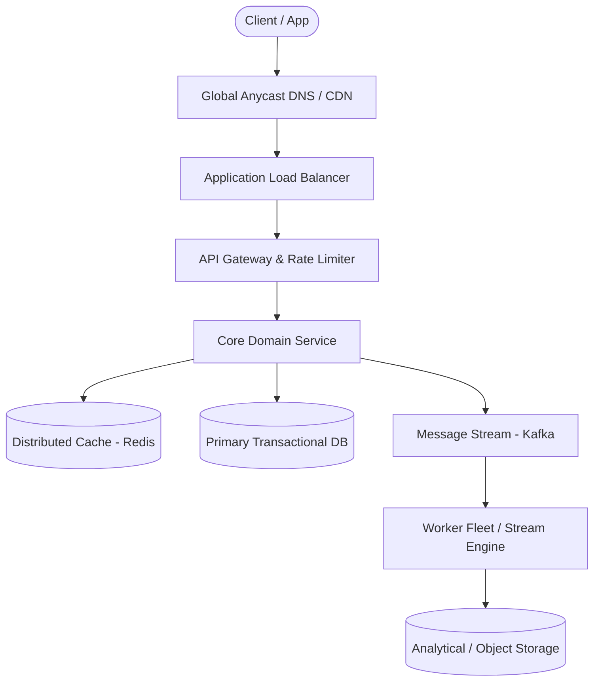

# Page 11: Flash Sale Inventory System

> **Page Index**: Page 11 of 32  
> **System Domain**: Extreme Contention & Concurrency Locking  
> **Industry Analogs**: Ticket drops, Black Friday, Sneaker drops  
> **Interview Difficulty**: Hard  
> **Core Architectural Patterns**: Dealing with Contention, Multi-step Processes, Rate Limiter  

---

## 1. Problem Overview & Architectural Scoping

### Problem Summary
Designing **Flash Sale Inventory System** requires architecting a production-grade distributed solution in the **Extreme Contention & Concurrency Locking** space. The system must support massive scale while balancing latency budgets, throughput requirements, data consistency, and system durability.

### Primary Technical Challenges
- **Throughput & Concurrency**: Handling high-volume traffic bursts, contention on hot resources, and partition skew without service degradation.
- **Consistency vs Availability**: Choosing the appropriate consistency model across distributed components (ACID transactions vs eventual consistency).
- **Resilience & Fault Tolerance**: Isolating failure domains, avoiding cascading collapses, and ensuring graceful degradation under partial system outages.

## 2. Requirements Specification

### Functional Requirements
Core Requirements
- Users can view the flash sale item.
- Users can secure/reserve an available unit for a limited time while the sale is active.
- Users who secure a unit can complete payment to purchase it.
The second requirement is the one candidates most often miss. It's tempting to go straight from viewing the product to buying it, but payment runs through a third party and takes seconds, and you can't hold inventory in an open database transaction that whole time. The reservation is what lets you take a unit off the table immediately and settle the money afterward. If you skip it, most interviewers will point you back toward it, though arriving there yourself is better than being led.
Below the line (out of scope):
- Users can browse or search a broader product catalog.
- Users can manage shipping, returns, refunds, or order history.
- Administrators can create, configure, or manage flash sales.
FIRST QUESTION
What are the non-functional requirements for this system?
Try it yourself first
We recommend you to practice the question yourself first to get instant personalized feedback as you go.

### Non-Functional Requirements & Performance SLOs
Unlike functional requirements, non-functional requirements describe the system qualities that matter to users. These are usually phrased as "the system should be able to..." statements.

## 3. Quantitative Scale & Capacity Estimations

| Metric Dimension | Production Scale | Architectural Implication |
| :--- | :--- | :--- |
| **Daily Active Users (DAU)** | 50M - 200M users | Distributed identity verification, user sharding, session caches. |
| **Write Throughput** | 1,000 - 50,000 QPS peak | Asynchronous ingestion queues (Kafka), write-behind caching, batch persistence. |
| **Read Throughput** | 10,000 - 500,000 QPS peak | Multi-tier CDN caching, distributed Redis read clusters, read replicas. |
| **Storage Capacity (5 Years)** | 10 TB - 500 TB | Columnar analytics storage, cold data tiering to object storage (S3). |
| **Network Egress / Ingress** | 1 Gbps - 40 Gbps | Connection multiplexing, compression (gzip/zstd), CDN edge offload. |

## 4. Core Data Entities & Schema Design

- **Primary Entity**: `id` (UUID PK), `owner_id` (UUID), `status` (ENUM), `created_at` (TIMESTAMP).
- **Transaction / Event Log**: `event_id` (UUID), `entity_id` (UUID FK), `payload` (JSONB), `timestamp` (BIGINT).
- **Aggregated / Materialized View**: `partition_key` (STRING), `window_start` (BIGINT), `counter` (BIGINT).

## 5. API & System Interface Contract

```http
POST /api/v1/resource
Headers:
  Authorization: Bearer <token>
  Idempotency-Key: <uuid>
Content-Type: application/json

{
  "action": "execute",
  "payload": {}
}

HTTP/1.1 200 OK
```

## 6. High-Level Architecture & End-to-End Flow



### Execution Workflow
1. **Edge Ingestion**: Requests pass through Edge CDN and API Gateway for rate limiting and authentication.
2. **Fast-Path Caching**: High-frequency reads are resolved from the distributed Redis cache with sub-5ms latency.
3. **Asynchronous Decoupling**: High-velocity write events are published directly to Kafka message broker partitions.
4. **Background Processing**: Stream workers (Flink/Workers) consume events, update read-model projections, and persist to long-term storage.

## 7. Deep Dives, Bottlenecks & Architectural Tradeoffs

### 1) How do we maintain consistency under extreme contention?
### 2) How do we efficiently release expired reservations?
### 3) How do we handle millions of users arriving at once?
### 4) How do we make access to limited inventory fair?
#

## 8. Evaluation Rubric by Engineering Level

?
### Mid-level
### Senior
### Staff+
### Purchase Premium to Keep Reading
Unlock this article and so much more with Hello Interview Premium
Buy Premium
Currently  up to 20% off
Hello Interview Premium
System Design Guided Practice
Exclusive content
Recent interview questions
Learn More
Reading Progress
On This Page
Understanding the Problem
Functional Requirements
Non-Functional Requirements
The Set Up
Planning the Approach
Defining the Core Entities
API or System Interface
High-Level Design
1) Users can view the flash sale item
2) Users can secure/reserve an available unit for a limited time while the sale is active
3) Users who secure a unit can complete payment to purchase it
Potential Deep Dives
1) How do we maintain consistency under extreme contention?
2) How do we efficiently release expired reservations?
3) How do we handle millions of users arriving at once?
4) How do we make access to limited inventory fair?
Final Design
What is Expected at Each Level?
Mid-level
Senior
Staff+
Questions
Meta SWE Interview QuestionsAmazon SWE Interview QuestionsGoogle SWE Interview QuestionsOpenAI SWE Interview QuestionsAnthropic SWE Interview QuestionsEngineering Manager (EM) Interview Questions
Learn
Learn System DesignLearn DSALearn BehavioralLearn ML System DesignLearn Low Level DesignGuided Practice
Links
FAQPricingGift PremiumHello Interview Premium
Legal
Terms and ConditionsPrivacy PolicySecurity
Contact
About UsProduct Support
7511 Greenwood Ave North
Unit #4238 Seattle
WA 98103
© 2026 Optick Labs Inc. All rights reserved.

## 9. ScaleLab Studio Simulation & Practice Pack Mapping

- **Recommended ScaleLab Palette Components**: `Client`, `Load balancer`, `API gateway`, `Service`, `Queue`, `Worker`, `Database`, `Cache`, `Circuit breaker`.
- **Simulation Load Test**: Configure a 'Spike' or 'Diurnal' traffic shape. Simulate worker crashes or database lock contention to observe queue backup and Little's Law latency spikes.
- **Practice Pack Readiness**: High priority candidate for addition to ScaleLab's guided practice suite with pinnable notes and runnable starter topologies.
