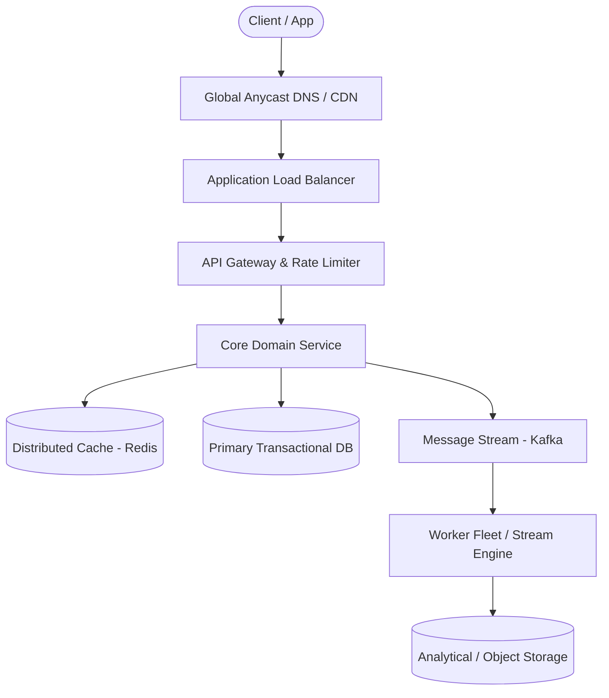

# Page 12: Collaborative Document Editor (Google Docs)

> **Page Index**: Page 12 of 32  
> **System Domain**: Real-Time Collaborative Editing  
> **Industry Analogs**: Google Docs, Figma, Notion  
> **Interview Difficulty**: Hard  
> **Core Architectural Patterns**: Real-time Updates, Dealing with Contention, Handling Large Blobs  

---

## 1. Problem Overview & Architectural Scoping

### Problem Summary
Designing **Collaborative Document Editor (Google Docs)** requires architecting a production-grade distributed solution in the **Real-Time Collaborative Editing** space. The system must support massive scale while balancing latency budgets, throughput requirements, data consistency, and system durability.

### Primary Technical Challenges
- **Throughput & Concurrency**: Handling high-volume traffic bursts, contention on hot resources, and partition skew without service degradation.
- **Consistency vs Availability**: Choosing the appropriate consistency model across distributed components (ACID transactions vs eventual consistency).
- **Resilience & Fault Tolerance**: Isolating failure domains, avoiding cascading collapses, and ensuring graceful degradation under partial system outages.

## 2. Requirements Specification

### Functional Requirements
Core Requirements
- Users should be able to create new documents.
- Multiple users should be able to edit the same document concurrently.
- Users should be able to view each other's changes in real-time.
- Users should be able to see the cursor position and presence of other users.
Below the line (out of scope)
- Sophisticated document structure. We'll assume a simple text editor.
- Permissions and collaboration levels (e.g. who has access to a document).
- Document history and versioning.
FIRST QUESTION
What are the non-functional requirements of the system?
Try it yourself first
We recommend you to practice the question yourself first to get instant personalized feedback as you go.

### Non-Functional Requirements & Performance SLOs
## Set Up
### Planning the Approach

## 3. Quantitative Scale & Capacity Estimations

| Metric Dimension | Production Scale | Architectural Implication |
| :--- | :--- | :--- |
| **Daily Active Users (DAU)** | 50M - 200M users | Distributed identity verification, user sharding, session caches. |
| **Write Throughput** | 1,000 - 50,000 QPS peak | Asynchronous ingestion queues (Kafka), write-behind caching, batch persistence. |
| **Read Throughput** | 10,000 - 500,000 QPS peak | Multi-tier CDN caching, distributed Redis read clusters, read replicas. |
| **Storage Capacity (5 Years)** | 10 TB - 500 TB | Columnar analytics storage, cold data tiering to object storage (S3). |
| **Network Egress / Ingress** | 1 Gbps - 40 Gbps | Connection multiplexing, compression (gzip/zstd), CDN edge offload. |

## 4. Core Data Entities & Schema Design

### Defining the API

## 5. API & System Interface Contract

```http
POST /api/v1/resource
Headers:
  Authorization: Bearer <token>
  Idempotency-Key: <uuid>
Content-Type: application/json

{
  "action": "execute",
  "payload": {}
}

HTTP/1.1 200 OK
```

## 6. High-Level Architecture & End-to-End Flow



### Execution Workflow
1. **Edge Ingestion**: Requests pass through Edge CDN and API Gateway for rate limiting and authentication.
2. **Fast-Path Caching**: High-frequency reads are resolved from the distributed Redis cache with sub-5ms latency.
3. **Asynchronous Decoupling**: High-velocity write events are published directly to Kafka message broker partitions.
4. **Background Processing**: Stream workers (Flink/Workers) consume events, update read-model projections, and persist to long-term storage.

## 7. Deep Dives, Bottlenecks & Architectural Tradeoffs

### 1) How do we scale to millions of websocket connections?
### 2) How do we keep storage under control?
#

## 8. Evaluation Rubric by Engineering Level

?
### Mid-level
### Senior
### Staff
## References
### Purchase Premium to Keep Reading
Unlock this article and so much more with Hello Interview Premium
Buy Premium
Currently  up to 20% off
Hello Interview Premium
System Design Guided Practice
Exclusive content
Recent interview questions
Learn More
Reading Progress
On This Page
Understanding the Problem
Functional Requirements
Non-Functional Requirements
Set Up
Planning the Approach
Defining the Core Entities
Defining the API
High-Level Design
1) Users should be able to create new documents.
2) Multiple users should be able to edit the same document concurrently.
3) Users should be able to view each other's changes in real-time.
4) Users should be able to see the cursor position and presence of other users.
Potential Deep Dives
1) How do we scale to millions of websocket connections?
2) How do we keep storage under control?
Final Design
Some additional deep dives you might consider
What is Expected at Each Level?
Mid-level
Senior
Staff
References
Questions
Meta SWE Interview QuestionsAmazon SWE Interview QuestionsGoogle SWE Interview QuestionsOpenAI SWE Interview QuestionsAnthropic SWE Interview QuestionsEngineering Manager (EM) Interview Questions
Learn
Learn System DesignLearn DSALearn BehavioralLearn ML System DesignLearn Low Level DesignGuided Practice
Links
FAQPricingGift PremiumHello Interview Premium
Legal
Terms and ConditionsPrivacy PolicySecurity
Contact
About UsProduct Support
7511 Greenwood Ave North
Unit #4238 Seattle
WA 98103
© 2026 Optick Labs Inc. All rights reserved.

## 9. ScaleLab Studio Simulation & Practice Pack Mapping

- **Recommended ScaleLab Palette Components**: `Client`, `Load balancer`, `API gateway`, `Service`, `Queue`, `Worker`, `Database`, `Cache`, `Circuit breaker`.
- **Simulation Load Test**: Configure a 'Spike' or 'Diurnal' traffic shape. Simulate worker crashes or database lock contention to observe queue backup and Little's Law latency spikes.
- **Practice Pack Readiness**: High priority candidate for addition to ScaleLab's guided practice suite with pinnable notes and runnable starter topologies.
