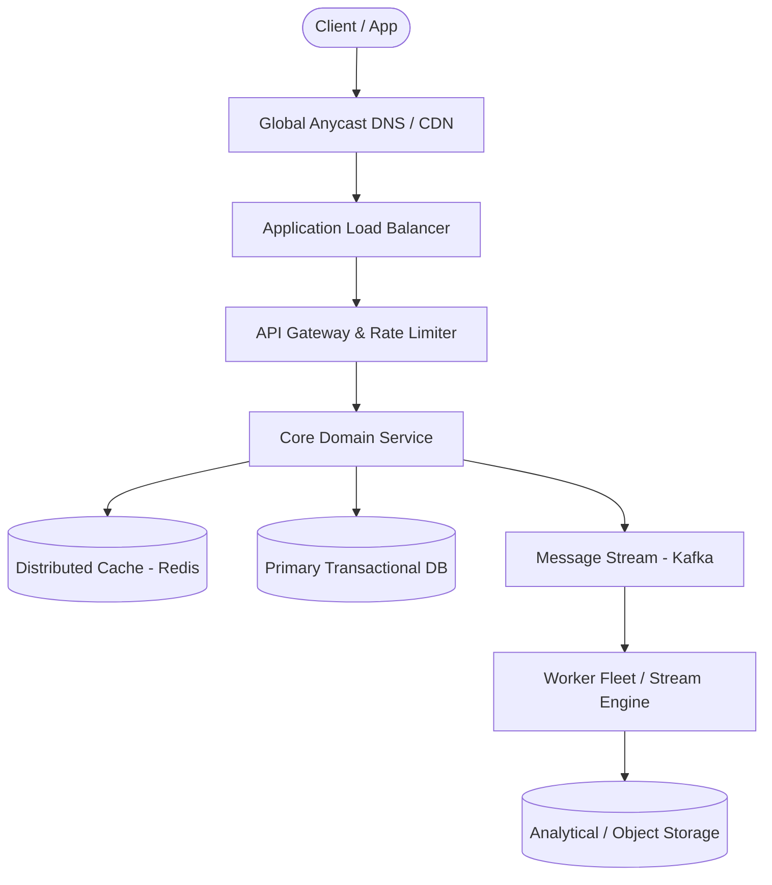

# Page 13: News Aggregator (Google News)

> **Page Index**: Page 13 of 32  
> **System Domain**: Web Ingestion, Deduplication & Clustering  
> **Industry Analogs**: Google News, Yahoo News, Apple News  
> **Interview Difficulty**: Medium  
> **Core Architectural Patterns**: Stream Processing, Scaling Reads, Handling Large Blobs  

---

## 1. Problem Overview & Architectural Scoping

### Problem Summary
Designing **News Aggregator (Google News)** requires architecting a production-grade distributed solution in the **Web Ingestion, Deduplication & Clustering** space. The system must support massive scale while balancing latency budgets, throughput requirements, data consistency, and system durability.

### Primary Technical Challenges
- **Throughput & Concurrency**: Handling high-volume traffic bursts, contention on hot resources, and partition skew without service degradation.
- **Consistency vs Availability**: Choosing the appropriate consistency model across distributed components (ACID transactions vs eventual consistency).
- **Resilience & Fault Tolerance**: Isolating failure domains, avoiding cascading collapses, and ensuring graceful degradation under partial system outages.

## 2. Requirements Specification

### Functional Requirements
Core Requirements
- Users should be able to view an aggregated feed of news articles from thousands of source publishers all over the world
- Users should be able to scroll through the feed "infinitely"
- Users should be able to click on articles and be redirected to the publisher's website to read the full content
Below the line (out of scope):
- Users should be able to customize their feed based on interests
- Users should be able to save articles for later reading
- Users should be able to share articles on social media platforms
FIRST QUESTION
What are the non-functional requirements?
Try it yourself first
We recommend you to practice the question yourself first to get instant personalized feedback as you go.

### Non-Functional Requirements & Performance SLOs
For a news platform, availability is prioritized over consistency, as users would prefer to see slightly outdated content rather than no content at all.

## 3. Quantitative Scale & Capacity Estimations

| Metric Dimension | Production Scale | Architectural Implication |
| :--- | :--- | :--- |
| **Daily Active Users (DAU)** | 50M - 200M users | Distributed identity verification, user sharding, session caches. |
| **Write Throughput** | 1,000 - 50,000 QPS peak | Asynchronous ingestion queues (Kafka), write-behind caching, batch persistence. |
| **Read Throughput** | 10,000 - 500,000 QPS peak | Multi-tier CDN caching, distributed Redis read clusters, read replicas. |
| **Storage Capacity (5 Years)** | 10 TB - 500 TB | Columnar analytics storage, cold data tiering to object storage (S3). |
| **Network Egress / Ingress** | 1 Gbps - 40 Gbps | Connection multiplexing, compression (gzip/zstd), CDN edge offload. |

## 4. Core Data Entities & Schema Design

- **Primary Entity**: `id` (UUID PK), `owner_id` (UUID), `status` (ENUM), `created_at` (TIMESTAMP).
- **Transaction / Event Log**: `event_id` (UUID), `entity_id` (UUID FK), `payload` (JSONB), `timestamp` (BIGINT).
- **Aggregated / Materialized View**: `partition_key` (STRING), `window_start` (BIGINT), `counter` (BIGINT).

## 5. API & System Interface Contract

```http
POST /api/v1/resource
Headers:
  Authorization: Bearer <token>
  Idempotency-Key: <uuid>
Content-Type: application/json

{
  "action": "execute",
  "payload": {}
}

HTTP/1.1 200 OK
```

## 6. High-Level Architecture & End-to-End Flow



### Execution Workflow
1. **Edge Ingestion**: Requests pass through Edge CDN and API Gateway for rate limiting and authentication.
2. **Fast-Path Caching**: High-frequency reads are resolved from the distributed Redis cache with sub-5ms latency.
3. **Asynchronous Decoupling**: High-velocity write events are published directly to Kafka message broker partitions.
4. **Background Processing**: Stream workers (Flink/Workers) consume events, update read-model projections, and persist to long-term storage.

## 7. Deep Dives, Bottlenecks & Architectural Tradeoffs

### 1) How can we improve pagination consistency and efficiency?
### 2) How do we achieve low latency (< 200ms) feed requests?
### 3) How do we ensure articles appear in feeds within 30 minutes of publication?
### 4) How do we handle media content (images/videos) efficiently?
### 5) How do we handle traffic spikes during breaking news?
## Bonus Deep Dives
### 6) How can we support category-based news feeds (Sports, Politics, Tech, etc.)?
### 7) How do we generate personalized feeds based on user reading behavior and preferences?
#

## 8. Evaluation Rubric by Engineering Level

| Level | Expected Demonstration |
| :--- | :--- |
| **Mid-Level (SDE II)** | Delivers a working baseline architecture, designs clean REST/WebSocket APIs, estimates scale, and configures basic caching and queuing. |
| **Senior (Senior SDE)** | Identifies single points of failure, mitigates hot-key bottlenecks, designs partition keys, details failure recovery, and justifies technology tradeoffs. |
| **Staff+ (Principal)** | Evaluates cross-datacenter replication, operational runbooks, brownout degradation modes, cost optimization, and organizational system boundaries. |

## 9. ScaleLab Studio Simulation & Practice Pack Mapping

- **Recommended ScaleLab Palette Components**: `Client`, `Load balancer`, `API gateway`, `Service`, `Queue`, `Worker`, `Database`, `Cache`, `Circuit breaker`.
- **Simulation Load Test**: Configure a 'Spike' or 'Diurnal' traffic shape. Simulate worker crashes or database lock contention to observe queue backup and Little's Law latency spikes.
- **Practice Pack Readiness**: High priority candidate for addition to ScaleLab's guided practice suite with pinnable notes and runnable starter topologies.
