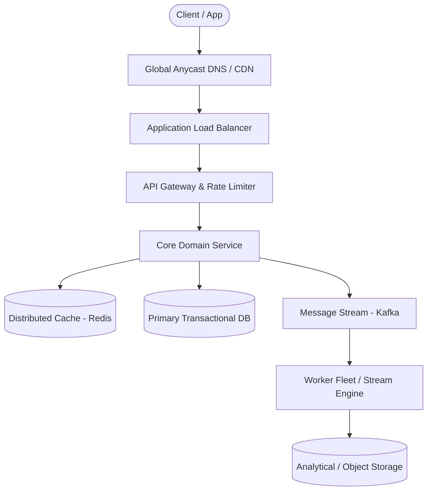

# Page 14: Local Delivery Service (Gopuff)

> **Page Index**: Page 14 of 32  
> **System Domain**: Dark Store Inventory & Route Optimization  
> **Industry Analogs**: Gopuff, DoorDash, Instacart  
> **Interview Difficulty**: Medium  
> **Core Architectural Patterns**: Dealing with Contention, Real-time Updates, Multi-step Processes  

---

## 1. Problem Overview & Architectural Scoping

### Problem Summary
Designing **Local Delivery Service (Gopuff)** requires architecting a production-grade distributed solution in the **Dark Store Inventory & Route Optimization** space. The system must support massive scale while balancing latency budgets, throughput requirements, data consistency, and system durability.

### Primary Technical Challenges
- **Throughput & Concurrency**: Handling high-volume traffic bursts, contention on hot resources, and partition skew without service degradation.
- **Consistency vs Availability**: Choosing the appropriate consistency model across distributed components (ACID transactions vs eventual consistency).
- **Resilience & Fault Tolerance**: Isolating failure domains, avoiding cascading collapses, and ensuring graceful degradation under partial system outages.

## 2. Requirements Specification

### Functional Requirements
We'll start by asking our interviewer about the extent of the functionality we need to build. Our goal for this section is to produce a concise set of functionalities that the system needs to support. In this case, we need to be able to query availability of items in our Distribution Centers (DCs) and place orders.
Core Requirements
- Customers should be able to query availability of items, deliverable in 1 hour, by location (i.e. the effective availability is the union of all inventory nearby DCs).
- Customers should be able to order multiple items at the same time.
Below the line (out of scope)
- Handling payments/purchases.
- Handling driver routing and deliveries.
- Search functionality and catalog APIs. (The system is strictly concerned with availability and ordering).
- Cancellations and returns.
For this problem, the emphasis is on aggregating availability of items across local distribution centers and allowing users to place orders without double booking. In other problems you may be more concerned with the product catalog, search functionality, etc.
FIRST QUESTION
What are the non-functional requirements of the system?
Try it yourself first
We recommend you to practice the question yourself first to get instant personalized feedback as you go.

### Non-Functional Requirements & Performance SLOs
Core Requirements
- Availability requests should be fast (<100ms) to support use-cases like search.
- Ordering should be strongly consistent: two customers should not be able to purchase the same physical product.
- System should be able to support 10k DCs and 100k items in the catalog across DCs.
- Order volume will be O(10m orders/day)
Below the line (out of scope)
- Privacy and security.
- Disaster recovery.
Here's how these might be shorthanded in an interview. Note that out-of-scope requirements usually stem from questions like "do we need to handle privacy?". Interviewers are usually comfortable with you making assertions "I'm going to leave privacy out of scope for the start" and will correct you if needed.
Requirements
## Set Up
### Planning the Approach
Before we go forward with designing the system, we'll think briefly through the approach we'll take.
For this problem, our requirements are fairly straightforward, so we'll take our default approach. We'll start by designing a system which simply supports our functional requirements without much concern for scale or our non-functional requirements. Then, in our deep-dives, we'll bring back those concerns one by one.
To do this we'll start by enumerating the "nouns" of our system, build out an API, and then start drawing our boxes.

## 3. Quantitative Scale & Capacity Estimations

| Metric Dimension | Production Scale | Architectural Implication |
| :--- | :--- | :--- |
| **Daily Active Users (DAU)** | 50M - 200M users | Distributed identity verification, user sharding, session caches. |
| **Write Throughput** | 1,000 - 50,000 QPS peak | Asynchronous ingestion queues (Kafka), write-behind caching, batch persistence. |
| **Read Throughput** | 10,000 - 500,000 QPS peak | Multi-tier CDN caching, distributed Redis read clusters, read replicas. |
| **Storage Capacity (5 Years)** | 10 TB - 500 TB | Columnar analytics storage, cold data tiering to object storage (S3). |
| **Network Egress / Ingress** | 1 Gbps - 40 Gbps | Connection multiplexing, compression (gzip/zstd), CDN edge offload. |

## 4. Core Data Entities & Schema Design

Core entities are the high level "nouns" for the system. We're not (yet) designing a full data model - for that, we'll need to have a better idea of how the system fits together overall. But by figuring out the entities we'll have the right blocks to build the rest of the system. Getting the right entities is particularly important for designing a good REST API as resources are the central anchor point for a REST API - which are very tightly related to our core entities.
Core Entities
One important thing to note for this problem is the distinction between Item and Inventory. You might think of this like the difference between a Class and an Instance in object-oriented programming. While our API consumers are strictly concerned with items that they might see in a catalog (e.g. Cheetos), we need to keep track of where the physical items are actually located. Our Inventory entity is a physical item at a specific location.
The remaining entities should be more obvious: we need DistributionCenter to keep up with where our inventory is physically located and and Order entity to keep track of the items being ordered.
- Inventory: A physical instance of an item, located at a DC. We'll sum up Inventory to determine the quantity available to a specific user for a specific Item.
- Item: A type of item, e.g. Cheetos. These are what our customers will actually care about.
- DistributionCenter: A physical location where items are stored. We'll use these to determine which items are available to a user. Inventory are stored in DCs.
- Order: A collection of Inventory which have been ordered by a user (and shipping/billing information).
Particularly in product design, outlining the identity of the entities in your system is important. By starting with the most concrete physical or business entities (e.g. items, users, etc.) and working your way up to more abstract entities (e.g. orders, carts, etc.) you can ensure that you don't miss any important entities.
### Defining the API
Next

## 5. API & System Interface Contract

```http
POST /api/v1/resource
Headers:
  Authorization: Bearer <token>
  Idempotency-Key: <uuid>
Content-Type: application/json

{
  "action": "execute",
  "payload": {}
}

HTTP/1.1 200 OK
```

## 6. High-Level Architecture & End-to-End Flow



### Execution Workflow
1. **Edge Ingestion**: Requests pass through Edge CDN and API Gateway for rate limiting and authentication.
2. **Fast-Path Caching**: High-frequency reads are resolved from the distributed Redis cache with sub-5ms latency.
3. **Asynchronous Decoupling**: High-velocity write events are published directly to Kafka message broker partitions.
4. **Background Processing**: Stream workers (Flink/Workers) consume events, update read-model projections, and persist to long-term storage.

## 7. Deep Dives, Bottlenecks & Architectural Tradeoffs

### 1) Make availability lookups incorporate traffic and drive time
So far our system is only determining nearby DCs based on a simple distance calculation. But if our DC is over a river, or a border, it may be close in miles but not close in drive time. Further, traffic might influence the travel times. Since our functional requirements mandate 1 hour of drive time, we'll need something more sophisticated. What can we do?
### Bad Solution: Simple SQL Distance
Approach
We can put all the lat/long of our DC into a table, then measure the distance to the user’s input with some simple math. A very basic version might use Euclidean distance while a more sophisticated example might use the Haversine formula to take into account the curvature of the Earth. Taking a simple threshold on this query would give us DCs within X as the crow flies.
Simple SQL DistanceChallenges
- This is a very simple approach which doesn’t take into account traffic, road conditions, etc. It also doesn’t take into account the fact that we might have multiple DCs in the same city.
### Bad Solution: Use a Travel Time Estimation Service Against all DCs
Approach
Since our DCs are rarely going to change (they're buildings!), we can sync periodically (like every 5 minutes) from a DC table to memory of our service. We can use a travel time estimation service to find the travel times from our input location to each of our DCs by iterating over all of them.
Travel Time Estimation ServiceChallenges
We're making far too many queries to the travel time estimation service. Most of the DCs we're querying aren't close enough to ever plausibly be delivered in 1 hour.
### Great Solution: Use a Travel Time Estimation Service Against Nearby DCs
We build on the previous solution to sync periodically (like every 5 minutes) from a DC table to memory of our service. When an input comes in, we can prune down the "candidate" DCs by taking a fixed radius (say 60 miles, the most optimistic distance we could drive over in 1 hour) and limiting ourselves to only evaluating those. We'll take these restricted candidates and then pass to the external travel time service to create our final estimate.
Travel Time Against Nearby DCs
### 2) Make availability lookups fast and scalable
Currently, once we have nearby DCs we use those DCs to look up availability directly from our database. This introduces a lot of load onto our database. Let's briefly detour into some estimates to figure out how much throughput we might expect.
Using quantitative estimation where you've spotted a potential bottleneck can significantly improve your interview performance. It gives you and your interviewer a common set of data from which to weigh tradeoffs and it shows you're able to make reasonable assumptions about the system.
To figure out how many queries for availability we might have, we'll back in from our orders/day requirement which we set at 10m orders per day. All-in, we might estimate that each user will look at 10 pages acr

## 8. Evaluation Rubric by Engineering Level

?
Your interviewer may even have you go deeper on specific sections, or ask follow-up questions. What might you expect in an actual assessment?
### Mid-Level
Breadth vs. Depth: A mid-level candidate will be mostly focused on breadth. As an approximation, you’ll show 80% breadth and 20% depth in your knowledge. You should be able to craft a high-level design that meets the functional requirements you've defined, but the optimality of your solution will be icing on top rather than the focus.
Probing the Basics: Your interviewer spend some time probing the basics to confirm that you know what each component in your system does. For example, if you use DynamoDB, expect to be asked about the indexes available to you. Your interviewer will not be taking anything for granted with respect to your knowledge.
Mixture of Driving and Taking the Backseat: You should drive the early stages of the interview in particular, but your interviewer won't necessarily expect that you are able to proactively recognize problems in your design with high precision. Because of this, it’s reasonable that they take over and drive the later stages of the interview while probing your design.
The Bar for GoPuff: For this question, interviewers expect a mid-level candidate to have clearly defined the API endpoints and data model, and created both routes: availability and orders. In instances where the candidate uses a “Bad” solution, the interviewer will expect a good discussion but not that the candidate immediately jumps to a great (or sometimes even good) solution.
### Senior
Depth of Expertise: As a senior candidate, your interviewer expects a shift towards more in-depth knowledge — about 60% breadth and 40% depth. This means you should be able to go into technical details in areas where you have hands-on experience.
Advanced System Design: You should be familiar with advanced system design principles. Certain aspects of this problem should jump out to experienced engineers (read volume, trivial

## 9. ScaleLab Studio Simulation & Practice Pack Mapping

- **Recommended ScaleLab Palette Components**: `Client`, `Load balancer`, `API gateway`, `Service`, `Queue`, `Worker`, `Database`, `Cache`, `Circuit breaker`.
- **Simulation Load Test**: Configure a 'Spike' or 'Diurnal' traffic shape. Simulate worker crashes or database lock contention to observe queue backup and Little's Law latency spikes.
- **Practice Pack Readiness**: High priority candidate for addition to ScaleLab's guided practice suite with pinnable notes and runnable starter topologies.
