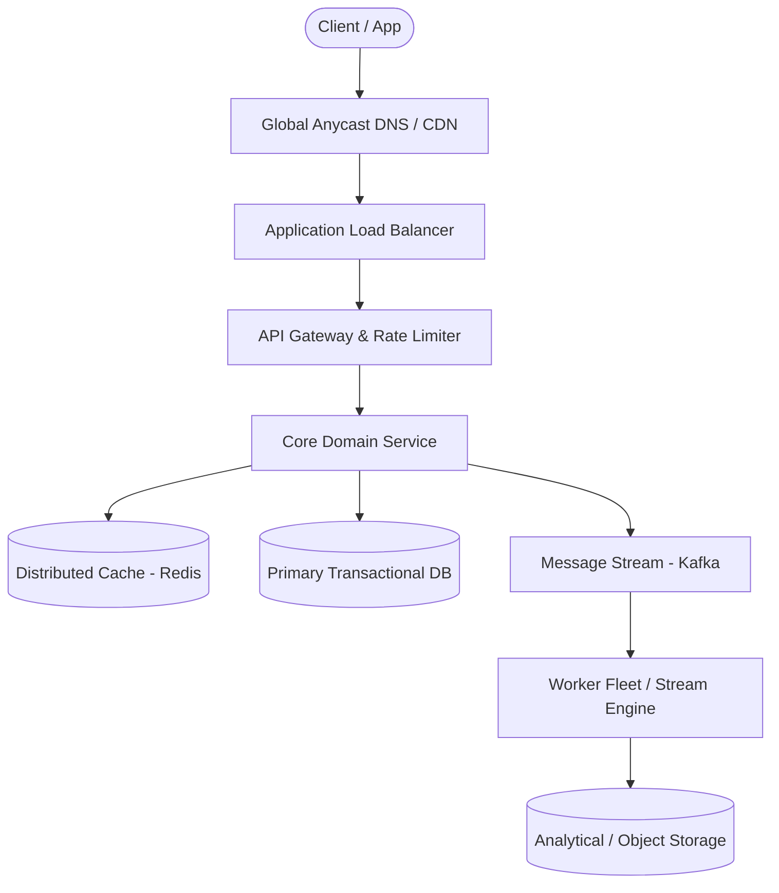

# Page 17: Online Code Judge (LeetCode)

> **Page Index**: Page 17 of 32  
> **System Domain**: Sandboxed Code Execution & Leaderboards  
> **Industry Analogs**: LeetCode, HackerRank, Codeforces  
> **Interview Difficulty**: Medium  
> **Core Architectural Patterns**: Managing Long Running Tasks, Rate Limiter, Caching  

---

## 1. Problem Overview & Architectural Scoping

### Problem Summary
Designing **Online Code Judge (LeetCode)** requires architecting a production-grade distributed solution in the **Sandboxed Code Execution & Leaderboards** space. The system must support massive scale while balancing latency budgets, throughput requirements, data consistency, and system durability.

### Primary Technical Challenges
- **Throughput & Concurrency**: Handling high-volume traffic bursts, contention on hot resources, and partition skew without service degradation.
- **Consistency vs Availability**: Choosing the appropriate consistency model across distributed components (ACID transactions vs eventual consistency).
- **Resilience & Fault Tolerance**: Isolating failure domains, avoiding cascading collapses, and ensuring graceful degradation under partial system outages.

## 2. Requirements Specification

### Functional Requirements
Core Requirements
- Users should be able to view a list of coding problems.
- Users should be able to view a given problem, code a solution in multiple languages.
- Users should be able to submit their solution and get instant feedback.
- Users should be able to view a live leaderboard for competitions.
Below the line (out of scope):
- User authentication
- User profiles
- Payment processing
- User analytics
- Social features
For the sake of this problem (and most system design problems for what it's worth), we can assume that users are already authenticated and that we have their user ID stored in the session or JWT.
FIRST QUESTION
What are the non-functional requirements of the system?
Try it yourself first
We recommend you to practice the question yourself first to get instant personalized feedback as you go.

### Non-Functional Requirements & Performance SLOs
Core Requirements
- The system should prioritize availability over consistency.
- The system should support isolation and security when running user code.
- The system should return submission results within 5 seconds.
- The system should scale to support competitions with 100,000 users.
Below the line (out of scope):
- The system should be fault-tolerant.
- The system should provide secure transactions for purchases.
- The system should be well-tested and easy to deploy (CI/CD pipelines).
- The system should have regular backups.
It's important to note that LeetCode only has a few hundred thousand users and roughly 4,000 problems. Relative to most system design interviews, this is a small-scale system. Keep this in mind as it will have a significant impact on our design.
Here's how it might look on your whiteboard:
Requirements
Adding features that are out of scope is a "nice to have". It shows product thinking and gives your interviewer a chance to help you reprioritize based on what they want to see in the interview. That said, it's very much a nice to have. If additional features are not coming to you quickly, don't waste your time and move on.

## 3. Quantitative Scale & Capacity Estimations

| Metric Dimension | Production Scale | Architectural Implication |
| :--- | :--- | :--- |
| **Daily Active Users (DAU)** | 50M - 200M users | Distributed identity verification, user sharding, session caches. |
| **Write Throughput** | 1,000 - 50,000 QPS peak | Asynchronous ingestion queues (Kafka), write-behind caching, batch persistence. |
| **Read Throughput** | 10,000 - 500,000 QPS peak | Multi-tier CDN caching, distributed Redis read clusters, read replicas. |
| **Storage Capacity (5 Years)** | 10 TB - 500 TB | Columnar analytics storage, cold data tiering to object storage (S3). |
| **Network Egress / Ingress** | 1 Gbps - 40 Gbps | Connection multiplexing, compression (gzip/zstd), CDN edge offload. |

## 4. Core Data Entities & Schema Design

I like to begin with a broad overview of the primary entities. At this stage, it is not necessary to know every specific column or detail. We will focus on the intricacies, such as columns and fields, later when we have a clearer grasp. Initially, establishing these key entities will guide our thought process and lay a solid foundation as we progress towards defining the API.
To satisfy our key functional requirements, we'll need the following entities:
- Problem: This entity will store the problem statement, test cases, and the expected output.
- Submission: This entity will store the user's code submission and the result of running the code against the test cases.
- Leaderboard: This entity will store the leaderboard for competitions.
In the actual interview, this can be as simple as a short list like this. Just make sure you talk through the entities with your interviewer to ensure you are on the same page. You can add User here too; many candidates do, but in general, I find this implied and not necessary to call out.
Entities
As you move onto the design, your objective is simple: create a system that meets all functional and non-functional requirements. To do this, I recommend you start by satisfying the functional requirements and then layer in the non-functional requirements afterward. This will help you stay focused and ensure you don't get lost in the weeds as you go.

## 5. API & System Interface Contract

When defining the API, we can usually just go one-by-one through our functional requirements and make sure that we have (at least) one endpoint to satisfy each requirement. This is a good way to ensure that we're not missing anything.
Starting with viewing a list of problems, we'll have a simple GET endpoint that returns a list. I've added some basic pagination as well since we have far more problems than should be returned in a single request or rendered on a single page.
GET /problems?page=1&limit=100 -> Partial<Problem>[]
The Partial here is taken from TypeScript and indicates that we're only returning a subset of the Problem entity. In reality, we only need the problem title, id, level, and maybe a tags or category field but no need to return the entire problem statement or code stubs here. How you short hand this is not important so long as you are clear with your interviewer.
Next, we'll need an endpoint to view a specific problem. This will be another GET endpoint that takes a problem ID (which we got when a user clicked on a problem from the problem list) and returns the full problem statement and code stub.
GET /problems/:id?language={language} -> Problem
We've added a query parameter for language which can default to any language, say python if not provided. This will allow us to return the code stub in the user's preferred language.
Then, we'll need an endpoint to submit a solution to a problem. This will be a POST endpoint that takes a problem ID and the user's code submission and returns the result of running the code against the test cases.
POST /problems/:id/submit -> Submission
{
code: string,
language: string
}
- userId not passed into the API, we can assume the user is authenticated and the userId is stored in the session
Finally, we'll need an endpoint to view a live leaderboard for competitions. This will be a GET endpoint that returns the ranked list of users based on their performance in the competition.
GET /leaderboard/:competitionId?page=1&l

## 6. High-Level Architecture & End-to-End Flow

### Execution Workflow
1. **Edge Ingestion**: Requests pass through Edge CDN and API Gateway for rate limiting and authentication.
2. **Fast-Path Caching**: High-frequency reads are resolved from the distributed Redis cache with sub-5ms latency.
3. **Asynchronous Decoupling**: High-velocity write events are published directly to Kafka message broker partitions.
4. **Background Processing**: Stream workers (Flink/Workers) consume events, update read-model projections, and persist to long-term storage.

## 7. Deep Dives, Bottlenecks & Architectural Tradeoffs

With the core functional requirements met, it's time to delve into the non-functional requirements through deep dives. Here are the key areas I like to cover for this question.
The extent to which a candidate should proactively lead the deep dives is determined by their seniority. For instance, in a mid-level interview, it is entirely reasonable for the interviewer to lead most of the deep dives. However, in senior and staff+ interviews, the expected level of initiative and responsibility from the candidate rises. They ought to proactively anticipate challenges and identify potential issues with their design, while suggesting solutions to resolve them.
### 1) How will the system support isolation and security when running user code?
By running our code in an isolated container, we've already taken a big step towards ensuring security and isolation. But there are a few things we'll want to include in our container setup to further enhance security:
- Read Only Filesystem: To prevent users from writing to the filesystem, we can mount the code directory as read-only and write any output to a temporary directory that is deleted a short time after completion.
- CPU and Memory Bounds: To prevent users from consuming excessive resources, we can set CPU and memory limits on the container. If these limits are exceeded, the container will be killed, preventing resource exhaustion.
- Explicit Timeout: To prevent users from running infinite loops, we can wrap the user's code in a timeout that kills the process if it runs for longer than a predefined time limit, say 5 seconds. This will also help us meet our requirement of returning submission results within 5 seconds.
- Limit Network Access: To prevent users from making network requests, we can disable network access in the container, ensuring that users can't make any external calls. If working within the AWS ecosystem, we can use Virtual Private Cloud (VPC) Security Groups and NACLs to restrict all outbound and inbound traffic except for predefined, essential connections.
- No System Calls (Seccomp): We don't want users to be able to make system calls that could compromise the host system. We can use seccomp to restrict the system calls that the container can make.
Note that in an interview you're likely not expected to go into a ton of detail on how you'd implement each of these security measures. Instead, focus on the high-level concepts and how they would help to secure the system. If your interviewer is interested in a particular area, they'll ask you to dive deeper. To be concrete, this means just saying, "We'd use docker containers while limiting network access, setting CPU and memory bounds, and enforcing a timeout on the code execution" is likely sufficient.
Security
### 2) How would you make fetching the leaderboard more efficient?
As we mentioned during our high-level design, our current approach is not going to cut it for fetching the leaderboard, it's far too inefficient. Let's take a look at s

## 8. Evaluation Rubric by Engineering Level

?
You may be thinking, “how much of that is actually required from me in an interview?” Let’s break it down.
### Mid-level
Breadth vs. Depth: A mid-level candidate will be mostly focused on breadth (80% vs 20%). You should be able to craft a high-level design that meets the functional requirements you've defined, but many of the components will be abstractions with which you only have surface-level familiarity.
Probing the Basics: Your interviewer will spend some time probing the basics to confirm that you know what each component in your system does. For example, if you add an API Gateway, expect that they may ask you what it does and how it works (at a high level). In short, the interviewer is not taking anything for granted with respect to your knowledge.
Mixture of Driving and Taking the Backseat: You should drive the early stages of the interview in particular, but the interviewer doesn’t expect that you are able to proactively recognize problems in your design with high precision. Because of this, it’s reasonable that they will take over and drive the later stages of the interview while probing your design.
The Bar for LeetCode: For this question, an IC4 candidate will have clearly defined the API endpoints and data model, landed on a high-level design that is functional and meets the requirements. They would have understood the need for security and isolation when running user code and ideally proposed either a container, VM, or serverless function approach.
### Senior
Depth of Expertise: As a senior candidate, expectations shift towards more in-depth knowledge — about 60% breadth and 40% depth. This means you should be able to go into technical details in areas where you have hands-on experience. It's crucial that you demonstrate a deep understanding of key concepts and technologies relevant to the task at hand.
Articulating Architectural Decisions: You should be able to clearly articulate the pros and cons of different architectural choices, especially how 

## 9. ScaleLab Studio Simulation & Practice Pack Mapping

- **Recommended ScaleLab Palette Components**: `Client`, `Load balancer`, `API gateway`, `Service`, `Queue`, `Worker`, `Database`, `Cache`, `Circuit breaker`.
- **Simulation Load Test**: Configure a 'Spike' or 'Diurnal' traffic shape. Simulate worker crashes or database lock contention to observe queue backup and Little's Law latency spikes.
- **Practice Pack Readiness**: High priority candidate for addition to ScaleLab's guided practice suite with pinnable notes and runnable starter topologies.
