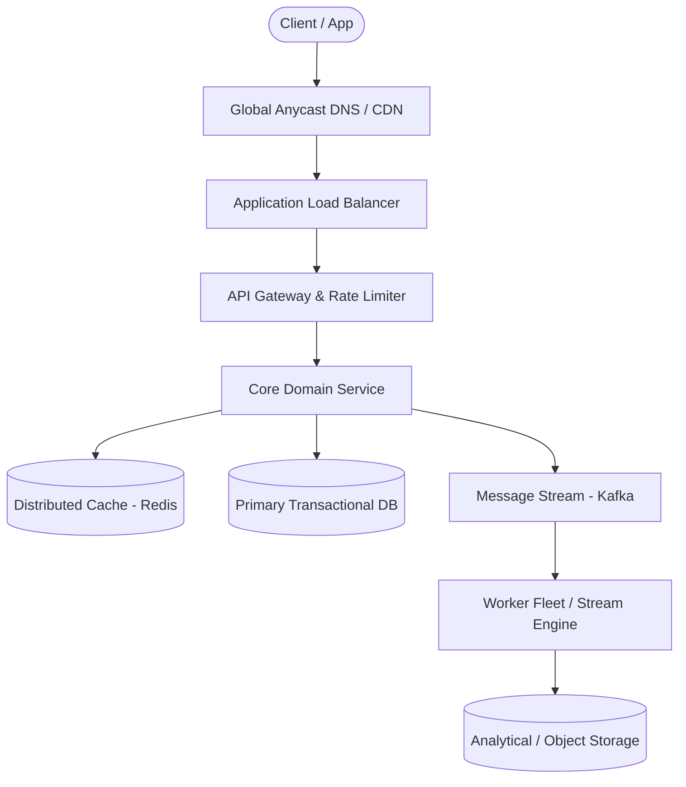

# Page 18: Metrics Monitoring Platform (Datadog)

> **Page Index**: Page 18 of 32  
> **System Domain**: High-Throughput Time-Series & Alerting  
> **Industry Analogs**: Datadog, Prometheus, Grafana  
> **Interview Difficulty**: Hard  
> **Core Architectural Patterns**: Time Series, Stream Processing, Scaling Writes  

---

## 1. Problem Overview & Architectural Scoping

### Problem Summary
Designing **Metrics Monitoring Platform (Datadog)** requires architecting a production-grade distributed solution in the **High-Throughput Time-Series & Alerting** space. The system must support massive scale while balancing latency budgets, throughput requirements, data consistency, and system durability.

### Primary Technical Challenges
- **Throughput & Concurrency**: Handling high-volume traffic bursts, contention on hot resources, and partition skew without service degradation.
- **Consistency vs Availability**: Choosing the appropriate consistency model across distributed components (ACID transactions vs eventual consistency).
- **Resilience & Fault Tolerance**: Isolating failure domains, avoiding cascading collapses, and ensuring graceful degradation under partial system outages.

## 2. Requirements Specification

### Functional Requirements
We'll start our discussion by trying to tease out from our interviewer what the system needs to be able to do. Even though a metrics monitoring system is simple at face-value (collect metrics, store them, query them, etc.) there's a lot of potential complexity here so we want to narrow things down.
Core Requirements
- The platform should be able to ingest metrics (CPU, memory, latency, custom counters) from services
- Users should be able to query and visualize metrics on dashboards with filters, aggregations, and time ranges
- Users should be able to define alert rules with thresholds over time windows (e.g., "alert if p99 latency > 500ms for 5 minutes")
- Users should receive notifications when alerts fire (email, Slack, PagerDuty)
Below the line (out of scope):
- Log aggregation and full-text search (separate concern)
- Distributed tracing (spans, traces)
- Anomaly detection via ML
FIRST QUESTION
What are the non-functional requirements?
Try it yourself first
We recommend you to practice the question yourself first to get instant personalized feedback as you go.

### Non-Functional Requirements & Performance SLOs
Metrics monitoring systems can range from a single team's services to a fleet of hundreds of thousands of servers. Getting a sense of the scale of the system is important because it will influence a bunch of the decisions we need to make.
We might ask our interviewer or they might tell us "we need to design for monitoring 500k servers". That's a big fleet. If each server emits 100 metric data points every 10 seconds, that's 5 million metrics per second at peak. Each data point is small (timestamp, value, labels) at roughly 100-200 bytes, but at that volume we're looking at 1GB per second of raw ingestion. That's the crux of the problem.
Core Requirements
- The system should scale to ingest 5M metrics per second from 500k servers
- Dashboard queries should return within seconds, even for queries spanning days or weeks
- Alerts should evaluate with low latency (< 1 minute from metric emission to alert firing)
- The system should be highly available. We can tolerate eventual consistency for dashboards, but alert evaluation should be reliable.
- The system should handle late or out-of-order data gracefully (network delays are common)
Below the line (out of scope):
- Multi-region replication (would add complexity)
- Strong consistency guarantees
Here's how your requirements section might look on your whiteboard:
Requirements
The requirement for alerts to fire in under a minute might seem slow to some readers. "Wouldn't we want to fire as soon as the event happens?" Yes and no. In most production systems, it's difficult to see an event until you've accumulated enough data. Oftentimes alerts are (sensibly) set on moving averages or trends over time.
When you do want to fire an alert as soon as possible, it often is constructed in a very particular way. Amazon detects order drops (their most important event!) by looking for breaches of the number of milliseconds since their last order. Since they have so many orders, this number is very stable and allows them to fire almost

## 3. Quantitative Scale & Capacity Estimations

| Metric Dimension | Production Scale | Architectural Implication |
| :--- | :--- | :--- |
| **Daily Active Users (DAU)** | 50M - 200M users | Distributed identity verification, user sharding, session caches. |
| **Write Throughput** | 1,000 - 50,000 QPS peak | Asynchronous ingestion queues (Kafka), write-behind caching, batch persistence. |
| **Read Throughput** | 10,000 - 500,000 QPS peak | Multi-tier CDN caching, distributed Redis read clusters, read replicas. |
| **Storage Capacity (5 Years)** | 10 TB - 500 TB | Columnar analytics storage, cold data tiering to object storage (S3). |
| **Network Egress / Ingress** | 1 Gbps - 40 Gbps | Connection multiplexing, compression (gzip/zstd), CDN edge offload. |

## 4. Core Data Entities & Schema Design

### Data Flow

## 5. API & System Interface Contract

```http
POST /api/v1/resource
Headers:
  Authorization: Bearer <token>
  Idempotency-Key: <uuid>
Content-Type: application/json

{
  "action": "execute",
  "payload": {}
}

HTTP/1.1 200 OK
```

## 6. High-Level Architecture & End-to-End Flow



### Execution Workflow
1. **Edge Ingestion**: Requests pass through Edge CDN and API Gateway for rate limiting and authentication.
2. **Fast-Path Caching**: High-frequency reads are resolved from the distributed Redis cache with sub-5ms latency.
3. **Asynchronous Decoupling**: High-velocity write events are published directly to Kafka message broker partitions.
4. **Background Processing**: Stream workers (Flink/Workers) consume events, update read-model projections, and persist to long-term storage.

## 7. Deep Dives, Bottlenecks & Architectural Tradeoffs

### 1) How do we serve low-latency dashboard queries over weeks of data?
### 2) How do we reduce alert latency below 1 minute?
### 3) How do we ensure high availability during spikes and failures?
### 4) How do we handle cardinality explosion?
#

## 8. Evaluation Rubric by Engineering Level

?
### Mid-level
### Senior
### Staff+
### Purchase Premium to Keep Reading
Unlock this article and so much more with Hello Interview Premium
Buy Premium
Want a structured way to prepare?The System Design Course puts lessons, quizzes, and full design exercises into a recommended sequence.View course
Reading Progress
On This Page
Understanding the Problem
Functional Requirements
Non-Functional Requirements
The Set Up
Planning the Approach
Defining the Core Entities
Data Flow
API or System Interface
High-Level Design
1) The platform can ingest metrics from services
2) Users can query and visualize metrics on dashboards
3) Users can define alert rules with thresholds
4) Users receive notifications when alerts fire
Potential Deep Dives
1) How do we serve low-latency dashboard queries over weeks of data?
2) How do we reduce alert latency below 1 minute?
3) How do we ensure high availability during spikes and failures?
4) How do we handle cardinality explosion?
Final Design
What is Expected at Each Level?
Mid-level
Senior
Staff+
Questions
Meta SWE Interview QuestionsAmazon SWE Interview QuestionsGoogle SWE Interview QuestionsOpenAI SWE Interview QuestionsAnthropic SWE Interview QuestionsEngineering Manager (EM) Interview Questions
Learn
Learn System DesignLearn DSALearn BehavioralLearn ML System DesignLearn Low Level DesignGuided Practice
Links
FAQPricingGift PremiumHello Interview Premium
Legal
Terms and ConditionsPrivacy PolicySecurity
Contact
About UsProduct Support
7511 Greenwood Ave North
Unit #4238 Seattle
WA 98103
© 2026 Optick Labs Inc. All rights reserved.

## 9. ScaleLab Studio Simulation & Practice Pack Mapping

- **Recommended ScaleLab Palette Components**: `Client`, `Load balancer`, `API gateway`, `Service`, `Queue`, `Worker`, `Database`, `Cache`, `Circuit breaker`.
- **Simulation Load Test**: Configure a 'Spike' or 'Diurnal' traffic shape. Simulate worker crashes or database lock contention to observe queue backup and Little's Law latency spikes.
- **Practice Pack Readiness**: High priority candidate for addition to ScaleLab's guided practice suite with pinnable notes and runnable starter topologies.
