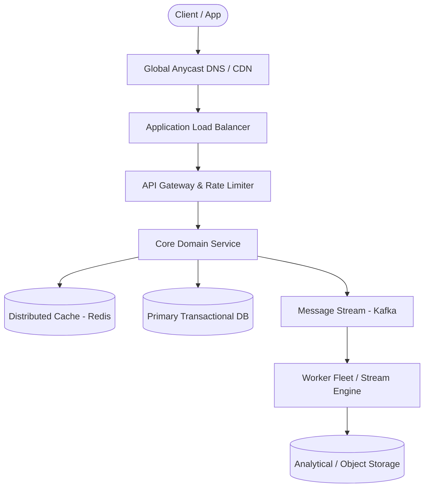

# Page 19: Distributed Notification System

> **Page Index**: Page 19 of 32  
> **System Domain**: Multi-Channel Delivery & Rate Limiting  
> **Industry Analogs**: AWS SNS, Twilio, OneSignal  
> **Interview Difficulty**: Medium  
> **Core Architectural Patterns**: Multi-step Processes, Rate Limiter, Managing Long Running Tasks  

---

## 1. Problem Overview & Architectural Scoping

### Problem Summary
Designing **Distributed Notification System** requires architecting a production-grade distributed solution in the **Multi-Channel Delivery & Rate Limiting** space. The system must support massive scale while balancing latency budgets, throughput requirements, data consistency, and system durability.

### Primary Technical Challenges
- **Throughput & Concurrency**: Handling high-volume traffic bursts, contention on hot resources, and partition skew without service degradation.
- **Consistency vs Availability**: Choosing the appropriate consistency model across distributed components (ACID transactions vs eventual consistency).
- **Resilience & Fault Tolerance**: Isolating failure domains, avoiding cascading collapses, and ensuring graceful degradation under partial system outages.

## 2. Requirements Specification

### Functional Requirements
This is the set I steer candidates toward when I ask this question. There are a lot of different ways this system can go so interviewers will try to get you to cover some of the key ones while they let you get creative with the rest.
Core Requirements
- Upstream services should be able to send a notification to a user via push, email, or SMS, either immediately or in the future.
- Upstream services should be able to send campaigns, the same message delivered to a whole segment of users, immediately or scheduled.
- Users should be able to set notification preferences (channel opt-outs and quiet hours).
Below the line (out of scope):
- Template management and rich content authoring.
- Delivery analytics dashboards (open rates, click-through tracking).
- In-app notification feeds and badge counts.
- Frequency capping across notification types.
Remember that you're not getting much credit (if any) for enumerating "below the line" requirements, so skip these if you're low on time.
FIRST QUESTION
What are the non-functional requirements of the system?
Try it yourself first
We recommend you to practice the question yourself first to get instant personalized feedback as you go.

### Non-Functional Requirements & Performance SLOs
Before writing these down, we need a number to design against. This is a platform question, so how the system holds up under load is most of what we are being asked here.
Say we deliver 10M notifications a day. Spread evenly, that's about 100 per second which is honestly almost nothing.
But notifications don't spread evenly. If one of our clients schedules a campaign at 9am they expect most of it to be delivered at that time instead of dragged out through the day. Delivering 1M inside 5 minutes works out to over 3,000 per second, and that's a single campaign.
So we'll design for surges of 5,000 notifications per second or roughly 50x our sustained rate. This is big enough that warning lights should be going off in your head about how we handle it, that will focus our design.

## 3. Quantitative Scale & Capacity Estimations

| Metric Dimension | Production Scale | Architectural Implication |
| :--- | :--- | :--- |
| **Daily Active Users (DAU)** | 50M - 200M users | Distributed identity verification, user sharding, session caches. |
| **Write Throughput** | 1,000 - 50,000 QPS peak | Asynchronous ingestion queues (Kafka), write-behind caching, batch persistence. |
| **Read Throughput** | 10,000 - 500,000 QPS peak | Multi-tier CDN caching, distributed Redis read clusters, read replicas. |
| **Storage Capacity (5 Years)** | 10 TB - 500 TB | Columnar analytics storage, cold data tiering to object storage (S3). |
| **Network Egress / Ingress** | 1 Gbps - 40 Gbps | Connection multiplexing, compression (gzip/zstd), CDN edge offload. |

## 4. Core Data Entities & Schema Design

- **Primary Entity**: `id` (UUID PK), `owner_id` (UUID), `status` (ENUM), `created_at` (TIMESTAMP).
- **Transaction / Event Log**: `event_id` (UUID), `entity_id` (UUID FK), `payload` (JSONB), `timestamp` (BIGINT).
- **Aggregated / Materialized View**: `partition_key` (STRING), `window_start` (BIGINT), `counter` (BIGINT).

## 5. API & System Interface Contract

```http
POST /api/v1/resource
Headers:
  Authorization: Bearer <token>
  Idempotency-Key: <uuid>
Content-Type: application/json

{
  "action": "execute",
  "payload": {}
}

HTTP/1.1 200 OK
```

## 6. High-Level Architecture & End-to-End Flow



### Execution Workflow
1. **Edge Ingestion**: Requests pass through Edge CDN and API Gateway for rate limiting and authentication.
2. **Fast-Path Caching**: High-frequency reads are resolved from the distributed Redis cache with sub-5ms latency.
3. **Asynchronous Decoupling**: High-velocity write events are published directly to Kafka message broker partitions.
4. **Background Processing**: Stream workers (Flink/Workers) consume events, update read-model projections, and persist to long-term storage.

## 7. Deep Dives, Bottlenecks & Architectural Tradeoffs

### 1) How do we guarantee an accepted notification is never dropped?
### 2) How do we deliver high priority notifications within 5 seconds, even during a campaign blast?
### 3) How do we prevent duplicate notifications on top of at-least-once delivery?
#

## 8. Evaluation Rubric by Engineering Level

?
### Mid-level
### Senior
### Staff+
### Purchase Premium to Keep Reading
Unlock this article and so much more with Hello Interview Premium
Buy Premium
Currently  up to 20% off
Hello Interview Premium
System Design Guided Practice
Exclusive content
Recent interview questions
Learn More
Reading Progress
On This Page
Understanding the Problem
Functional Requirements
Non-Functional Requirements
The Set Up
Defining the Core Entities
API or System Interface
High-Level Design
1) Upstream services should be able to send a notification to a user, immediately or scheduled
2) Upstream services should be able to send campaigns to segments of users
3) Users should be able to set notification preferences
Potential Deep Dives
1) How do we guarantee an accepted notification is never dropped?
2) How do we deliver high priority notifications within 5 seconds, even during a campaign blast?
3) How do we prevent duplicate notifications on top of at-least-once delivery?
Final Design
Some additional deep dives you might consider
What is Expected at Each Level?
Mid-level
Senior
Staff+
Questions
Meta SWE Interview QuestionsAmazon SWE Interview QuestionsGoogle SWE Interview QuestionsOpenAI SWE Interview QuestionsAnthropic SWE Interview QuestionsEngineering Manager (EM) Interview Questions
Learn
Learn System DesignLearn DSALearn BehavioralLearn ML System DesignLearn Low Level DesignGuided Practice
Links
FAQPricingGift PremiumHello Interview Premium
Legal
Terms and ConditionsPrivacy PolicySecurity
Contact
About UsProduct Support
7511 Greenwood Ave North
Unit #4238 Seattle
WA 98103
© 2026 Optick Labs Inc. All rights reserved.

## 9. ScaleLab Studio Simulation & Practice Pack Mapping

- **Recommended ScaleLab Palette Components**: `Client`, `Load balancer`, `API gateway`, `Service`, `Queue`, `Worker`, `Database`, `Cache`, `Circuit breaker`.
- **Simulation Load Test**: Configure a 'Spike' or 'Diurnal' traffic shape. Simulate worker crashes or database lock contention to observe queue backup and Little's Law latency spikes.
- **Practice Pack Readiness**: High priority candidate for addition to ScaleLab's guided practice suite with pinnable notes and runnable starter topologies.
