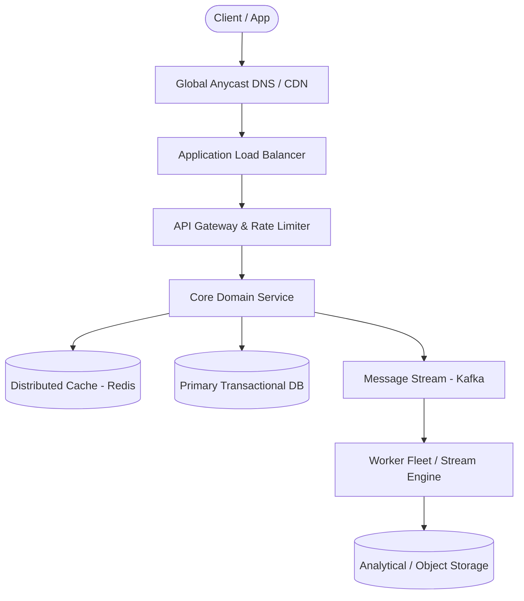

# Page 21: Online Multiplayer Chess

> **Page Index**: Page 21 of 32  
> **System Domain**: Turn-Based State Sync & Matchmaking  
> **Industry Analogs**: Chess.com, Lichess  
> **Interview Difficulty**: Medium  
> **Core Architectural Patterns**: Real-time Updates, Dealing with Contention, Scaling Reads  

---

## 1. Problem Overview & Architectural Scoping

### Problem Summary
Designing **Online Multiplayer Chess** requires architecting a production-grade distributed solution in the **Turn-Based State Sync & Matchmaking** space. The system must support massive scale while balancing latency budgets, throughput requirements, data consistency, and system durability.

### Primary Technical Challenges
- **Throughput & Concurrency**: Handling high-volume traffic bursts, contention on hot resources, and partition skew without service degradation.
- **Consistency vs Availability**: Choosing the appropriate consistency model across distributed components (ACID transactions vs eventual consistency).
- **Resilience & Fault Tolerance**: Isolating failure domains, avoiding cascading collapses, and ensuring graceful degradation under partial system outages.

## 2. Requirements Specification

### Functional Requirements
Start by nailing down the top few functional requirements. Everything else is below the line. Calling those out shows product sense, but you won't design them, so keep the core list tight and check with your interviewer before moving on.
Core Requirements
- Players should be able to find an opponent through skill-based matchmaking and start a game.
- Players should be able to play a game in real time.
- Players should be able to view a global leaderboard and see their own rank, both updating shortly after games finish.
Below the line (out of scope)
- Spectating live games and broadcasting popular boards.
- In-game chat, friends, and social features.
- Puzzles, training, and post-game analysis or replay.
- Tournaments and arena play.
- Anti-cheat and engine-detection (fair play), plus tournament integrity. We'll come back to why this one is interesting but out of scope at the end.
FIRST QUESTION
What are the non-functional requirements for this system?
Try it yourself first
We recommend you to practice the question yourself first to get instant personalized feedback as you go.

### Non-Functional Requirements & Performance SLOs
Before the requirements, let's pin down the scale, since it drives most of the design. We'll design for 500K concurrent games at peak. Each game has two players on their own connections, so that's 500K games * 2 = 1M concurrent connections, plus the compute to validate every move and run two clocks per game. These numbers carry through the deep dives.
With that in mind, here are the non-functional requirements:

## 3. Quantitative Scale & Capacity Estimations

| Metric Dimension | Production Scale | Architectural Implication |
| :--- | :--- | :--- |
| **Daily Active Users (DAU)** | 50M - 200M users | Distributed identity verification, user sharding, session caches. |
| **Write Throughput** | 1,000 - 50,000 QPS peak | Asynchronous ingestion queues (Kafka), write-behind caching, batch persistence. |
| **Read Throughput** | 10,000 - 500,000 QPS peak | Multi-tier CDN caching, distributed Redis read clusters, read replicas. |
| **Storage Capacity (5 Years)** | 10 TB - 500 TB | Columnar analytics storage, cold data tiering to object storage (S3). |
| **Network Egress / Ingress** | 1 Gbps - 40 Gbps | Connection multiplexing, compression (gzip/zstd), CDN edge offload. |

## 4. Core Data Entities & Schema Design

- **Primary Entity**: `id` (UUID PK), `owner_id` (UUID), `status` (ENUM), `created_at` (TIMESTAMP).
- **Transaction / Event Log**: `event_id` (UUID), `entity_id` (UUID FK), `payload` (JSONB), `timestamp` (BIGINT).
- **Aggregated / Materialized View**: `partition_key` (STRING), `window_start` (BIGINT), `counter` (BIGINT).

## 5. API & System Interface Contract

```http
POST /api/v1/resource
Headers:
  Authorization: Bearer <token>
  Idempotency-Key: <uuid>
Content-Type: application/json

{
  "action": "execute",
  "payload": {}
}

HTTP/1.1 200 OK
```

## 6. High-Level Architecture & End-to-End Flow



### Execution Workflow
1. **Edge Ingestion**: Requests pass through Edge CDN and API Gateway for rate limiting and authentication.
2. **Fast-Path Caching**: High-frequency reads are resolved from the distributed Redis cache with sub-5ms latency.
3. **Asynchronous Decoupling**: High-velocity write events are published directly to Kafka message broker partitions.
4. **Background Processing**: Stream workers (Flink/Workers) consume events, update read-model projections, and persist to long-term storage.

## 7. Deep Dives, Bottlenecks & Architectural Tradeoffs

### 1) How do we match players fairly at scale?
#### Do we need to shard the pool across Redis nodes?
#### What happens if that Redis node goes down?
### 2) How do we scale the game servers to 500K concurrent games?
### 3) How do we keep the clock fair despite uneven latency?
### 4) How do we keep the leaderboard correct and fast at 10M players?
#

## 8. Evaluation Rubric by Engineering Level

?
### Mid-level
### Senior
### Staff+
### Purchase Premium to Keep Reading
Unlock this article and so much more with Hello Interview Premium
Buy Premium
Currently  up to 20% off
Hello Interview Premium
System Design Guided Practice
Exclusive content
Recent interview questions
Learn More
Reading Progress
On This Page
Understanding the Problem
Functional Requirements
Non-Functional Requirements
The Set Up
Planning the Approach
Defining the Core Entities
API or System Interface
High-Level Design
1) Players should be able to find an opponent through skill-based matchmaking and start a game
2) Players should be able to play a game in real time
3) Players should be able to view a global leaderboard and see their own rank
Potential Deep Dives
1) How do we match players fairly at scale?
2) How do we scale the game servers to 500K concurrent games?
3) How do we keep the clock fair despite uneven latency?
4) How do we keep the leaderboard correct and fast at 10M players?
Final Design
Some additional deep dives you might consider
What is Expected at Each Level?
Mid-level
Senior
Staff+
Questions
Meta SWE Interview QuestionsAmazon SWE Interview QuestionsGoogle SWE Interview QuestionsOpenAI SWE Interview QuestionsAnthropic SWE Interview QuestionsEngineering Manager (EM) Interview Questions
Learn
Learn System DesignLearn DSALearn BehavioralLearn ML System DesignLearn Low Level DesignGuided Practice
Links
FAQPricingGift PremiumHello Interview Premium
Legal
Terms and ConditionsPrivacy PolicySecurity
Contact
About UsProduct Support
7511 Greenwood Ave North
Unit #4238 Seattle
WA 98103
© 2026 Optick Labs Inc. All rights reserved.

## 9. ScaleLab Studio Simulation & Practice Pack Mapping

- **Recommended ScaleLab Palette Components**: `Client`, `Load balancer`, `API gateway`, `Service`, `Queue`, `Worker`, `Database`, `Cache`, `Circuit breaker`.
- **Simulation Load Test**: Configure a 'Spike' or 'Diurnal' traffic shape. Simulate worker crashes or database lock contention to observe queue backup and Little's Law latency spikes.
- **Practice Pack Readiness**: High priority candidate for addition to ScaleLab's guided practice suite with pinnable notes and runnable starter topologies.
