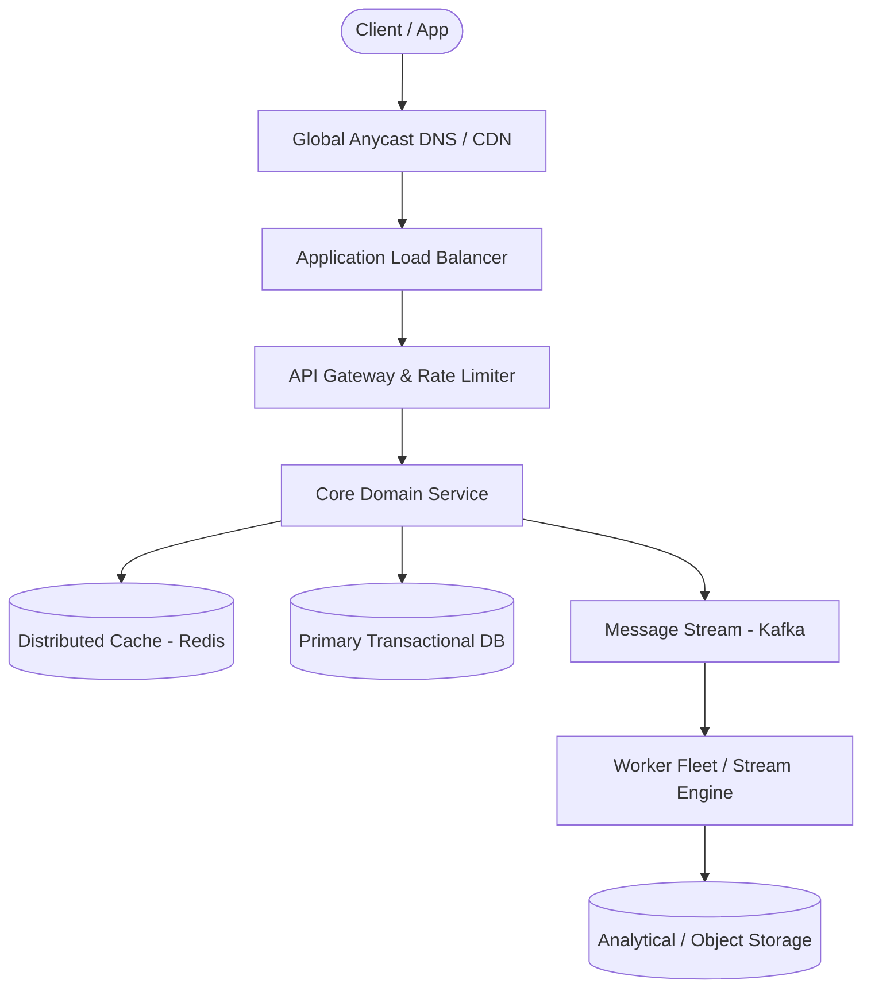

# Page 22: Payment Processing System (Stripe)

> **Page Index**: Page 22 of 32  
> **System Domain**: Financial Ledgers, Idempotency & Sagas  
> **Industry Analogs**: Stripe, Adyen, PayPal  
> **Interview Difficulty**: Hard  
> **Core Architectural Patterns**: Multi-step Processes, Dealing with Contention, Fault Tolerance  

---

## 1. Problem Overview & Architectural Scoping

### Problem Summary
Designing **Payment Processing System (Stripe)** requires architecting a production-grade distributed solution in the **Financial Ledgers, Idempotency & Sagas** space. The system must support massive scale while balancing latency budgets, throughput requirements, data consistency, and system durability.

### Primary Technical Challenges
- **Throughput & Concurrency**: Handling high-volume traffic bursts, contention on hot resources, and partition skew without service degradation.
- **Consistency vs Availability**: Choosing the appropriate consistency model across distributed components (ACID transactions vs eventual consistency).
- **Resilience & Fault Tolerance**: Isolating failure domains, avoiding cascading collapses, and ensuring graceful degradation under partial system outages.

## 2. Requirements Specification

### Functional Requirements
Core Requirements
- Merchants should be able to initiate payment requests (charge a customer for a specific amount).
- Users should be able to pay for products with credit/debit cards.
- Merchants should be able to view status updates for payments (e.g., pending, success, failed).
Below the line (out of scope):
- Customers should be able to save payment methods for future use.
- Merchants should be able to issue full or partial refunds.
- Merchants should be able to view transaction history and reports.
- Support for alternative payment methods (e.g., bank transfers, digital wallets).
- Handling recurring payments (subscriptions).
- Payouts to merchants.
FIRST QUESTION
What are the non-functional requirements?
Try it yourself first
We recommend you to practice the question yourself first to get instant personalized feedback as you go.

### Non-Functional Requirements & Performance SLOs
Before defining your non-functional requirements in an interview, it's wise to inquire about the scale of the system as this will have a meaningful impact on your design. In this case, we'll be looking at a system handling about 10,000 transactions per second (TPS) at peak load.

## 3. Quantitative Scale & Capacity Estimations

| Metric Dimension | Production Scale | Architectural Implication |
| :--- | :--- | :--- |
| **Daily Active Users (DAU)** | 50M - 200M users | Distributed identity verification, user sharding, session caches. |
| **Write Throughput** | 1,000 - 50,000 QPS peak | Asynchronous ingestion queues (Kafka), write-behind caching, batch persistence. |
| **Read Throughput** | 10,000 - 500,000 QPS peak | Multi-tier CDN caching, distributed Redis read clusters, read replicas. |
| **Storage Capacity (5 Years)** | 10 TB - 500 TB | Columnar analytics storage, cold data tiering to object storage (S3). |
| **Network Egress / Ingress** | 1 Gbps - 40 Gbps | Connection multiplexing, compression (gzip/zstd), CDN edge offload. |

## 4. Core Data Entities & Schema Design

- **Primary Entity**: `id` (UUID PK), `owner_id` (UUID), `status` (ENUM), `created_at` (TIMESTAMP).
- **Transaction / Event Log**: `event_id` (UUID), `entity_id` (UUID FK), `payload` (JSONB), `timestamp` (BIGINT).
- **Aggregated / Materialized View**: `partition_key` (STRING), `window_start` (BIGINT), `counter` (BIGINT).

## 5. API & System Interface Contract

```http
POST /api/v1/resource
Headers:
  Authorization: Bearer <token>
  Idempotency-Key: <uuid>
Content-Type: application/json

{
  "action": "execute",
  "payload": {}
}

HTTP/1.1 200 OK
```

## 6. High-Level Architecture & End-to-End Flow



### Execution Workflow
1. **Edge Ingestion**: Requests pass through Edge CDN and API Gateway for rate limiting and authentication.
2. **Fast-Path Caching**: High-frequency reads are resolved from the distributed Redis cache with sub-5ms latency.
3. **Asynchronous Decoupling**: High-velocity write events are published directly to Kafka message broker partitions.
4. **Background Processing**: Stream workers (Flink/Workers) consume events, update read-model projections, and persist to long-term storage.

## 7. Deep Dives, Bottlenecks & Architectural Tradeoffs

### 1) The system should be highly secure
### 2) The system should guarantee durability and auditability with no transaction data ever being lost, even in case of failures.
### 3) The system should guarantee transaction safety and financial integrity despite the inherently asynchronous nature of external payment networks
### 4) The system should be scalable to handle high transaction volume (10,000+ TPS)
#### Servers
#### Kafka
#### Database
## Bonus Deep Dives
### 1) How can we expand the design to support Webhooks?
#

## 8. Evaluation Rubric by Engineering Level

?
### Mid-level
### Senior
### Staff+
### Purchase Premium to Keep Reading
Unlock this article and so much more with Hello Interview Premium
Buy Premium
Currently  up to 20% off
Hello Interview Premium
System Design Guided Practice
Exclusive content
Recent interview questions
Learn More
Reading Progress
On This Page
Understanding the Problem
Functional Requirements
Non-Functional Requirements
The Set Up
Defining the Core Entities
API or System Interface
High-Level Design
1) Merchants should be able to initiate payment requests
2) Users should be able to pay for products with credit/debit cards.
3) The system should provide status updates for payments
Potential Deep Dives
1) The system should be highly secure
2) The system should guarantee durability and auditability with no transaction data ever being lost, even in case of failures.
3) The system should guarantee transaction safety and financial integrity despite the inherently asynchronous nature of external payment networks
4) The system should be scalable to handle high transaction volume (10,000+ TPS)
Bonus Deep Dives
1) How can we expand the design to support Webhooks?
Final Design
What is Expected at Each Level?
Mid-level
Senior
Staff+
Questions
Meta SWE Interview QuestionsAmazon SWE Interview QuestionsGoogle SWE Interview QuestionsOpenAI SWE Interview QuestionsAnthropic SWE Interview QuestionsEngineering Manager (EM) Interview Questions
Learn
Learn System DesignLearn DSALearn BehavioralLearn ML System DesignLearn Low Level DesignGuided Practice
Links
FAQPricingGift PremiumHello Interview Premium
Legal
Terms and ConditionsPrivacy PolicySecurity
Contact
About UsProduct Support
7511 Greenwood Ave North
Unit #4238 Seattle
WA 98103
© 2026 Optick Labs Inc. All rights reserved.

## 9. ScaleLab Studio Simulation & Practice Pack Mapping

- **Recommended ScaleLab Palette Components**: `Client`, `Load balancer`, `API gateway`, `Service`, `Queue`, `Worker`, `Database`, `Cache`, `Circuit breaker`.
- **Simulation Load Test**: Configure a 'Spike' or 'Diurnal' traffic shape. Simulate worker crashes or database lock contention to observe queue backup and Little's Law latency spikes.
- **Practice Pack Readiness**: High priority candidate for addition to ScaleLab's guided practice suite with pinnable notes and runnable starter topologies.
