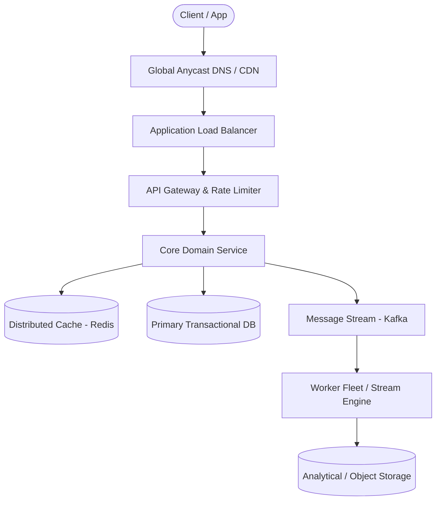

# Page 25: Ticket Booking & Seat Reservation (Ticketmaster)

> **Page Index**: Page 25 of 32  
> **System Domain**: High-Contention Seat Map & Holds  
> **Industry Analogs**: Ticketmaster, StubHub, Eventbrite  
> **Interview Difficulty**: Hard  
> **Core Architectural Patterns**: Dealing with Contention, Multi-step Processes, Scaling Reads  

---

## 1. Problem Overview & Architectural Scoping

### Problem Summary
Designing **Ticket Booking & Seat Reservation (Ticketmaster)** requires architecting a production-grade distributed solution in the **High-Contention Seat Map & Holds** space. The system must support massive scale while balancing latency budgets, throughput requirements, data consistency, and system durability.

### Primary Technical Challenges
- **Throughput & Concurrency**: Handling high-volume traffic bursts, contention on hot resources, and partition skew without service degradation.
- **Consistency vs Availability**: Choosing the appropriate consistency model across distributed components (ACID transactions vs eventual consistency).
- **Resilience & Fault Tolerance**: Isolating failure domains, avoiding cascading collapses, and ensuring graceful degradation under partial system outages.

## 2. Requirements Specification

### Functional Requirements
- Start your interview by defining the functional and non-functional requirements. For user facing applications like this one, functional requirements are the "Users should be able to..." statements whereas non-functional defines the system qualities via "The system should..." statements.
- Prioritize the top 3 functional requirements. Everything else shows your product thinking, but clearly note it as "below the line" so the interviewer knows you won't be including them in your design. Check in to see if your interviewer wants to move anything above the line or move anything down. Choosing just the top 3 is important to ensuring you stay focused and can execute in the limited time window.
Core Requirements
- Users should be able to view events
- Users should be able to search for events
- Users should be able to book tickets to events
Below the line (out of scope):
- Users should be able to view their booked events
- Admins or event coordinators should be able to add events
- Popular events should have dynamic pricing
FIRST QUESTION
What are the non-functional requirements of the system?
Try it yourself first
We recommend you to practice the question yourself first to get instant personalized feedback as you go.

### Non-Functional Requirements & Performance SLOs
Core Requirements
- The system should prioritize availability for searching & viewing events, but should
prioritize consistency for booking events (no double booking)
- The system should be scalable and able to handle high throughput in the form of popular
events (10 million users, one event)
- The system should have low latency search (< 500ms)
- The system is read heavy, and thus needs to be able to support high read throughput (100:1)
Below the line (out of scope):
- The system should protect user data and adhere to GDPR
- The system should be fault tolerant
- The system should provide secure transactions for purchases
- The system should be well tested and easy to deploy (CI/CD pipelines)
- The system should have regular backups
Here's how it might look on your whiteboard:
Requirements
Adding features that are out of scope is a "nice to have". It shows product thinking and gives your interviewer a chance to help you reprioritize based on what they want to see in the interview. That said, it's very much a nice to have. If additional features are not coming to you quickly, don't waste your time and move on.

## 3. Quantitative Scale & Capacity Estimations

| Metric Dimension | Production Scale | Architectural Implication |
| :--- | :--- | :--- |
| **Daily Active Users (DAU)** | 50M - 200M users | Distributed identity verification, user sharding, session caches. |
| **Write Throughput** | 1,000 - 50,000 QPS peak | Asynchronous ingestion queues (Kafka), write-behind caching, batch persistence. |
| **Read Throughput** | 10,000 - 500,000 QPS peak | Multi-tier CDN caching, distributed Redis read clusters, read replicas. |
| **Storage Capacity (5 Years)** | 10 TB - 500 TB | Columnar analytics storage, cold data tiering to object storage (S3). |
| **Network Egress / Ingress** | 1 Gbps - 40 Gbps | Connection multiplexing, compression (gzip/zstd), CDN edge offload. |

## 4. Core Data Entities & Schema Design

I like to begin with a broad overview of the primary entities. At this stage, it is not necessary to know every specific column or detail. We will focus on the intricacies, such as columns and fields, later when we have a clearer grasp. Initially, establishing these key entities will guide our thought process and lay a solid foundation as we progress towards defining the API.
To satisfy our key functional requirements, we'll need the following entities:
- Event: This entity stores essential information about an event, including details like the date, description, type, and the performer or team involved. It acts as the central point of information for each unique event.
- User: Represents the individual interacting with the system. Needs no further explanation.
- Performer: Represents the individual or group performing or participating in the event. Key attributes for this entity include the performer's name, a brief description, and potentially links to their work or profiles. (Note: this could be artist, company, collective, or many other types of entities. The choice of "performer" is intending to be general enough to cover all possible groups)
- Venue: Represents the physical location where an event is held. Each venue entity includes details such as address, capacity, and a specific seat map, providing a layout of seating arrangements unique to the venue.
- Ticket: Contains information related to individual tickets for events. This includes attributes such as the associated event ID, seat details (like section, row, and seat number), pricing, and status (available or sold). When a new event is created, a ticket is generated for each seat in the venue based on the venue's seat map. The seat map itself is stored as part of the Venue entity (for example, a JSON structure or related table defining sections, rows, and seat numbers along with their coordinates for rendering). The client uses this seat map data combined with each ticket's status to render the interact

## 5. API & System Interface Contract

The API for viewing events is straightforward. We create a simple GET endpoint that takes in an eventId and return the details of that event.
GET /events/:eventId -> Event & Venue & Performer & Ticket[]
- tickets are to render the seat map on the Client
In most instances, your interviewer will be able to read between the lines of your core entities and the requirement we're satisfying to understand the data returned by the API. They will either tell you or you can ask them if they'd like you to go into additional detail but be cautious about being over-verbose - you have a lot of ground to cover and enumerating the fields in the Event object may not be the best use of your time!
Next, for search, we just need a single GET endpoint that takes in a set of search parameters and returns a list of events that match those parameters.
GET /events/search?keyword={keyword}&start={start_date}&end={end_date}&pageSize={page_size}&page={page_number} -> Event[]
When it comes to purchasing/booking a ticket, we have a post endpoint that takes the list of tickets and payment details and returns a bookingId.
Later in the design, we'll evolve this into two separate endpoints - one for reserving a ticket and one for confirming a purchase, but this is a good starting point.
POST /bookings/:eventId -> bookingId
{
"ticketIds": string[],
"paymentDetails": ...
}
It's ok to have simple APIs from the start that you evolve as your design progresses. As always, just communicate, "Here is a simple API to start, but as we get into the design, we'll likely need to evolve this to handle more complex scenarios."

## 6. High-Level Architecture & End-to-End Flow

### Execution Workflow
1. **Edge Ingestion**: Requests pass through Edge CDN and API Gateway for rate limiting and authentication.
2. **Fast-Path Caching**: High-frequency reads are resolved from the distributed Redis cache with sub-5ms latency.
3. **Asynchronous Decoupling**: High-velocity write events are published directly to Kafka message broker partitions.
4. **Background Processing**: Stream workers (Flink/Workers) consume events, update read-model projections, and persist to long-term storage.

## 7. Deep Dives, Bottlenecks & Architectural Tradeoffs

With the core functional requirements met, it's time to dig into the non-functional requirements via deep dives. These are the main deep dives I like to cover for this question:
The degree to which a candidate should proactively lead the deep dives is a function of their seniority. For example, it is completely reasonable in a mid-level interview for the interviewer to drive the majority of the deep dives. However, in senior and staff+ interviews, the level of agency and ownership expected of the candidate increases. They should be able to proactively look around corners and address the system in ways that the interviewer may not have thought of.
### 1) How do we improve the booking experience by reserving tickets?
The current solution, while it technically works, results in a horrible user experience. No one wants to spend 5 minutes filling out a payment form only to find out the tickets they wanted are no longer available because someone else typed their credit card info faster.
If you've ever used similar sites to book event tickets, airline tickets, hotels, etc., you've probably seen a timer counting down the time you have to complete your purchase. This is a common technique to reserve the tickets for a user while they are checking out. Let's discuss how we can add something like this to our design.
We need to ensure that the ticket is locked for the user while they are checking out. We also need to ensure that if the user abandons the checkout process, the ticket is released for other users to purchase. Finally, we need to ensure that if the user completes the checkout process, the ticket is marked as sold and the booking is confirmed. Here are a couple ways we could do this:
### Bad Solution: Long-Running Database Locks
Approach
A bad solution many candidates propose for this problem is to use long-running database locks (sometimes referred to as "interactive transactions"). In this method, the database is directly utilized to lock a specific ticket row, ensuring exclusive access to the first user trying to book it. This is typically done using the SELECT FOR UPDATE statement in PostgreSQL, which locks the selected row(s) as part of a database transaction. The lock on the row is maintained until the transaction is either committed or rolled back. During this time, other transactions attempting to select the same row with SELECT FOR UPDATE will be blocked until the lock is released. This ensures that only one user can process the ticket booking at a time.
When it comes to unlocking, there are two cases we need to consider:
- If the user finalizes the purchase, the transaction is committed, the database lock is released, and the ticket status is set to "Booked".
- If the user takes too long or abandons the purchase, the system has to rely on their subsequent actions or session timeouts to release the lock. This introduces the risk of tickets being locked indefinitely if not appropriately handled.
Challenges
Why is this a bad idea? Well, data

## 8. Evaluation Rubric by Engineering Level

?
Ok, that was a lot. You may be thinking, "how much of that is actually required from me in an interview?" Let's break it down.
### Mid-level
Breadth vs. Depth: A mid-level candidate will be mostly focused on breadth (80% vs 20%). You should be able to craft a high-level design that meets the functional requirements you've defined, but many of the components will be abstractions with which you only have surface-level familiarity.
Probing the Basics: Your interviewer will spend some time probing the basics to confirm that you know what each component in your system does. For example, if you add an API Gateway, expect that they may ask you what it does and how it works (at a high level). In short, the interviewer is not taking anything for granted with respect to your knowledge.
Mixture of Driving and Taking the Backseat: You should drive the early stages of the interview in particular, but the interviewer doesn't expect that you are able to proactively recognize problems in your design with high precision. Because of this, it's reasonable that they will take over and drive the later stages of the interview while probing your design.
The Bar for Ticketmaster: For this question, an E4 candidate will have clearly defined the API endpoints and data model, landed on a high-level design that is functional for at least viewing and booking events. They are able to solve the "No Double Booking" problem with at least the "Good Solution" which uses status field, timeout, and cron job. Any additional depth would be a bonus, but further deep dives wouldn't be expected.
### Senior
Depth of Expertise: As a senior candidate, expectations shift towards more in-depth knowledge — about 60% breadth and 40% depth. This means you should be able to go into technical details in areas where you have hands-on experience. It's crucial that you demonstrate a deep understanding of key concepts and technologies relevant to the task at hand.
Advanced System Design: You should be familiar with adv

## 9. ScaleLab Studio Simulation & Practice Pack Mapping

- **Recommended ScaleLab Palette Components**: `Client`, `Load balancer`, `API gateway`, `Service`, `Queue`, `Worker`, `Database`, `Cache`, `Circuit breaker`.
- **Simulation Load Test**: Configure a 'Spike' or 'Diurnal' traffic shape. Simulate worker crashes or database lock contention to observe queue backup and Little's Law latency spikes.
- **Practice Pack Readiness**: High priority candidate for addition to ScaleLab's guided practice suite with pinnable notes and runnable starter topologies.
