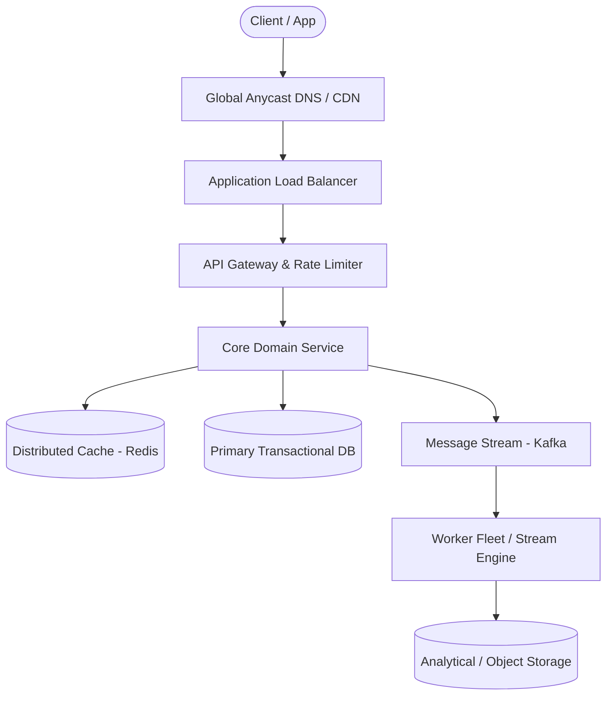

# Page 26: Location-Based Dating App (Tinder)

> **Page Index**: Page 26 of 32  
> **System Domain**: Geospatial Matching & Swipe Ingestion  
> **Industry Analogs**: Tinder, Bumble, Hinge  
> **Interview Difficulty**: Medium  
> **Core Architectural Patterns**: Consistent Hashing, Real-time Updates, Scaling Writes  

---

## 1. Problem Overview & Architectural Scoping

### Problem Summary
Designing **Location-Based Dating App (Tinder)** requires architecting a production-grade distributed solution in the **Geospatial Matching & Swipe Ingestion** space. The system must support massive scale while balancing latency budgets, throughput requirements, data consistency, and system durability.

### Primary Technical Challenges
- **Throughput & Concurrency**: Handling high-volume traffic bursts, contention on hot resources, and partition skew without service degradation.
- **Consistency vs Availability**: Choosing the appropriate consistency model across distributed components (ACID transactions vs eventual consistency).
- **Resilience & Fault Tolerance**: Isolating failure domains, avoiding cascading collapses, and ensuring graceful degradation under partial system outages.

## 2. Requirements Specification

### Functional Requirements
Core Requirements
- Users can create a profile with preferences (e.g. age range, interests) and specify a maximum distance.
- Users can view a stack of potential matches in line with their preferences and within max distance of their current location.
- Users can swipe right / left on profiles one-by-one, to express "yes" or "no" on other users.
- Users get a match notification if they mutually swipe on each other.
Below the line (out of scope)
- Users should be able to upload pictures.
- Users should be able to chat via DM after matching.
- Users can send "super swipes" or purchase other premium features.
It's worth noting that this question is mostly focused on the user recommendation "feed" and swiping experience, not on other auxiliary features. If you're unsure what features to focus on for an app like this, have some brief back and forth with the interviewer to figure out what part of the system they care the most about. It'll typically be the functionality that makes the app unique or the most complex.
FIRST QUESTION
What are the non-functional requirements?
Try it yourself first
We recommend you to practice the question yourself first to get instant personalized feedback as you go.

### Non-Functional Requirements & Performance SLOs
Core Requirements
- The system should have strong consistency for swiping. If a user swipes "yes" on a user who already swiped "yes" on them, they should get a match notification.
- The system should scale to lots of daily users / concurrent users (20M daily actives, ~100 swipes/user/day on average).
- The system should load the potential matches stack with low latency (e.g. < 300ms).
- The system should avoid showing user profiles that the user has previously swiped on.
Below the line (out of scope)
- The system should protect against fake profiles.
- The system should have monitoring / alerting.
Here's how it might look on a whiteboard:
Non-Functional Requirements

## 3. Quantitative Scale & Capacity Estimations

| Metric Dimension | Production Scale | Architectural Implication |
| :--- | :--- | :--- |
| **Daily Active Users (DAU)** | 50M - 200M users | Distributed identity verification, user sharding, session caches. |
| **Write Throughput** | 1,000 - 50,000 QPS peak | Asynchronous ingestion queues (Kafka), write-behind caching, batch persistence. |
| **Read Throughput** | 10,000 - 500,000 QPS peak | Multi-tier CDN caching, distributed Redis read clusters, read replicas. |
| **Storage Capacity (5 Years)** | 10 TB - 500 TB | Columnar analytics storage, cold data tiering to object storage (S3). |
| **Network Egress / Ingress** | 1 Gbps - 40 Gbps | Connection multiplexing, compression (gzip/zstd), CDN edge offload. |

## 4. Core Data Entities & Schema Design

Let's start by defining the set of core entities. Initially, establishing these key entities will guide our thought process and lay a solid foundation as we progress towards defining the API. We don't need to know every field or column at this point, but if you have a good idea of what they might be, feel free to jot them down.
For Tinder, the primary entities are pretty straightforward:
- User: This represents both a user using the app and a profile that might be shown to the user. We typically omit the "user" concept when listing entities, but because users are swiping on other users, we'll include it here.
- Swipe: Expression of "yes" or "no" on a user profile; belongs to a user (swiping_user) and is about another user (target_user).
- Match: A connection between 2 users as a result of them both swiping "yes" on each other.
In the actual interview, this can be as simple as a short list like this. Just make sure you talk through the entities with your interviewer to ensure you are on the same page.
Defining the Core Entities
As you move onto the design, your objective is simple: create a system that meets all functional and non-functional requirements. To do this, I recommend you start by satisfying the functional requirements and then layer in the non-functional requirements afterward. This will help you stay focused and ensure you don't get lost in the weeds as you go.

## 5. API & System Interface Contract

The API is the primary interface that users will interact with. You'll want to define the API early on, as it will guide your high-level design. We just need to define an endpoint for each of our functional requirements.
The first endpoint we need is an endpoint to create a profile for a user. Of course, this would include images, bio, etc, but we're going to focus just on their match preferences for this question.
POST /profile
{
"age_min": 20,
"age_max": 30,
"distance": 10,
"interestedIn": "female" | "male" | "both",
...
}
Next we need an endpoint to get the "feed" of user profiles to swipe on, this way we have a "stack" of profiles ready for the user:
GET /feed?lat={}&long={}&distance={} -> User[]
We don't need to pass in other filters like age, interests, etc. because we're assuming the user has already specified these in the app settings, and we can load them server-side.
Unless you pay for the premium version (out of scope), Tinder will show users within a specific radius of your current location. Given that this can always change, we pass it in client-side as opposed to persisting server-side.
You might be tempted to proactively consider pagination for the feed endpoint. This is actually superfluous for Tinder b/c we're really generating recommendations. Rather than "paging", the app can just hit the endpoint again for more recommendations if the current list is exhausted.
We'll also need an endpoint to power swiping:
POST /swipe/{userId}
Request:
{
decision: "yes" | "no"
}
With each of these requests, the user information will be passed in the headers (either via session token or JWT). This is a common pattern for APIs and is a good way to ensure that the user is authenticated and authorized to perform the action while preserving security. You should avoid passing user information in the request body, as this can be easily manipulated by the client.
In the interview, you may want to just denote which endpoints require user authentication and which don't. In 

## 6. High-Level Architecture & End-to-End Flow

### Execution Workflow
1. **Edge Ingestion**: Requests pass through Edge CDN and API Gateway for rate limiting and authentication.
2. **Fast-Path Caching**: High-frequency reads are resolved from the distributed Redis cache with sub-5ms latency.
3. **Asynchronous Decoupling**: High-velocity write events are published directly to Kafka message broker partitions.
4. **Background Processing**: Stream workers (Flink/Workers) consume events, update read-model projections, and persist to long-term storage.

## 7. Deep Dives, Bottlenecks & Architectural Tradeoffs

At this point, we have a basic, functioning system that satisfies the functional requirements. However, there are a number of areas we could dive deeper into to improve the system's performance, scalability, etc. Depending on your seniority, you'll be expected to drive the conversation toward these deeper topics of interest.
### 1) How can we ensure that swiping is consistent and low latency?
Let's start by considering the failure scenario. Imagine Person A and Person B both swipe right (like) on each other at roughly the same time. Our order of operations could feasibly look something like this:
- Person A swipe hits the server and we check for inverse swipe. Nothing.
- Person B swipe hits the server and we check for inverse swipe. Nothing.
- We save Person A swipe on Person B.
- We save Person B swipe on Person A.
Now, we've saved the swipe to our database, but we've lost the opportunity to notify Person A and Person B that they have a new match. They will both go on forever not knowing that they matched and true love may never be discovered.
It's worth mentioning that you could solve this problem without strong consistency. You could have some reconciliation process that runs periodically to ensure all matching swipes have been processed as a match. For those that haven't, just send both Person A and Person B a notification. They won't be any the wiser and will just assume the other person swiped on them in that moment. This would allow you to prioritize availability over consistency and would be an interesting trade-off to discuss in the interview. It makes the problem slightly less challenging, though, so there is a decent chance the interviewer will appreciate the conversation but suggest you stick with prioritizing consistency.
Given that we need to notify the last swiper of the match immediately, we need to ensure the system is consistent. Here are a few approaches we could take to ensure this consistency:
### Bad Solution: Database Polling for Matches
Approach
The first thing that comes to mind is to periodically poll the database to check for reciprocal swipes and create matches accordingly. This obviously does not meet our requirement of being able to notify users of a match immediately, so it's a non-starter, though worth mentioning.Challenges
This approach introduces latency due to the intervals between polls, meaning users would not receive immediate feedback upon swiping. The lack of instant gratification can significantly diminish user engagement, as the timely dopamine hit associated with immediate match notifications is a critical component of the user experience. Additionally, frequent polling can place unnecessary load on the database, leading to scalability issues.
### Good Solution: Transactions
Approach
If we need consistency, our mind should immediately jump to database transactions. We can make sure that both the swipe and the check for a reciprocal swipe happen in the same transaction, so that we either successfully save

## 8. Evaluation Rubric by Engineering Level

?
Ok, that was a lot. You may be thinking, “how much of that is actually required from me in an interview?” Let’s break it down.
### Mid-level
Breadth vs. Depth: A mid-level candidate will be mostly focused on breadth (80% vs 20%). You should be able to craft a high-level design that meets the functional requirements you've defined, but many of the components will be abstractions with which you only have surface-level familiarity.
Probing the Basics: Your interviewer will spend some time probing the basics to confirm that you know what each component in your system does. For example, if you add an API Gateway, expect that they may ask you what it does and how it works (at a high level). In short, the interviewer is not taking anything for granted with respect to your knowledge.
Mixture of Driving and Taking the Backseat: You should drive the early stages of the interview in particular, but the interviewer doesn’t expect that you are able to proactively recognize problems in your design with high precision. Because of this, it’s reasonable that they will take over and drive the later stages of the interview while probing your design.
The Bar for Tinder: For this question, an E4 candidate will have clearly defined the API endpoints and data model, landed on a high-level design that is functional for all of feed creation, swiping, and matching. I don't expect candidates to know in-depth information about specific technologies, but I do expect the candidate to design a solution that supports traditional filters and geo-spatial filters. I also expect the candidate to design a solution to avoid re-showing swiped-on profiles.
### Senior
Depth of Expertise: As a senior candidate, expectations shift towards more in-depth knowledge — about 60% breadth and 40% depth. This means you should be able to go into technical details in areas where you have hands-on experience. It's crucial that you demonstrate a deep understanding of key concepts and technologies relevant to the task 

## 9. ScaleLab Studio Simulation & Practice Pack Mapping

- **Recommended ScaleLab Palette Components**: `Client`, `Load balancer`, `API gateway`, `Service`, `Queue`, `Worker`, `Database`, `Cache`, `Circuit breaker`.
- **Simulation Load Test**: Configure a 'Spike' or 'Diurnal' traffic shape. Simulate worker crashes or database lock contention to observe queue backup and Little's Law latency spikes.
- **Practice Pack Readiness**: High priority candidate for addition to ScaleLab's guided practice suite with pinnable notes and runnable starter topologies.
