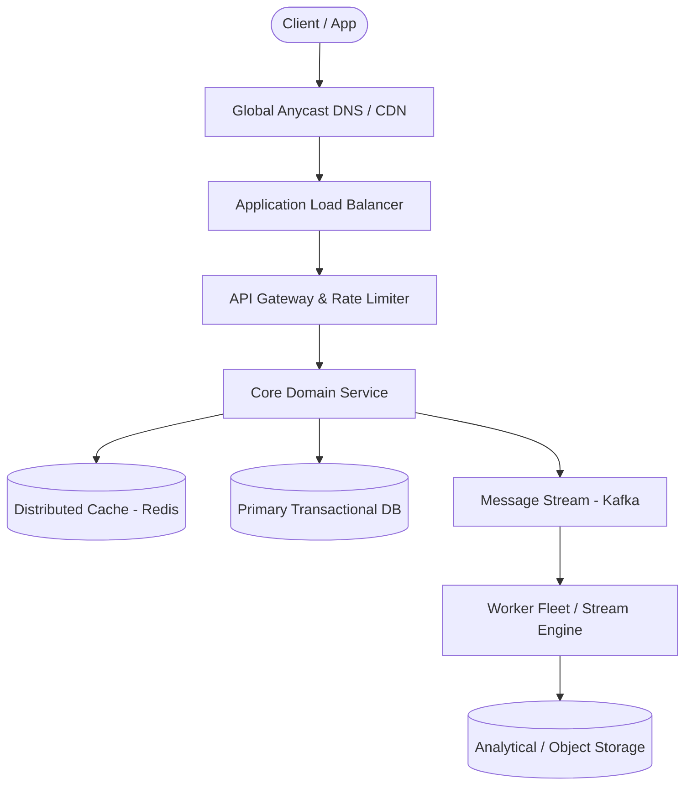

# Page 27: Top-K Heavy Hitters (YouTube Top K)

> **Page Index**: Page 27 of 32  
> **System Domain**: Streaming Frequency Estimation & Rolling Windows  
> **Industry Analogs**: YouTube Trending, Twitter Trends, TikTok  
> **Interview Difficulty**: Hard  
> **Core Architectural Patterns**: Stream Processing, Window Aggregations, Caching  

---

## 1. Problem Overview & Architectural Scoping

### Problem Summary
Designing **Top-K Heavy Hitters (YouTube Top K)** requires architecting a production-grade distributed solution in the **Streaming Frequency Estimation & Rolling Windows** space. The system must support massive scale while balancing latency budgets, throughput requirements, data consistency, and system durability.

### Primary Technical Challenges
- **Throughput & Concurrency**: Handling high-volume traffic bursts, contention on hot resources, and partition skew without service degradation.
- **Consistency vs Availability**: Choosing the appropriate consistency model across distributed components (ACID transactions vs eventual consistency).
- **Resilience & Fault Tolerance**: Isolating failure domains, avoiding cascading collapses, and ensuring graceful degradation under partial system outages.

## 2. Requirements Specification

### Functional Requirements
Requirements clarifications are important for all system design problems, but in top-K questions in particular small changes to the requirements can have dramatic impacts on the design. We need to nail down the contract we have with our clients: what do they expect our system to be able to do?
This might seem obvious: they want to get the top K videos! But digging in here reveals some interesting wrinkles that your interviewer will be expecting you to discover.
First, we need to clarify what time period or windows the system needs to support. We could conceivably have a system which is only looking to tabulate the most viewed videos of all time. It wouldn't be very interesting (those don't change very often!), but it is possible. Generally though, this problem becomes more interesting when we need to include some windows, and we'll assume that our clients want to query the top K videos for the last 1 hour, 1 day, 1 month, and all time.
Next, to drive the discussion forward, it's helpful to talk a little bit about windowing. When we talk about the last 1 hour, what exactly does that mean? There's two primary types of windows that are used in streaming systems: sliding windows and tumbling windows.
- With sliding windows, the last 1 hour is the time between [T-1 hour] and [T]. If our current time is 10:06, the last 1 hour is the time between 9:06 and 10:06.
- With tumbling windows the window for the last hour is the last full hour that starts and ends on an hour boundary. So the time between [Floor(T - 1 hour, 'hour')] and [Floor(T, 'hour')]. If our current time is 10:06, the last 1 hour is the time between 9:00 and 10:00.
Window Types
For this problem, we're going to propose to our interviewer that we'll use tumbling windows and give them a moment to object. This shows our foresight (we're anticipating ambiguity in the requirements!) and tumbling windows are easier to handle than sliding windows, making our job easy for now.
Next, it's useful for us to clarify the ti

### Non-Functional Requirements & Performance SLOs
Similar to our functional requirements, our non-functional requirements are load bearing for this problem.
One key question is how the top K calculation is actually carried out. Views from YouTube videos are events that happen at a real point in time (like 09:59:55) but in a distributed system there are sometimes delays in transmitting and processing these events. Maybe that view event doesn't arrive to our system until 10:00:55. How long should we wait for these events to be processed? We're going to give ourselves a generous 1 minute buffer here between when a view happens and when it needs to be tabulated and included in our top K calculation.
Another question for us to answer is whether we'll tolerate approximation in results. For large-scale systems, it's common to trade off some precision for performance. Approximate systems can often be more efficient, but are more complex. We're going to start by assuming our system should be precise and tell our interviewer we'll come back to this later in the deep dives if we have time (we cover it in our deep dives below).
Data Structures for Big Data is a great resource for understanding various approximation techniques that can be used to scale to massive data sizes.
Next, we need to think about the expectations of our clients. What should be the latency they'll expect on calls to our system? Let's get ambitious here and aim for our system to respond within 10's of milliseconds. If we can carefully precompute results, serving them out of a cache is entirely possible and should allow us to achieve this latency.
Finally, we'll make some nods to our scaling requirements. We know this system is going to be big, but the exact size matters a lot. Calculating the top K songs played by a single user (e.g. for Spotify) is done trivially on a single CPU. But views on YouTube are going to be massive — we need to have an idea of how many videos are going to be watched and how many views are going to be processed per second so we kn

## 3. Quantitative Scale & Capacity Estimations

| Metric Dimension | Production Scale | Architectural Implication |
| :--- | :--- | :--- |
| **Daily Active Users (DAU)** | 50M - 200M users | Distributed identity verification, user sharding, session caches. |
| **Write Throughput** | 1,000 - 50,000 QPS peak | Asynchronous ingestion queues (Kafka), write-behind caching, batch persistence. |
| **Read Throughput** | 10,000 - 500,000 QPS peak | Multi-tier CDN caching, distributed Redis read clusters, read replicas. |
| **Storage Capacity (5 Years)** | 10 TB - 500 TB | Columnar analytics storage, cold data tiering to object storage (S3). |
| **Network Egress / Ingress** | 1 Gbps - 40 Gbps | Connection multiplexing, compression (gzip/zstd), CDN edge offload. |

## 4. Core Data Entities & Schema Design

In this problem, we have some basic entities we're going to work with to build our API:
- Video: The video being viewed.
- View: The view event that happened.
- Time Window: The time window associated with the query "all time", "last hour", "last day", "last month".
There's really not a lot of complexity to the interface for this problem so we're not going to spend any more time here and keep going.

## 5. API & System Interface Contract

Our API guides the rest of the interview, but in this case it's really basic too! We simply need an API to retrieve the top K videos.
GET /views/top-k?window={WINDOW}&k={K} -> { videoId: string, views: number }[]
Normally, for variable length result sets like this we might want to consider pagination. For this problem, we're explicitly limiting responses to no more than 1k results, so pagination is less of a concern. We already let clients tell us how many results they want.
That's it. We're not going to dawdle here and keep moving on to the meat of the interview.
Especially for more senior candidates, it's important to focus your efforts on the "interesting" aspects of the interview. Spending too much time on obvious elements both deprives you of time for the more interesting parts of the interview but also signals to the interviewer that you may not be able to distinguish more complex pieces from trivial ones: a critical skill for senior engineers.

## 6. High-Level Architecture & End-to-End Flow

### Execution Workflow
1. **Edge Ingestion**: Requests pass through Edge CDN and API Gateway for rate limiting and authentication.
2. **Fast-Path Caching**: High-frequency reads are resolved from the distributed Redis cache with sub-5ms latency.
3. **Asynchronous Decoupling**: High-velocity write events are published directly to Kafka message broker partitions.
4. **Background Processing**: Stream workers (Flink/Workers) consume events, update read-model projections, and persist to long-term storage.

## 7. Deep Dives, Bottlenecks & Architectural Tradeoffs

### 1) How can we cut down on the number of queries to the database?
The lowest-hanging problem we have is that we make a query to the database for every request that comes in for top K. Per our latest updates, the query for top K is resource intensive! If we have millions of requests for top K coming to our service, we're going to be in trouble.
But remember: our non-functional requirements grant us a 1 minute grace period from when a video view event happens and when it needs to be tabulated in our results. This gives us a great opportunity to utilize caching or precomputation, which should be on top of your mind when thinking about scaling reads.
Pattern: Scaling Reads
Caching and precomputation are some of the most common strategies for scaling reads, but it's helpful to understand the full toolbox when approaching new system design problems.Learn This Pattern
### Good Solution: Cache the Top K for each time window
Approach
One of the more elegant approaches for us is to simply put a cache by our top-K service. We can use any distributed cache like Redis or Memcached. If the request is in the cache, we can return it immediately. If the request is not in the cache, we can compute it, store it in the cache (with a TTL of a couple hours), and return it.
We'll store cache entries with a key of top-k:{window}:{truncated_timestamp} and a value of the top K videos for that window. To make things easy, we can cache the entire response of the top-K service.
Cache Top-K
For cache hits (the overwhelming majority of requests), we can return our results well inside of the 10's of milliseconds requirement we set. Most caches will return results in the sub-millisecond range.Challenges
The biggest problem with this approach is when the cache expires we (a) suddenly have a flood of requests to the database, and (b) they're all going to break our SLA since our top K request takes longer than 10's of milliseconds. While we can partially solve (a) by coalescing requests (i.e. only allowing one request per server a given time window to the database, have all the other requests wait for that response), we can't solve (b) without a more sophisticated approach.
### Great Solution: Precompute the Top K for each time window
Approach
Another approach we can utilize is to add a cron to our system which, on fixed intervals, will precompute the top K for each time window and warms our cache in the same way. Then, requests that come to our top-K service are only reading from the cache, never querying the database.
Cron Top-K
This solves the problem of (b) in our "good" solution where we break our SLA around window boundaries when our cache expires. Because our cron job is running at fixed intervals, it has time to "get ahead" of the expirations that would have happened.Challenges
The biggest problem with this approach is that it adds some operational complexity. What happens if the cron job fails? How do we monitor to ensure we're not very far behind? In the grander scheme

## 8. Evaluation Rubric by Engineering Level

?
Ok, that was a lot. You may be thinking, "how much of that is actually required from me in an interview?" Let's break it down.
### Mid-level
Breadth vs. Depth: A mid-level candidate will be mostly focused on breadth (80% vs 20%). You should be able to craft a high-level design that meets the functional requirements you've defined, but many of the components will be abstractions with which you only have surface-level familiarity.
Probing the Basics: Your interviewer will spend some time probing the basics to confirm that you know what each component in your system does. For example, if you add an API Gateway, expect that they may ask you what it does and how it works (at a high level). In short, the interviewer is not taking anything for granted with respect to your knowledge.
Mixture of Driving and Taking the Backseat: You should drive the early stages of the interview in particular, but the interviewer doesn't expect that you are able to proactively recognize problems in your design with high precision. Because of this, it's reasonable that they will take over and drive the later stages of the interview while probing your design.
The Bar for Top K: For this question, an Mid-Level candidate will be able to come up with an end-to-end solution that probably isn't optimal. They'll have some insights into pinch points of the system and be able to solve some of them. They'll have familiarity with relevant technologies, but will make some mistakes.
### Senior
Depth of Expertise: As a senior candidate, expectations shift towards more in-depth knowledge — about 60% breadth and 40% depth. This means you should be able to go into technical details in areas where you have hands-on experience. It's crucial that you demonstrate a deep understanding of key concepts and technologies relevant to the task at hand.
Advanced System Design: You should be familiar with advanced system design principles. You're thinking intuitively about data flow. You should be familiar with streaming

## 9. ScaleLab Studio Simulation & Practice Pack Mapping

- **Recommended ScaleLab Palette Components**: `Client`, `Load balancer`, `API gateway`, `Service`, `Queue`, `Worker`, `Database`, `Cache`, `Circuit breaker`.
- **Simulation Load Test**: Configure a 'Spike' or 'Diurnal' traffic shape. Simulate worker crashes or database lock contention to observe queue backup and Little's Law latency spikes.
- **Practice Pack Readiness**: High priority candidate for addition to ScaleLab's guided practice suite with pinnable notes and runnable starter topologies.
