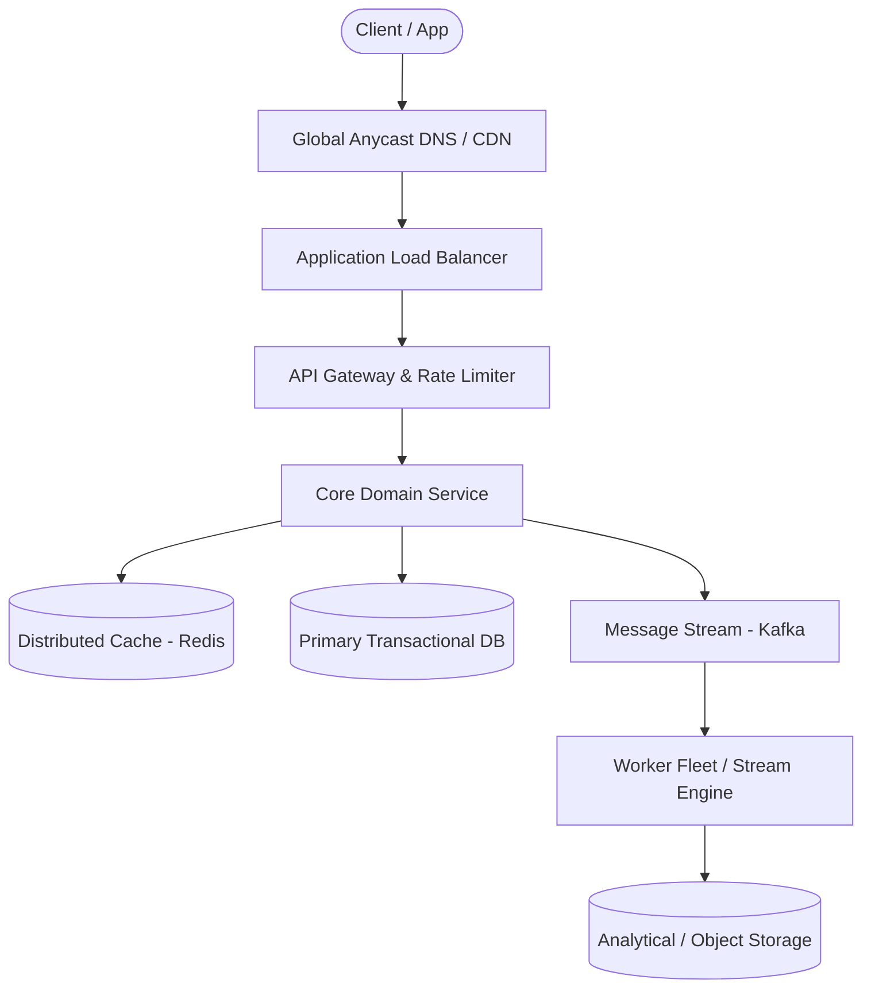

# Page 28: Ride-Sharing Dispatch & Tracking (Uber)

> **Page Index**: Page 28 of 32  
> **System Domain**: Geospatial Indexing & Driver Dispatch  
> **Industry Analogs**: Uber, Lyft, Grab  
> **Interview Difficulty**: Hard  
> **Core Architectural Patterns**: Real-time Updates, Consistent Hashing, Dealing with Contention  

---

## 1. Problem Overview & Architectural Scoping

### Problem Summary
Designing **Ride-Sharing Dispatch & Tracking (Uber)** requires architecting a production-grade distributed solution in the **Geospatial Indexing & Driver Dispatch** space. The system must support massive scale while balancing latency budgets, throughput requirements, data consistency, and system durability.

### Primary Technical Challenges
- **Throughput & Concurrency**: Handling high-volume traffic bursts, contention on hot resources, and partition skew without service degradation.
- **Consistency vs Availability**: Choosing the appropriate consistency model across distributed components (ACID transactions vs eventual consistency).
- **Resilience & Fault Tolerance**: Isolating failure domains, avoiding cascading collapses, and ensuring graceful degradation under partial system outages.

## 2. Requirements Specification

### Functional Requirements
- Start your interview by defining the functional and non-functional requirements. For user facing applications like this one, functional requirements are the "Users should be able to..." statements whereas non-functional defines the system qualities via "The system should..." statements.
- Prioritize the top 3 functional requirements. Everything else shows your product thinking, but clearly note it as "below the line" so the interviewer knows you won't be including them in your design. Check in to see if your interviewer wants to move anything above the line or move anything down. Choosing just the top 3 is important to ensuring you stay focused and can execute in the limited time window.
Core Requirements
- Riders should be able to input a start location and a destination and get a fare estimate.
- Riders should be able to request a ride based on the estimated fare.
- Upon request, riders should be matched with a driver who is nearby and available.
- Drivers should be able to accept/decline a request and navigate to pickup/drop-off.
Below the line (out of scope)
- Riders should be able to rate their ride and driver post-trip.
- Drivers should be able to rate passengers.
- Riders should be able to schedule rides in advance.
- Riders should be able to request different categories of rides (e.g., X, XL, Comfort).
FIRST QUESTION
What are the non-functional requirements of the system?
Try it yourself first
We recommend you to practice the question yourself first to get instant personalized feedback as you go.

### Non-Functional Requirements & Performance SLOs
Core Requirements
- The system should prioritize low latency matching (< 1 minutes to match or failure)
- The system should ensure strong consistency in ride matching to prevent any driver from being assigned multiple rides simultaneously
- The system should be able to handle high throughput, especially during peak hours or special events (100k requests from same location)
Below the line (out of scope)
- The system should ensure the security and privacy of user and driver data, complying with regulations like GDPR.
- The system should be resilient to failures, with redundancy and failover mechanisms in place.
- The system should have robust monitoring, logging, and alerting to quickly identify and resolve issues.
- The system should facilitate easy updates and maintenance without significant downtime (CI/CD pipelines).
Uber Requirements
Adding features that are out of scope is a "nice to have". It shows product thinking and gives your interviewer a chance to help you reprioritize based on what they want to see in the interview. That said, it's very much a nice to have. If additional features are not coming to you quickly, don't waste your time and move on.

## 3. Quantitative Scale & Capacity Estimations

| Metric Dimension | Production Scale | Architectural Implication |
| :--- | :--- | :--- |
| **Daily Active Users (DAU)** | 50M - 200M users | Distributed identity verification, user sharding, session caches. |
| **Write Throughput** | 1,000 - 50,000 QPS peak | Asynchronous ingestion queues (Kafka), write-behind caching, batch persistence. |
| **Read Throughput** | 10,000 - 500,000 QPS peak | Multi-tier CDN caching, distributed Redis read clusters, read replicas. |
| **Storage Capacity (5 Years)** | 10 TB - 500 TB | Columnar analytics storage, cold data tiering to object storage (S3). |
| **Network Egress / Ingress** | 1 Gbps - 40 Gbps | Connection multiplexing, compression (gzip/zstd), CDN edge offload. |

## 4. Core Data Entities & Schema Design

I like to begin with a broad overview of the primary entities. At this stage, it is not necessary to know every specific column or detail. We will focus on the intricacies, such as columns and fields, later when we have a clearer grasp. Initially, establishing these key entities will guide our thought process and lay a solid foundation as we progress towards defining the API.
To satisfy our key functional requirements, we'll need the following entities:
- Rider: This is any user who uses the platform to request rides. It includes personal information such as name and contact details, preferred payment methods for ride transactions, etc.
- Driver: This is any users who are registered as drivers on the platform and provide transportation services. It has their personal details, vehicle information (make, model, year, etc.), and preferences, and availability status.
- Fare: This entity represents an estimated fare for a ride. It includes the pickup and destination locations, the estimated fare, and the estimated time of arrival. This could also just be put on the ride object, but we'll keep it separate for now but there is no right or wrong answer here.
- Ride: This entity represents an individual ride from the moment a rider confirms a fare estimate and requests a ride, all the way until its completion. It records all pertinent details of the ride, including the identities of the rider and the driver, vehicle details, state, the planned route, the actual fare charged at the end of the trip, and timestamps marking the pickup and drop-off.
- Location: This entity stores the real-time location of drivers. It includes the latitude and longitude coordinates, as well as the timestamp of the last update. This entity is crucial for matching riders with nearby drivers and for tracking the progress of a ride.
In the actual interview, this can be as simple as a short list like this. Just make sure you talk through the entities with your interviewer to ensure you are on the same 

## 5. API & System Interface Contract

The API for retrieving a fare estimate is straightforward. We define a simple POST endpoint that takes in the user's current location and desired destination and returns a Fare object with the estimated fare and eta. We use POST here because we will be creating a new Fare entity in the database.
POST /fare -> Fare
Body: {
pickupLocation,
destination
}
Request Ride Endpoint: This endpoint is used by riders to confirm their ride request after reviewing the estimated fare. It initiates the ride matching process by signaling the backend to find a suitable driver, thus creating a new ride object.
POST /rides -> Ride
Body: {
fareId
}
Note that at this point in the flow, we match them with a driver who is nearby and available. However, this is all happening in the backend, so we don't need to explicitly list out an endpoint for this.
Update Driver Location Endpoint: Before we can do any matching, we need to know where our drivers are. This endpoint is used by drivers to update their location in real-time. It is called periodically by the driver client to ensure that the driver's location is always up to date.
POST /drivers/location -> Success/Error
Body: {
lat, long
}
- note the driverId is present in the session cookie or JWT and not in the body or path params
Always consider the security implications of your API. I regularly see candidates passing in data like userId, timestamps, or even fareEstimate in the body or query parameters. This is a red flag as it shows a lack of understanding of security best practices. Remember that you can't trust any data sent from the client as it can be easily manipulated. User data should always be passed in the session or JWT, while timestamps should be generated by the server. Data like fareEstimate should be retrieved from the database and never passed in by the client.
Accept Ride Request Endpoint: This endpoint allows drivers to accept a ride request. Upon acceptance, the system updates the ride status and provides the driver with t

## 6. High-Level Architecture & End-to-End Flow

### Execution Workflow
1. **Edge Ingestion**: Requests pass through Edge CDN and API Gateway for rate limiting and authentication.
2. **Fast-Path Caching**: High-frequency reads are resolved from the distributed Redis cache with sub-5ms latency.
3. **Asynchronous Decoupling**: High-velocity write events are published directly to Kafka message broker partitions.
4. **Background Processing**: Stream workers (Flink/Workers) consume events, update read-model projections, and persist to long-term storage.

## 7. Deep Dives, Bottlenecks & Architectural Tradeoffs

With the core functional requirements met, it's time to dig into the non-functional requirements via deep dives. These are the main deep dives I like to cover for this question.
The degree to which a candidate should proactively lead the deep dives is a function of their seniority. For example, it is completely reasonable in a mid-level interview for the interviewer to drive the majority of the deep dives. However, in senior and staff+ interviews, the level of agency and ownership expected of the candidate increases. They should be able to proactively look around corners and identify potential issues with their design, proposing solutions to address them.
### 1) How do we handle frequent driver location updates and efficient proximity searches on location data?
Managing the high volume of location updates from drivers and performing efficient proximity searches to match them with nearby ride requests is a difficult task, and our current high-level design most definitely does not handle this well. There are two main problems with our current design that we need to solve:
- High Frequency of Writes: Given we have around 10 million drivers, sending locations roughly every 5 seconds, that's about 2 million updates a second! Whether we choose something like DynamoDB or PostgreSQL (both great choices for the rest of the system), either one would either fall over under the write load, or need to be scaled up so much that it becomes prohibitively expensive for most companies.
- Query Efficiency: Without any optimizations, to query a table based on lat/long we would need to perform a full table scan, calculating the distance between each driver's location and the rider's location. This would be extremely inefficient, especially with millions of drivers. Even with indexing on lat/long columns, traditional B-tree indexes are not well-suited for multi-dimensional data like geographical coordinates, leading to suboptimal query performance for proximity searches. This is essentially a non-starter.
For DynamoDB in particular, 2M writes a second of 100 bytes at on-demand pricing ($1.25 per million WRUs) would cost you over $200k a day. Learn more about DynamoDB and its limitations here
So, what can we do to address these issues?
### Bad Solution: Direct Database Writes and Proximity Queries
Approach
The bad approach is what we briefly describe above, and what we have coming out of our high-level design. This approach involves directly writing each driver's location update to the database as it comes in, and performing proximity searches on this raw data. It's considered a bad approach because it doesn't scale well with the high volume of updates from millions of drivers, and it makes proximity searches inefficient and slow. This method would likely lead to system overload, high latency, and poor user experience, making it unsuitable for a large-scale ride-sharing application like this.
### Good Solution: Batch Processing and Specialized Geospatial Database
Appro

## 8. Evaluation Rubric by Engineering Level

?
Ok, that was a lot. You may be thinking, "how much of that is actually required from me in an interview?" Let's break it down.
### Mid-level
Breadth vs. Depth: A mid-level candidate will be mostly focused on breadth (80% vs 20%). You should be able to craft a high-level design that meets the functional requirements you've defined, but many of the components will be abstractions with which you only have surface-level familiarity.
Probing the Basics: Your interviewer will spend some time probing the basics to confirm that you know what each component in your system does. For example, if you add an API Gateway, expect that they may ask you what it does and how it works (at a high level). In short, the interviewer is not taking anything for granted with respect to your knowledge.
Mixture of Driving and Taking the Backseat: You should drive the early stages of the interview in particular, but the interviewer doesn't expect that you are able to proactively recognize problems in your design with high precision. Because of this, it's reasonable that they will take over and drive the later stages of the interview while probing your design.
The Bar for Uber: For this question, an E4 candidate will have clearly defined the API endpoints and data model, landed on a high-level design that is functional and meets the requirements. They would have understood the need for some spatial index to speed up location searches, but may not have landed on a specific solution. They would have also implemented at least the "good solution" for the ride request locking problem.
### Senior
Depth of Expertise: As a senior candidate, expectations shift towards more in-depth knowledge — about 60% breadth and 40% depth. This means you should be able to go into technical details in areas where you have hands-on experience. It's crucial that you demonstrate a deep understanding of key concepts and technologies relevant to the task at hand.
Advanced System Design: You should be familiar with advance

## 9. ScaleLab Studio Simulation & Practice Pack Mapping

- **Recommended ScaleLab Palette Components**: `Client`, `Load balancer`, `API gateway`, `Service`, `Queue`, `Worker`, `Database`, `Cache`, `Circuit breaker`.
- **Simulation Load Test**: Configure a 'Spike' or 'Diurnal' traffic shape. Simulate worker crashes or database lock contention to observe queue backup and Little's Law latency spikes.
- **Practice Pack Readiness**: High priority candidate for addition to ScaleLab's guided practice suite with pinnable notes and runnable starter topologies.
