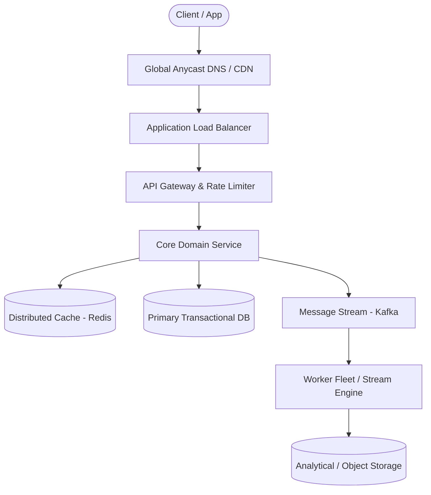

# Page 29: Distributed Web Crawler

> **Page Index**: Page 29 of 32  
> **System Domain**: Politeness Frontier, Deduplication & Storage  
> **Industry Analogs**: Googlebot, Bingbot, Common Crawl  
> **Interview Difficulty**: Hard  
> **Core Architectural Patterns**: Managing Long Running Tasks, Handling Large Blobs, Scaling Writes  

---

## 1. Problem Overview & Architectural Scoping

### Problem Summary
Designing **Distributed Web Crawler** requires architecting a production-grade distributed solution in the **Politeness Frontier, Deduplication & Storage** space. The system must support massive scale while balancing latency budgets, throughput requirements, data consistency, and system durability.

### Primary Technical Challenges
- **Throughput & Concurrency**: Handling high-volume traffic bursts, contention on hot resources, and partition skew without service degradation.
- **Consistency vs Availability**: Choosing the appropriate consistency model across distributed components (ACID transactions vs eventual consistency).
- **Resilience & Fault Tolerance**: Isolating failure domains, avoiding cascading collapses, and ensuring graceful degradation under partial system outages.

## 2. Requirements Specification

### Functional Requirements
Core Requirements
- Crawl the web starting from a given set of seed URLs.
- Extract text data from each web page and store the text for later processing.
Below the line (out of scope)
- The actual processing of the text data (e.g., training an LLM).
- Handling of non-text data (e.g., images, videos, etc.).
- Handling of dynamic content (e.g., JavaScript-rendered pages).
- Handling of authentication (e.g., login-required pages).
It's not possible to scrape the entire internet. Instead, we are going to scrape the vast majority of the web. Many small sites exist in the dark corners of the internet that we will not be able to reach. It may be worth clarifying this with your interviewer, but it's a general assumption of web crawling that you can't reach every page on the web.
FIRST QUESTION
What are the non-functional requirements of the system?
Try it yourself first
We recommend you to practice the question yourself first to get instant personalized feedback as you go.

### Non-Functional Requirements & Performance SLOs
Before we jump into our non-functional requirements, it's important to ask your interviewer about the scale of the system. For this design in particular, the scale will have a large impact on the database design and the overall architecture.
We'll assume there are 10B pages on the web, with an average size of 2MB per page (this is the total transfer size including HTML and any inline resources, though the HTML alone is typically much smaller at ~30KB, but 2MB is a reasonable worst-case for planning bandwidth). We are also going to say that the company needs this data to be available for training 5 days after you start crawling.
It's commonly advised to start with back-of-the-envelope (BOE) calculations. However, I recommend delaying these calculations until they are necessary for solving a specific problem. This approach avoids unnecessary computations and focuses your efforts on aspects that directly impact your solution. You'll find examples of appropriate moments for estimations in our detailed discussions later. Regardless of what approach you take, just make sure to communicate with your interviewer so that you're on the same page.
With that in mind, let's document the non-functional requirements:
Core Requirements
- Fault tolerance to handle failures gracefully and resume crawling without losing progress.
- Politeness to adhere to robots.txt and not overload website servers inappropriately.
- Efficiency to crawl the web in under 5 days.
- Scalability to handle 10B pages.
Below the line (out of scope)
- Security to protect the system from malicious actors.
- Cost to operate the system within budget constraints.
- Compliance to adhere to legal requirements and privacy regulations.
Here's how it might look on your whiteboard:
Requirements

## 3. Quantitative Scale & Capacity Estimations

| Metric Dimension | Production Scale | Architectural Implication |
| :--- | :--- | :--- |
| **Daily Active Users (DAU)** | 50M - 200M users | Distributed identity verification, user sharding, session caches. |
| **Write Throughput** | 1,000 - 50,000 QPS peak | Asynchronous ingestion queues (Kafka), write-behind caching, batch persistence. |
| **Read Throughput** | 10,000 - 500,000 QPS peak | Multi-tier CDN caching, distributed Redis read clusters, read replicas. |
| **Storage Capacity (5 Years)** | 10 TB - 500 TB | Columnar analytics storage, cold data tiering to object storage (S3). |
| **Network Egress / Ingress** | 1 Gbps - 40 Gbps | Connection multiplexing, compression (gzip/zstd), CDN edge offload. |

## 4. Core Data Entities & Schema Design

- **Primary Entity**: `id` (UUID PK), `owner_id` (UUID), `status` (ENUM), `created_at` (TIMESTAMP).
- **Transaction / Event Log**: `event_id` (UUID), `entity_id` (UUID FK), `payload` (JSONB), `timestamp` (BIGINT).
- **Aggregated / Materialized View**: `partition_key` (STRING), `window_start` (BIGINT), `counter` (BIGINT).

## 5. API & System Interface Contract

For data processing system design questions like this one, it helps to start by defining the system's interface. This includes clearly outline what data the system receives and what it outputs, establishing a clear boundary of the system's functionality.
System Interface
- Input: Seed URLs to start crawling from.
- Output: Text data extracted from web pages.

## 6. High-Level Architecture & End-to-End Flow

### Execution Workflow
1. **Edge Ingestion**: Requests pass through Edge CDN and API Gateway for rate limiting and authentication.
2. **Fast-Path Caching**: High-frequency reads are resolved from the distributed Redis cache with sub-5ms latency.
3. **Asynchronous Decoupling**: High-velocity write events are published directly to Kafka message broker partitions.
4. **Background Processing**: Stream workers (Flink/Workers) consume events, update read-model projections, and persist to long-term storage.

## 7. Deep Dives, Bottlenecks & Architectural Tradeoffs

That should have been relatively straightforward so far. Now for the fun part. We are going to go 1-by-1 through our non-functional requirements and discuss how we can improve our design to meet them.
This is why defining good non-functional requirements is so important -- especially for more senior candidates! So often I see candidates rush through the requirements and then look at me, the interviewer, wide eyed, unsure of what to do next after they have a simple design. If you've taken your time to define quality non-functional requirements, then you shouldn't run out of things to talk about until your system has met all functional and non-functional requirements, at which point, you've likely passed the interview!
### 1) How can we ensure we are fault tolerant and don't lose progress?
The first thing we should notice is that our crawler service is doing a lot. It's hitting DNS, fetching web pages, extracting text data, and extracting new URLs to add to the frontier queue. When we introduce politeness and efficiency, we'll find that it ends up doing even more. While the server can handle all of these tasks, it's not ideal from a fault tolerance perspective. If there is a failure in any single task, all progress will be lost.
Fetching web pages is the most likely task to fail. The internet is a messy place and there are many reasons why a fetch might fail. The server might be down, the connection might be slow, the page might be too large, etc.
To handle this, we should break the crawler service into smaller, pipelined stages. This way, if there is a failure in any stage, we can retry that stage without losing progress on the rest of the data. It also allows us to scale each stage independently and optimize each stage for its specific task.
Here's how we might break the crawler service into stages:
- URL Fetcher: This stage fetches the HTML of the web page from the external server. If there is a failure, we can retry the fetch without losing progress on the rest of the data. We will store the raw HTML in blob storage for later processing.
- Text & URL Extraction: This stage extracts the text data from the HTML and extracts any linked URLs to add to the frontier queue. There is an argument that text extraction and URL extraction should be separate stages, but these tasks are both simple and can be done in parallel without much overhead so I'd prefer to simplify the design and combine them into a single stage.
If you get a data processing question like this, your first thought should be to break the system down into smaller, pipelined stages. Pipelining allows you to isolate failures to a single stage and retry that stage without losing progress on the rest of the data. It also allows us to scale each stage independently and optimize each stage for its specific task.
Multi-Stage Pipeline
In order to make this work, we need to add some additional state. We'll add a Metadata DB (DynamoDB is fine here. PostgreSQL/MySQL could also work) with a table f

## 8. Evaluation Rubric by Engineering Level

?
Ok, that was a lot. You may be thinking, “how much of that is actually required from me in an interview?” Let’s break it down.
### Mid-level
Breadth vs. Depth: A mid-level candidate will be mostly focused on breadth (80% vs 20%). You should be able to craft a high-level design that meets the functional requirements you've defined, but many of the components will be abstractions with which you only have surface-level familiarity.
Probing the Basics: Your interviewer will spend some time probing the basics to confirm that you know what each component in your system does. For example, if you add an Queue, expect that they may ask you what it does and how it works (at a high level). In short, the interviewer is not taking anything for granted with respect to your knowledge.
Mixture of Driving and Taking the Backseat: You should drive the early stages of the interview in particular, but the interviewer doesn’t expect that you are able to proactively recognize problems in your design with high precision. Because of this, it’s reasonable that they will take over and drive the later stages of the interview while probing your design.
The Bar for Web Crawler: For this question, an E4 candidate will be able to understand the high-level data flow and implent a simple system (like our high-level design) which can effectively crawl the web. They should be able to discuss the basics of how to handle politeness and adhere to robots.txt. They should have some idea of how to scale the system, but any depth on queueing technologies and rate limiting is not necessarily expected.
### Senior
Depth of Expertise: As a senior candidate, expectations shift towards more in-depth knowledge — about 60% breadth and 40% depth. This means you should be able to go into technical details in areas where you have hands-on experience. It's crucial that you demonstrate a deep understanding of key concepts and technologies relevant to the task at hand.
Advanced System Design: You should be familiar wit

## 9. ScaleLab Studio Simulation & Practice Pack Mapping

- **Recommended ScaleLab Palette Components**: `Client`, `Load balancer`, `API gateway`, `Service`, `Queue`, `Worker`, `Database`, `Cache`, `Circuit breaker`.
- **Simulation Load Test**: Configure a 'Spike' or 'Diurnal' traffic shape. Simulate worker crashes or database lock contention to observe queue backup and Little's Law latency spikes.
- **Practice Pack Readiness**: High priority candidate for addition to ScaleLab's guided practice suite with pinnable notes and runnable starter topologies.
