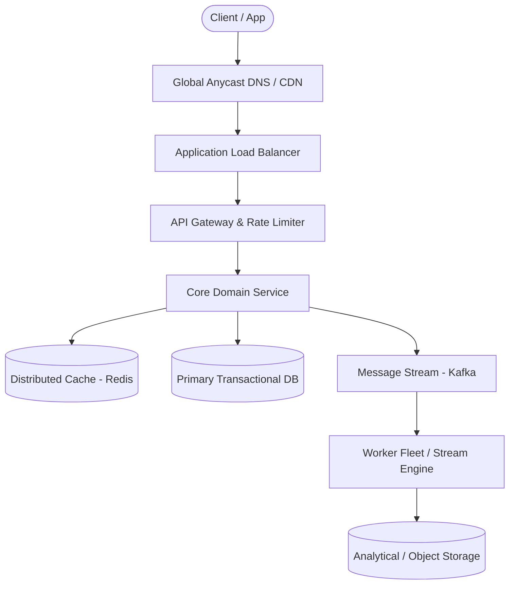

# Page 30: Instant Messaging App (WhatsApp)

> **Page Index**: Page 30 of 32  
> **System Domain**: Persistent Connections & Offline Buffers  
> **Industry Analogs**: WhatsApp, Telegram, Signal  
> **Interview Difficulty**: Hard  
> **Core Architectural Patterns**: Real-time Updates, Scaling Reads, Scaling Writes  

---

## 1. Problem Overview & Architectural Scoping

### Problem Summary
Designing **Instant Messaging App (WhatsApp)** requires architecting a production-grade distributed solution in the **Persistent Connections & Offline Buffers** space. The system must support massive scale while balancing latency budgets, throughput requirements, data consistency, and system durability.

### Primary Technical Challenges
- **Throughput & Concurrency**: Handling high-volume traffic bursts, contention on hot resources, and partition skew without service degradation.
- **Consistency vs Availability**: Choosing the appropriate consistency model across distributed components (ACID transactions vs eventual consistency).
- **Resilience & Fault Tolerance**: Isolating failure domains, avoiding cascading collapses, and ensuring graceful degradation under partial system outages.

## 2. Requirements Specification

### Functional Requirements
Apps like WhatsApp and Messenger have tons of features, but your interviewer doesn't want you to cover them all. The most obvious capabilities are almost definitely in-scope but it's good to ask your interviewer if they want you to move beyond. Spending too much time in requirements will make it harder for you to give detail in the rest of the interview, so we won't dawdle too long here!
Core Requirements
- Users should be able to start group chats with multiple participants (limit 100).
- Users should be able to send/receive messages.
- Users should be able to receive messages sent while they are not online (up to 30 days).
- Users should be able to send/receive media in their messages.
That third requirement isn't obvious to everyone (but it's interesting to design) and If I'm your interviewer I'll probably guide you to it.
Below the line (out of scope)
- Audio/Video calling.
- Interactions with businesses.
- Registration and profile management.
FIRST QUESTION
What are the non-functional requirements of the system?
Try it yourself first
We recommend you to practice the question yourself first to get instant personalized feedback as you go.

### Non-Functional Requirements & Performance SLOs
Before getting into non-functional requirements, it might make sense to ask your interviewer how the app is used by the majority of users if you haven't used it much. Are users mostly doing 1:1 chats, or is the app for large groups? How often are people sending messages? These questions will help you to understand the system that needs to be built and while they are not explicitly "requirements" they will dictate some design decisions that come later.
Core Requirements
- Messages should be delivered to available users with low latency, < 500ms.
- We should guarantee deliverability of messages - they should make their way to users.
- The system should be able to handle billions of users with high throughput (we'll estimate later).
- Messages should be stored on centralized servers no longer than necessary.
- The system should be resilient against failures of individual components.
Below the line (out of scope)
- Exhaustive treatment of security concerns.
- Spam and scraping prevention systems.
Adding features that are out of scope is a "nice to have". It shows product thinking and gives your interviewer a chance to help you reprioritize based on what they want to see in the interview. That said, it's very much a nice to have. If additional features are not coming to you quickly (or you've already burned some time), don't waste your time and move on. It's easy to use precious time defining features that are out of scope, which provides negligible value for a hiring decision.
Requirements

## 3. Quantitative Scale & Capacity Estimations

| Metric Dimension | Production Scale | Architectural Implication |
| :--- | :--- | :--- |
| **Daily Active Users (DAU)** | 50M - 200M users | Distributed identity verification, user sharding, session caches. |
| **Write Throughput** | 1,000 - 50,000 QPS peak | Asynchronous ingestion queues (Kafka), write-behind caching, batch persistence. |
| **Read Throughput** | 10,000 - 500,000 QPS peak | Multi-tier CDN caching, distributed Redis read clusters, read replicas. |
| **Storage Capacity (5 Years)** | 10 TB - 500 TB | Columnar analytics storage, cold data tiering to object storage (S3). |
| **Network Egress / Ingress** | 1 Gbps - 40 Gbps | Connection multiplexing, compression (gzip/zstd), CDN edge offload. |

## 4. Core Data Entities & Schema Design

In the core entities section, we'll think through the main "nouns" of our system. The intent here is to give us the right language to reason through the problem and set the stage for our API and data model.
Interviewers aren't evaluating you on what you list for core entitites, they're an intermediate step to help you reason through the problem. That doesn't mean they don't matter though! Getting the entities wrong is a great way to start building on a broken foundation - so spend a few moments to get them right and keep moving.
We can walk through our functional requirements to get an idea of what the core entities are. We need:
- Users
- Chats (2-100 users)
- Messages
- Clients (a user might have multiple devices)
We'll use this language to reason through the problem.

## 5. API & System Interface Contract

Next, we'll want to think through the API of our system. Unlike a lot of other products where a REST API is probably appropriate, for a chat app, we're going to have high-frequency updates being both sent and received. This is a perfect use case for a bi-directional socket connection!
Pattern: Real-time Updates
WebSocket connections and real-time messaging demonstrate the broader real-time updates pattern used across many distributed systems. Whether it's chat messages, live dashboards, collaborative editing, or gaming, the same principles apply: persistent connections for low latency, pub/sub for scaling across servers, and careful state management for reliability.Learn This Pattern
For this interview, we'll use WebSockets (over TLS for security), although a custom protocol over a raw TLS-encrypted TCP connection would also work. The idea will be that users will open the app and connect to the server, opening this socket which will be used to send and receive commands which represent our API.
As we define our API, we'll specify the commands that are sent and received over the connection by the client.
First, let's be able to create a chat.
// -> createChat
{
"participants": [],
"name": ""
} -> {
"chatId": ""
}
Now we should be able to send messages on the chat.
// -> sendMessage
{
"chatId": "",
"message": "",
"attachments": []
} -> {
"status": "SUCCESS" | "FAILURE",
"messageId": ""
}
We need a way to create attachments (note: I'm going to amend this later in the writeup).
// -> createAttachment
{
"body": ...,
"hash":
} -> {
"attachmentId": ""
}
And we need a way to add/remove users to the chat.
// -> modifyChatParticipants
{
"chatId": "",
"userId": "",
"operation": "ADD" | "REMOVE"
} -> "SUCCESS" | "FAILURE"
Each of these commands will have parallel commands that are sent to other clients. When the command has been received by clients, they'll send an ack command back to the server letting it know the command has been received (and it doesn't have to be sent again)

## 6. High-Level Architecture & End-to-End Flow

### Execution Workflow
1. **Edge Ingestion**: Requests pass through Edge CDN and API Gateway for rate limiting and authentication.
2. **Fast-Path Caching**: High-frequency reads are resolved from the distributed Redis cache with sub-5ms latency.
3. **Asynchronous Decoupling**: High-velocity write events are published directly to Kafka message broker partitions.
4. **Background Processing**: Stream workers (Flink/Workers) consume events, update read-model projections, and persist to long-term storage.

## 7. Deep Dives, Bottlenecks & Architectural Tradeoffs

With the core functional requirements met, it's time to dig into the non-functional requirements via deep dives and solve some of the issues we've earmarked to this point. This includes solving obvious scalability issues as well as auxiliary questions which demonstrate your command of system design.
The degree to which a candidate should proactively lead the deep dives is a function of their seniority. In this problem, all levels should be quick to point out that my single-host solution isn't going to scale. But beyond these bottlenecks, it's reasonable in a mid-level interview for the interviewer to drive the majority of the deep dives. However, in senior and staff+ interviews, the level of agency and ownership expected of the candidate increases. They should be able to proactively look around corners and identify potential issues with their design, proposing solutions to address them.
### 1) How can we handle billions of simultaneous users?
Our single-host system is convenient but unrealistic. Serving billions of users via a single machine isn't possible and it would make deployments and failures a nightmare. So what can we do? The obvious answer is to try to scale out the number of Chat Servers we have.
If we have 1b users, we might expect 200m of them to be connected at any one time. Whatsapp famously served 1-2m users per host, but this will require us to have hundreds of chat servers. That's a lot of simultaneous connections (!).
Note that I've included some back-of-the-envelope calculations here. Your interviewer will likely expect them, but you'll get more mileage from your calculations by doing them just-in-time: when you need to figure out a scaling bottleneck.
Adding more chat servers also introduces some new problems: now the sending and receiving users might be connected to different hosts. If User A is trying to send a message to User B and C via Chat Server 1, but User C is connected to Chat Server 2, we're going to have a problem.
Host Confusion
The issue is one of of routing: we need to route messages to the right Chat Servers in order to deliver them. We have a few options here which are discussed in greatest depth in the Realtime Updates lesson.
### Bad Solution: Naively horizontally scale
Approach
The most naive (broken) solution is to put a load balancer in front of our Chat Servers and scale horizontally. Just add some hosts!Challenges
The problem is this won't work. A given server might accept a message to be sent to a Chat, but we're no longer guaranteed it will have the connections to each of the clients who needs to receive it. We won't be able to deliver the events and messages!
Don't be tempted to do this in an interview!
### Bad Solution: Keep a kafka topic per user
Approach
Many candidates instinctively reach for a queue or stream in order to solve the scaling problem. One example solution would be to create a Kafka topic for every user in the system. The idea here would be that we could keep our Inbox table as a Kaf

## 8. Evaluation Rubric by Engineering Level

?
Ok, that was a lot. You may be thinking, “how much of that is actually required from me in an interview?” Let’s break it down.
### Mid-level
Breadth vs. Depth: A mid-level candidate will be mostly focused on breadth (80% vs 20%). You should be able to craft a high-level design that meets the functional requirements you've defined, but many of the components will be abstractions with which you only have surface-level familiarity.
Probing the Basics: Your interviewer will spend some time probing the basics to confirm that you know what each component in your system does. For example, if you use websockets, expect that they may ask you what it does and how they work (at a high level). In short, the interviewer is not taking anything for granted with respect to your knowledge.
Mixture of Driving and Taking the Backseat: You should drive the early stages of the interview in particular, but the interviewer doesn’t expect that you are able to proactively recognize problems in your design with high precision. Because of this, it’s reasonable that they will take over and drive the later stages of the interview while probing your design.
The Bar for Whatsapp: For this question, an E4 candidate will have clearly defined the API, landed on a high-level design that is functional and meets the requirements. Their scaling solution will have rough edges but they'll have some knowledge of its flaws.
### Senior
Depth of Expertise: As a senior candidate, expectations shift towards more in-depth knowledge — about 60% breadth and 40% depth. This means you should be able to go into technical details in areas where you have hands-on experience. It's crucial that you demonstrate a deep understanding of key concepts and technologies relevant to the task at hand.
Advanced System Design: You should be familiar with advanced system design principles. For example, knowing about the consistent hashing for this problem is essential. You’re also expected to understand the mechanics of long-runni

## 9. ScaleLab Studio Simulation & Practice Pack Mapping

- **Recommended ScaleLab Palette Components**: `Client`, `Load balancer`, `API gateway`, `Service`, `Queue`, `Worker`, `Database`, `Cache`, `Circuit breaker`.
- **Simulation Load Test**: Configure a 'Spike' or 'Diurnal' traffic shape. Simulate worker crashes or database lock contention to observe queue backup and Little's Law latency spikes.
- **Practice Pack Readiness**: High priority candidate for addition to ScaleLab's guided practice suite with pinnable notes and runnable starter topologies.
