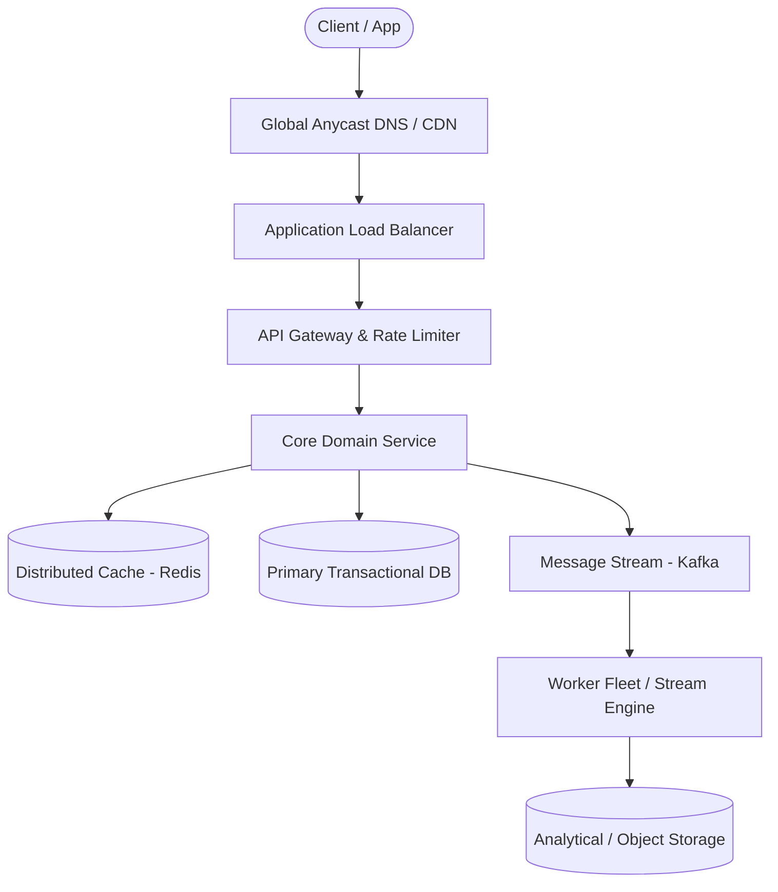

# Page 31: Local Business Review Site (Yelp)

> **Page Index**: Page 31 of 32  
> **System Domain**: Spatial Proximity Search & Rating Rollups  
> **Industry Analogs**: Yelp, Google Maps Places, TripAdvisor  
> **Interview Difficulty**: Medium  
> **Core Architectural Patterns**: Scaling Reads, Consistent Hashing, Caching  

---

## 1. Problem Overview & Architectural Scoping

### Problem Summary
Designing **Local Business Review Site (Yelp)** requires architecting a production-grade distributed solution in the **Spatial Proximity Search & Rating Rollups** space. The system must support massive scale while balancing latency budgets, throughput requirements, data consistency, and system durability.

### Primary Technical Challenges
- **Throughput & Concurrency**: Handling high-volume traffic bursts, contention on hot resources, and partition skew without service degradation.
- **Consistency vs Availability**: Choosing the appropriate consistency model across distributed components (ACID transactions vs eventual consistency).
- **Resilience & Fault Tolerance**: Isolating failure domains, avoiding cascading collapses, and ensuring graceful degradation under partial system outages.

## 2. Requirements Specification

### Functional Requirements
Some interviewers will start the interview by outlining the core functional requirements for you. Other times, you'll be tasked with coming up with them yourself. If you've used the product before, this should be relatively straight forward. However, if you haven't, it's a good idea to ask some questions of your interviewer to better understand the system.
Here is the set of functional requirements we'll focus on in this breakdown (this is also the set of requirements I lead candidates to when asking this question in an interview)
Core Requirements
- Users should be able to search for businesses by name, location (lat/long), and category
- Users should be able to view businesses (and their reviews)
- Users should be able to leave reviews on businesses (mandatory 1-5 star rating and optional text)
Below the line (out of scope):
- Admins should be able to add, update, and remove businesses (we will focus just on the user)
- Users should be able to view businesses on a map
- Users should be recommended businesses relevant to them
FIRST QUESTION
What are the non-functional requirements?
Try it yourself first
We recommend you to practice the question yourself first to get instant personalized feedback as you go.

### Non-Functional Requirements & Performance SLOs
Core Requirements
- The system should have low latency for search operations (< 500ms)
- The system should be highly available, eventual consistency is fine
- The system should be scalable to handle 100M daily users and 10M businesses
Below the line (out of scope):
- The system should protect user data and adhere to GDPR
- The system should be fault tolerant
- The system should protect against spam and abuse
If you're someone who often struggles to come up with your non-functional requirements, take a look at this list of common non-functional requirements that should be considered. Just remember, most systems are all these things (fault tolerant, scalable, etc) but your goal is to identify the unique characteristics that make this system challenging or unique.
Here is what you might write on the whiteboard:
Yelp Non-Functional Requirements

## 3. Quantitative Scale & Capacity Estimations

| Metric Dimension | Production Scale | Architectural Implication |
| :--- | :--- | :--- |
| **Daily Active Users (DAU)** | 50M - 200M users | Distributed identity verification, user sharding, session caches. |
| **Write Throughput** | 1,000 - 50,000 QPS peak | Asynchronous ingestion queues (Kafka), write-behind caching, batch persistence. |
| **Read Throughput** | 10,000 - 500,000 QPS peak | Multi-tier CDN caching, distributed Redis read clusters, read replicas. |
| **Storage Capacity (5 Years)** | 10 TB - 500 TB | Columnar analytics storage, cold data tiering to object storage (S3). |
| **Network Egress / Ingress** | 1 Gbps - 40 Gbps | Connection multiplexing, compression (gzip/zstd), CDN edge offload. |

## 4. Core Data Entities & Schema Design

- **Primary Entity**: `id` (UUID PK), `owner_id` (UUID), `status` (ENUM), `created_at` (TIMESTAMP).
- **Transaction / Event Log**: `event_id` (UUID), `entity_id` (UUID FK), `payload` (JSONB), `timestamp` (BIGINT).
- **Aggregated / Materialized View**: `partition_key` (STRING), `window_start` (BIGINT), `counter` (BIGINT).

## 5. API & System Interface Contract

```http
POST /api/v1/resource
Headers:
  Authorization: Bearer <token>
  Idempotency-Key: <uuid>
Content-Type: application/json

{
  "action": "execute",
  "payload": {}
}

HTTP/1.1 200 OK
```

## 6. High-Level Architecture & End-to-End Flow



### Execution Workflow
1. **Edge Ingestion**: Requests pass through Edge CDN and API Gateway for rate limiting and authentication.
2. **Fast-Path Caching**: High-frequency reads are resolved from the distributed Redis cache with sub-5ms latency.
3. **Asynchronous Decoupling**: High-velocity write events are published directly to Kafka message broker partitions.
4. **Background Processing**: Stream workers (Flink/Workers) consume events, update read-model projections, and persist to long-term storage.

## 7. Deep Dives, Bottlenecks & Architectural Tradeoffs

### 1) How would you efficiently calculate and update the average rating for businesses to ensure it's readily available in search results?
### 2) How would you modify your system to ensure that a user can only leave one review per business?
### 3) How can you improve search to handle complex queries more efficiently?
### 4) How would you modify your system to allow searching by predefined location names such as cities or neighborhoods?

## 8. Evaluation Rubric by Engineering Level

?
### Mid-level
### Senior
### Staff+
### Purchase Premium to Keep Reading
Unlock this article and so much more with Hello Interview Premium
Buy Premium
Currently  up to 20% off
Hello Interview Premium
System Design Guided Practice
Exclusive content
Recent interview questions
Learn More
Reading Progress
On This Page
Understanding the Problem
Functional Requirements
Non-Functional Requirements
Constraints
The Set Up
Defining the Core Entities
The API
High-Level Design
1) Users should be able to search for businesses
2) Users should be able to view businesses
3) Users should be able to leave reviews on businesses
Potential Deep Dives
1) How would you efficiently calculate and update the average rating for businesses to ensure it's readily available in search results?
2) How would you modify your system to ensure that a user can only leave one review per business?
3) How can you improve search to handle complex queries more efficiently?
4) How would you modify your system to allow searching by predefined location names such as cities or neighborhoods?
Final Design
What is Expected at Each Level?
Mid-level
Senior
Staff+
Questions
Meta SWE Interview QuestionsAmazon SWE Interview QuestionsGoogle SWE Interview QuestionsOpenAI SWE Interview QuestionsAnthropic SWE Interview QuestionsEngineering Manager (EM) Interview Questions
Learn
Learn System DesignLearn DSALearn BehavioralLearn ML System DesignLearn Low Level DesignGuided Practice
Links
FAQPricingGift PremiumHello Interview Premium
Legal
Terms and ConditionsPrivacy PolicySecurity
Contact
About UsProduct Support
7511 Greenwood Ave North
Unit #4238 Seattle
WA 98103
© 2026 Optick Labs Inc. All rights reserved.

## 9. ScaleLab Studio Simulation & Practice Pack Mapping

- **Recommended ScaleLab Palette Components**: `Client`, `Load balancer`, `API gateway`, `Service`, `Queue`, `Worker`, `Database`, `Cache`, `Circuit breaker`.
- **Simulation Load Test**: Configure a 'Spike' or 'Diurnal' traffic shape. Simulate worker crashes or database lock contention to observe queue backup and Little's Law latency spikes.
- **Practice Pack Readiness**: High priority candidate for addition to ScaleLab's guided practice suite with pinnable notes and runnable starter topologies.
