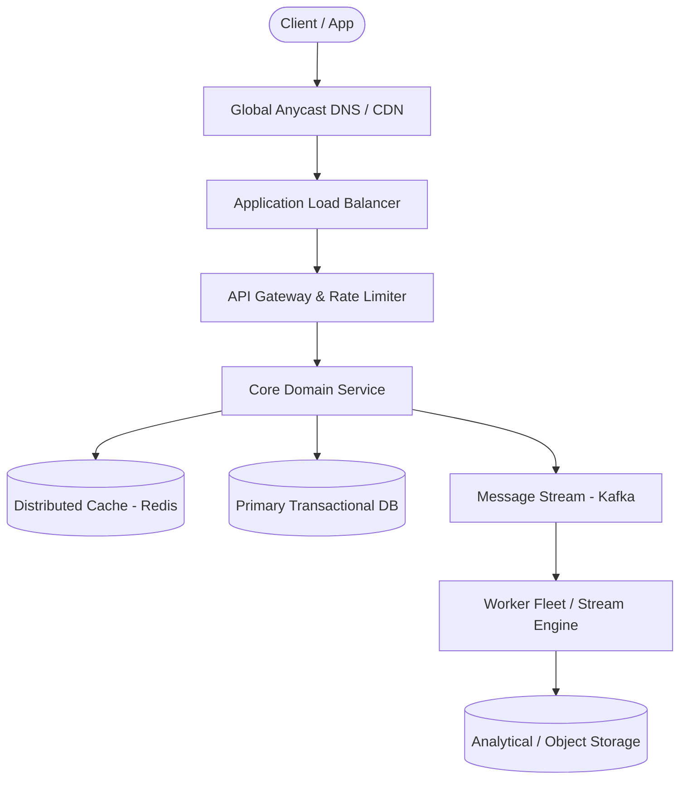

# Page 32: Video Streaming Platform (YouTube)

> **Page Index**: Page 32 of 32  
> **System Domain**: Chunked Uploads, Transcoding & Adaptive CDN  
> **Industry Analogs**: YouTube, Netflix, Vimeo  
> **Interview Difficulty**: Hard  
> **Core Architectural Patterns**: Handling Large Blobs, Managing Long Running Tasks, Scaling Reads  

---

## 1. Problem Overview & Architectural Scoping

### Problem Summary
Designing **Video Streaming Platform (YouTube)** requires architecting a production-grade distributed solution in the **Chunked Uploads, Transcoding & Adaptive CDN** space. The system must support massive scale while balancing latency budgets, throughput requirements, data consistency, and system durability.

### Primary Technical Challenges
- **Throughput & Concurrency**: Handling high-volume traffic bursts, contention on hot resources, and partition skew without service degradation.
- **Consistency vs Availability**: Choosing the appropriate consistency model across distributed components (ACID transactions vs eventual consistency).
- **Resilience & Fault Tolerance**: Isolating failure domains, avoiding cascading collapses, and ensuring graceful degradation under partial system outages.

## 2. Requirements Specification

### Functional Requirements
Core Requirements
- Users can upload videos.
- Users can watch (stream) videos.
Below the line (out of scope)
- Users can view information about a video, such as view counts.
- Users can search for videos.
- Users can comment on videos.
- Users can see recommended videos.
- Users can make a channel and manage their channel.
- Users can subscribe to channels.
It's worth noting that this question is mostly focused video-sharing aspects of YouTube. If you're unsure what features to focus on for a feature-rich app like YouTube or similar, have some brief back and forth with the interviewer to figure out what part of the system they care the most about.
FIRST QUESTION
What are the non-functional requirements?
Try it yourself first
We recommend you to practice the question yourself first to get instant personalized feedback as you go.

### Non-Functional Requirements & Performance SLOs
Core Requirements
- The system should be highly available (prioritizing availability over consistency).
- The system should support uploading and streaming large videos (10s of GBs).
- The system should allow for low latency streaming of videos, even in low bandwidth environments.
- The system should scale to a high number of videos uploaded and watched per day (~1M videos uploaded per day, 100M videos watched per day).
- The system should support resumable uploads.
Below the line (out of scope)
- The system should protect against bad content in videos.
- The system should protect against bots or fake accounts uploading or consuming videos.
- The system should have monitoring / alerting.
Here's how it might look on a whiteboard:
Non-Functional Requirements
For this question, given the small number of functional requirements, the non-functional requirements are even more important to pin down. They characterize the complexity of these deceptively simple "upload" and "watch" interactions. Enumerating these challenges is important, as it will affect your design.

## 3. Quantitative Scale & Capacity Estimations

| Metric Dimension | Production Scale | Architectural Implication |
| :--- | :--- | :--- |
| **Daily Active Users (DAU)** | 50M - 200M users | Distributed identity verification, user sharding, session caches. |
| **Write Throughput** | 1,000 - 50,000 QPS peak | Asynchronous ingestion queues (Kafka), write-behind caching, batch persistence. |
| **Read Throughput** | 10,000 - 500,000 QPS peak | Multi-tier CDN caching, distributed Redis read clusters, read replicas. |
| **Storage Capacity (5 Years)** | 10 TB - 500 TB | Columnar analytics storage, cold data tiering to object storage (S3). |
| **Network Egress / Ingress** | 1 Gbps - 40 Gbps | Connection multiplexing, compression (gzip/zstd), CDN edge offload. |

## 4. Core Data Entities & Schema Design

I like to start with a broad overview of the primary entities. At this stage, it is not necessary to know every specific column or detail. We will focus on these intricacies later when we have a clearer grasp of the system (during the high-level design). Initially, establishing these key entities will guide our thought process and lay a solid foundation as we progress towards defining the API.
For YouTube, the primary entities are pretty straightforward:
- User: A user of the system, either an uploader or viewer.
- Video: A video that is uploaded / watched.
- VideoMetadata: This is metadata associated with the video, such as the uploading user, URL reference to a transcript, etc. We'll go into more detail later about what specifically we'll be storing here.
In the actual interview, this can be as simple as a short list like this. Just make sure you talk through the entities with your interviewer to ensure you are on the same page.
Defining the Core Entities

## 5. API & System Interface Contract

The API is the primary interface that users will interact with. It's important to define the API early on, as it will guide your high-level design. We just need to define an endpoint for each of our functional requirements.
Let's start with an endpoint to upload a video. We might have an endpoint like this:
POST /upload
Request:
{
Video,
VideoMetadata
}
To stream a video, our endpoint might retrieve the video data to play it on device:
GET /videos/{videoId} -> Video & VideoMetadata
Be aware that your APIs may change or evolve as you progress. In this case, our upload and stream APIs actually evolve significantly as we weigh the trade-offs of various approaches in our high-level design (more on this later). You can proactively communicate this to your interviewer by saying, "I am going to outline some simple APIs, but may come back and improve them as we delve deeper into the design."

## 6. High-Level Architecture & End-to-End Flow

### Execution Workflow
1. **Edge Ingestion**: Requests pass through Edge CDN and API Gateway for rate limiting and authentication.
2. **Fast-Path Caching**: High-frequency reads are resolved from the distributed Redis cache with sub-5ms latency.
3. **Asynchronous Decoupling**: High-velocity write events are published directly to Kafka message broker partitions.
4. **Background Processing**: Stream workers (Flink/Workers) consume events, update read-model projections, and persist to long-term storage.

## 7. Deep Dives, Bottlenecks & Architectural Tradeoffs

### 1) How can we handle processing a video to support adaptive bitrate streaming?
Smooth video playback is key for the user experience of this system. In order to support smooth video playback, we need to support adaptive bitrate streaming, so the client can incrementally download segments of videos with varying formats to adapt to fluctuating network conditions. To support such a design, it is important to dig into the details of how video data is processed and stored.
When a video is uploaded in its original format, it needs to be post-processed to make it available as a streamable video to a wide range of devices. As indicated previously, post-processing a video ends up being a "pipeline". The output of this pipeline is:
- Video segment files in different formats (codec and container combinations) stored in S3.
- Manifest files (a primary manifest file and several media manifest files) stored in S3. The media manifest files will reference segment files in S3.
In order to generate the segments and manifest files, the stepwise order of operations will be:
- Split up the original file into segments (using a tool like ffmpeg or similar). These segments will be transcoded (converted from one encoding to another) and used to generated different video containers.
- Transcode (convert from one encoding to another) each segment and process other aspects of the segments (audio, transcript generation).
- Create manifest files referencing the different segments in different video formats.
- Mark the upload as "complete".
Of note, this design assumes that we upload the original video in full first, before we start processing / splitting. Some video services start processing earlier if the client splits up the video on upload into segments. This enables a "pipeline" where the client uploads part of the video and the downstream work can happen before the client is even done uploading the full original foramt. For the sake of simplicity, we avoid this approach, but this is an additional optimization we can consider if we want to speed up the upload experience for the user.
This series of operations can be thought of as a "graph" of work to be done. Each operation is a step with some fan-out / fan-in of work based on what "dependencies" exist. The segment processing (transcoding, audio processing, transcription) can be done in parallel on different worker nodes since there's no dependencies between segments and the segments have been "split up". Given the graph of work and the one-way dependencies, the work to be done here can be considered a directed, acyclic graph, or a "DAG."
For this DAG of work, the most expensive computation to be performed is the video segment transcoding. Ideally, this work is done with extreme parallelism and on many different computers (and cores), given the CPU-bound nature of converting a video from one codec to another.
Additionally, for actually orchestrating the work of this DAG, an orchestrator system can be used to handle bui

## 8. Evaluation Rubric by Engineering Level

?
Ok, that was a lot. You may be thinking, "how much of that is actually required from me in an interview?" Let’s break it down.
### Mid-level
Breadth vs. Depth: A mid-level candidate will be mostly focused on breadth (80% vs 20%). You should be able to craft a high-level design that meets the functional requirements you've defined, but many of the components will be abstractions with which you only have surface-level familiarity.
Probing the Basics: Your interviewer will spend some time probing the basics to confirm that you know what each component in your system does. For example, if you add an API Gateway, expect that they may ask you what it does and how it works (at a high level). In short, the interviewer is not taking anything for granted with respect to your knowledge.
Mixture of Driving and Taking the Backseat: You should drive the early stages of the interview in particular, but the interviewer doesn’t expect that you are able to proactively recognize problems in your design with high precision. Because of this, it’s reasonable that they will take over and drive the later stages of the interview while probing your design.
The Bar for YouTube: For this question, a mid-level candidate will have clearly defined the API endpoints and data model, landed on a high-level design that is functional for video upload / playback. I don't expect candidates to know in-depth information about video streaming, but the candidate should converge on ideas involving multipart upload and segment-based streaming. I also expect the candidate to understand the need to interface with a system like S3 directly for upload / streaming. I expect the candidate to drive some clarity about one relevant "deep dive" topic.
### Senior
Depth of Expertise: As a senior candidate, expectations shift towards more in-depth knowledge — about 60% breadth and 40% depth. This means you should be able to go into technical details in areas where you have hands-on experience. It's crucial that you demo

## 9. ScaleLab Studio Simulation & Practice Pack Mapping

- **Recommended ScaleLab Palette Components**: `Client`, `Load balancer`, `API gateway`, `Service`, `Queue`, `Worker`, `Database`, `Cache`, `Circuit breaker`.
- **Simulation Load Test**: Configure a 'Spike' or 'Diurnal' traffic shape. Simulate worker crashes or database lock contention to observe queue backup and Little's Law latency spikes.
- **Practice Pack Readiness**: High priority candidate for addition to ScaleLab's guided practice suite with pinnable notes and runnable starter topologies.
